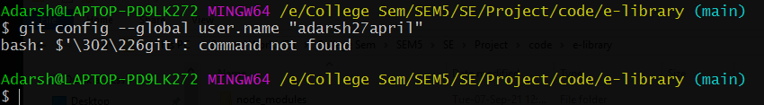
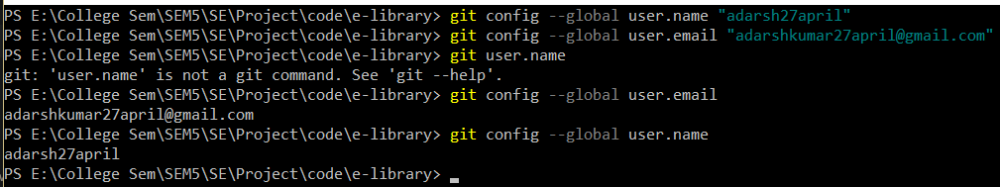
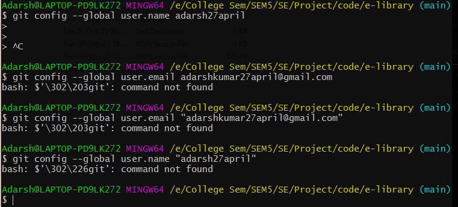

First & foremost: I installed `Git-2.29.2.2-64-bit` this version of git other version had some issues.
Issue 1 while installing:

* 

* Or if I run `git` in cmd/pwsh then it says `git not recognised` &rarr; solve the issue by adding `git/bin` and `git/cmd` folders in environment variables

Run these commands
```
git config --global user.email "adarshkumar27april@gmail.com"
```
```
git config --global user.name "adarsh27april"
```
user.name should be github username
* 

Another Issue left
* 

