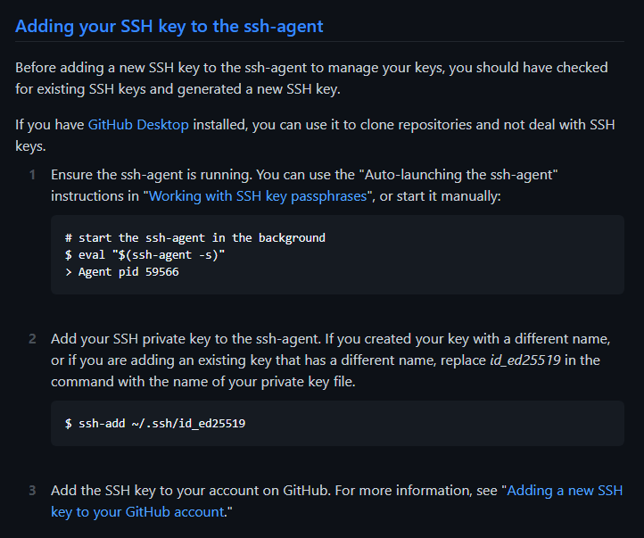
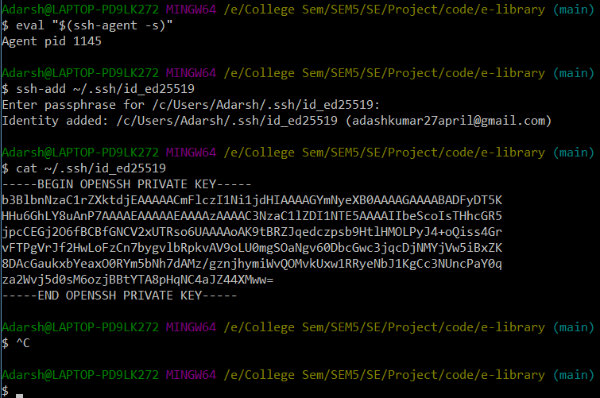

[Checking for existing SSH keys](https://docs.github.com/en/github/authenticating-to-github/connecting-to-github-with-ssh/checking-for-existing-ssh-keys)

If SSH keys do not exist then:


If SSH key exist then:
* 
* 


Somthing That I tried earlier but it didn't seem to work
<div style="color: black; background: crimson">
This part needs to be done only once:
In order to able to push to any repo on GitHub. We first need to verify that we are owner of that repo on GitHub by going to:
github-> acount logo-> settings-> ssh gpg keys

```
ssh-keygen -t ed25519 -C "adashkumar27april@gmail.com"
```

run this: (to start the ssh-agent in the background)
```
eval "$(ssh-agent -s)"
```

run this:
```
ssh-add ~/.ssh/id_ed25519
```
run this will show the ssh key:
```
 cat ~/.ssh/id_ed25519
```
copy the ssh key and paste it on github


</div>
