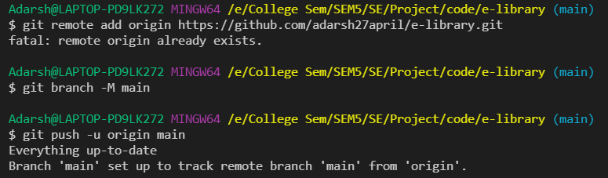
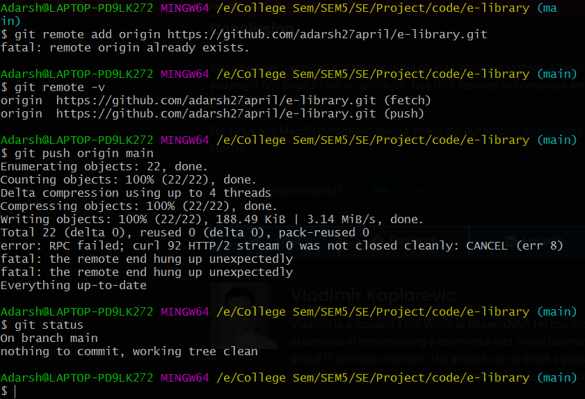
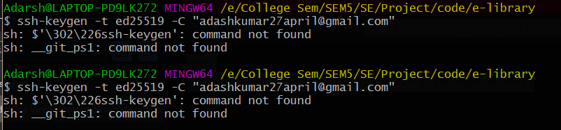

what i have :
* I have a project ***e-library*** which has a main branch name as : "main"

 
 follow the instructions on github as follows:
 

do these steps: 
step1:
get the link from the GitHub Repo in the Browser
```
git remote add origin https://github.com/adarsh27april/e-libray.git
```

`git remote`  will list all the remote sources
`git remote -v` lists all the remote sources url


step :
```
git push -u origin main
```
push `main` branch to the origin repository





Do not pay attention to below: 
***The errors that i was encountering***:
* 
* *`ssh-agent` is not recognised* in pwsh
my solution:
open pwsh
type `sh` and enter
now pwsh will work line git bash and it will look like that as well
enter the command: 
```
ssh-keygen -t ed25519 -C "adashkumar27april@gmail.com"
```
enter the passphrase and then good to go
