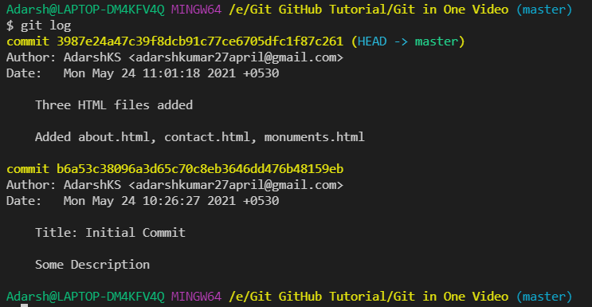
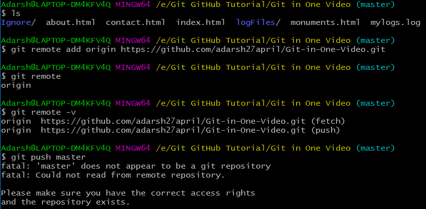

`git status` command shows the status of all the files in the git initialized folder

**Untracked** : git won't tract these files.These files are conciously told Git-Hub to untrack them. These type of files include like *log* files

**Staged** : इसमे हम वो चीज़े डालते है जो हमे commit करनी होती है commit is a snapshot of the project

कभी भी हमे अपने project की tracking को start करने के लिए एक commit करना पडता है और उसे हम initial commit कहते है

Earlier index.html was an untracked file after adding it to the **Staged** area by command `git add index.html` :

After commit the file index.html moves to **Unmodified** area and git shows us `working tree clean` i.e., till now all the changes till now are commited

After this if some changes is made in the index.html then it will move to **Modified** area

`touch about.html` will create a blank file `about.html`

`git add -A` will track all the untracked files

1.  
    
2.  
    
    - Here the empty version of all the files has been added to the **Staged area**
    - > On making changes in the `contact.html` file:
        > 
        
3.  
    
    - Here `contact.html` is in both **Staged** and **Modified** area
        
    - In **Staged** area it's empty version is present
        
    - In the **Modified** area its new edited version is present.
        
    - 
        now the updated version of Contact.html is present
        

`git checkout contact.html` का मतलब यह है की मेरे last commit मे जो contact.html है उस से match करा दो
ex:
initial contack.html:

Final

`git status` command

`git checkout contact.html`

`git checkout -f` to match all the changed files with the previous commit

`git log -p -1` will show last one change to see more replace 1 with some number.

git diff shows the difference b/w the working directory and it's Staging area.
like:

if i add the files to the staging area by `git add -A` then if i run `git diff` it won't show any changes. Because the Stageing area and the working directorya are same.

`git diff --staged` will compare the staging area with the last commit

Try Avoiding it as much as possible: To directly commit without staging. Like:

- 
- 

> Removing some file from the commit:
> 
> 
> 
> 
> 
> `git rm --cached waste.html` will remove the file only from the staging area only, the file will remain in the directory. Useful if we want to Untrack a tracked file
> 
> 
> 
> `git rm -r --cached folderName/` will remove a folder *folderName* from being tracked
> 
> 
> 
> `git rm waste.html` will delete the file from the directory as well as also from the staging area, but before it we will have to add it to the staging area.
> 
> 

- 1st डब्बा green → **Staging** area
- 2nd डब्बा red → **Working dir**

`gitignore` command:
To untrack some files like: log files or some automatically generated output files of some programs which can be generated in any system.

> if `.gitignore` isn't present
> 
> create folder `.gitignore` by `touch .gitignore`
> the name of the files written in `.gitignore` file will be ignored from being tracked.
> inside `.gitignore` if we write:
> `/fileName.extension` then only the `/mylogs.log` in the dir same as that of `.gitignore` will be tracked if the file will be inside some other folder won't be tracked
> 
> 
> `*.log` will ignore all the files with `.log` extension
> 
> To ignore a directory

## Git Branches

default branch is `master`

to move to branch `feature1`

At this time if we check the **master** branch by: `git checkout` then nothing has been changed in it.

Merging the **feature1** branch into the **master** branch

1.  first checkout to master branch
2.  then run `git`
    

To create a branch and switch to it by a single command:

## Pushing into remote repo (GitHub)

Remaining inside some branch of the Git Repo run commands if already have a SSH key:

- `git remote add origin https://github.com/adarsh27april/Git-in-One-Video.git`
- `git remote`
- `git remote -v`
- ``eval `ssh-agent -s` ``
- `ssh-add ~/.ssh/id_rsa`
- in video here the https url has been changed to ssh url at this point by:
    `git remote set-url origin git@github.com:adarsh27april/Git-in-One-Video.git`
- `git push -u origin master`
- to push flaskIntegration branch first checkout to that branch and run : `git push -u origin flaskIntegration`

