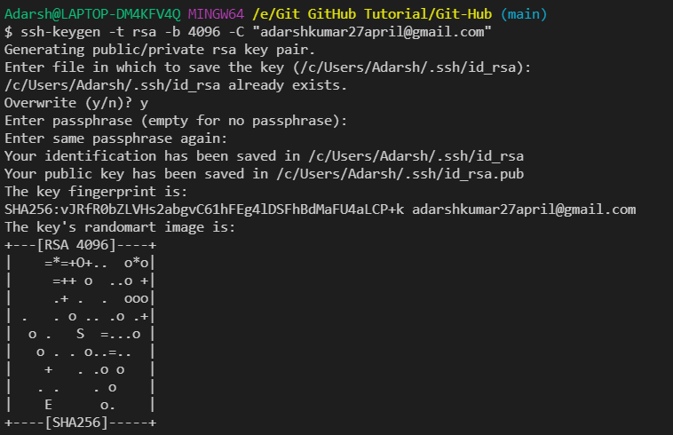

The **black background** or **white background** line stays the same

Cloning Repo from GitHub to Local File System

```Git
git clone https://github.com/adarsh27april/Git-Hub.git
```

## Cloning a Repo


Viewing Files in the Repo Folder

- Note that .git is a hidden file, it denotes that it is a Git folder


Initial file:


After change:


## Why we use SSH?





> **!!!Do Not Change it!!!**

```
ssh-rsa AAAAB3NzaC1yc2EAAAADAQABAAACAQC2eosvsMaMpVxIX0J7fgu2l2LdcJHDdJ2T5PdVVONK8WdtRDTyBqsLWJaeyNNgu6M8EodBkFz2Ndk74JgbKKWVKj4+JrmqQZ/z3DEPnc6fMFG041UBsViAMbMDMm52ZV/n04qTrPXnagnAIX3jK0+HXRyWhXfA6jl0uajtAmvEWVUnWS8+xuvHBfut00SvBcJ96vCLkZ3jSnkyghEGZLGh5RjXCIkguaNWmC6TgHteAc1LLEtL2Rhtmf30MASvL8b8lrqeZL2NrzPgbM/X6mzi4Z1dTlTGseQQoRrOTiGdixYyXM2rNWI8NozD7mocuwbLaYxYe/qMHg/ci1HGhDiqi6oeE5F8BAG/Y4NAIQ1oM0XgVa7e7pjdhMzLUJyvgHw5YBgFu8ajVnIRmZ3+rzYNmM2VWLN2jK76ucp193fpf/1mKXPNwjhrdsP3IaYdQuK2FJenoBWE8dQ2AGxgvuo12hNkNO4Nqu35NnzqJzlqW61zZeSSnJIxfUgDBp0XupEOAQRLQUYu01f4lq3xW3SCjYTeYUvLgzQBl8he6LeuB4GfemKjBglAJ9D3wd45MJO5mx4FisHJtvzdVHCwrCkC1ryjA1J5pCksxapEmhCTuJNfBJFdwiAr+cyThKxxp0Tdfb34JIhR0q2FgRTiKfVjMVZUH4Z/w5dWutvd8QaajQ== adarshkumar27april@gmail.com
```

> **!!!Do Not Change it!!!**

[Generating a new SSH key and adding it to the ssh-agent](https://docs.github.com/en/github/authenticating-to-github/generating-a-new-ssh-key-and-adding-it-to-the-ssh-agent)

[Connecting to GitHub with SSH](https://docs.github.com/en/github/authenticating-to-github/connecting-to-github-with-ssh)

