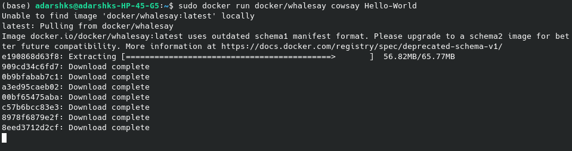
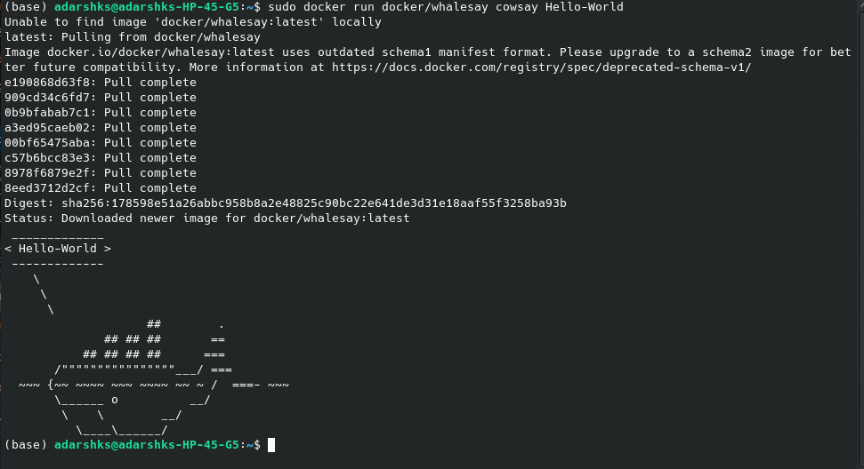
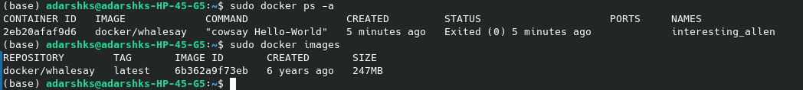
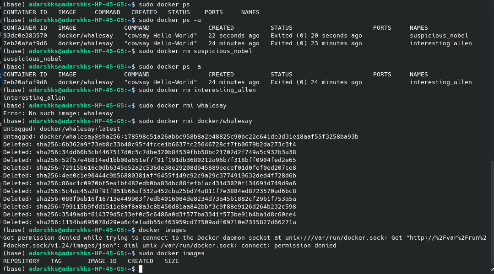

```bash
sudo docker version
```

[for downloading the image of the whalesay application](https://hub.docker.com/r/docker/whalesay)

then run command:

```bash
sudo docker run docker/whalesay cowsay Hello-World
```





`docker run  <name of image>` will run the image & if image isn't present then it download it from the dockerhub.


`docker ps` command will list all running containers and some basic things about them

`docker ps -a` will show all running, previously running & exited containers.

`docker stop  <name of container>` to stop the running container 

`docker rm  <name of container>` to remove a stopped or exited container, note that although the container is removed the image is still present.

`docker images` shows all the images present in the system

1. 

2. note on running the command `docker run  <name of image>` a new container of the image will be created with some different container name and then it will run.


to remove an image: 1st ensure no containers of the image are running, and delete all related containers.

`docker rmi <name of image>` 

`docker pull <name of image>` will only pull the image and not run it in a container
