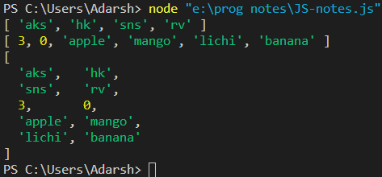
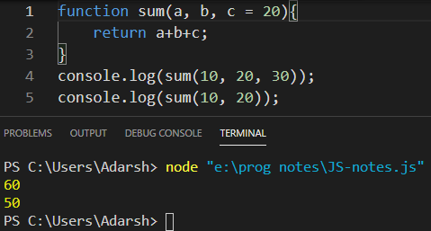
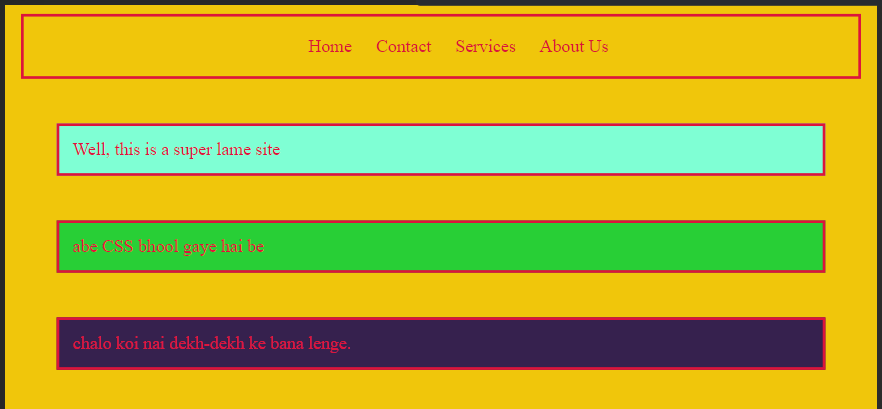
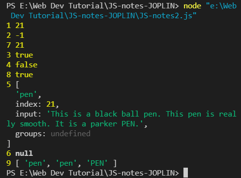
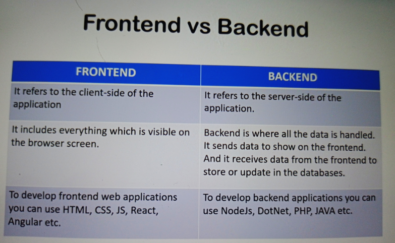
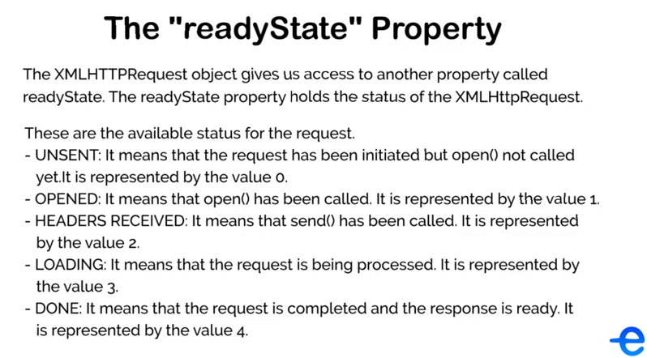
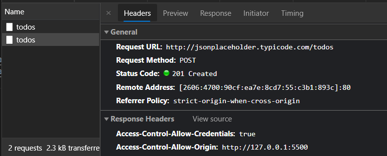
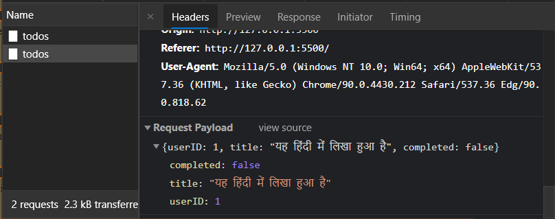

* * *

# Table of contents

- [Table of contents](#table-of-contents)
- [Variables in JavaScript:](#variables-in-javascript)
- [Data Types in JavaScript](#data-types-in-javascript)
  - [JS: Numbers](#js-numbers)
  - [JS In-Built Number Functions](#js-in-built-number-functions)
  - [JS String](#js-string)
  - [JS In-Built String Functions part-1](#js-in-built-string-functions-part-1)
  - [JS In-Built String Functions part-2](#js-in-built-string-functions-part-2)
  - [Null and Undefined Values](#null-and-undefined-values)
- [Conditional Statements](#conditional-statements)
  - [if-else](#if-else)
  - [Switch](#switch)
  - [Arithmetic Operators](#arithmetic-operators)
  - [Assignment Operators](#assignment-operators)
  - [Comparison and Logical Operators](#comparison-and-logical-operators)
- [JS Type Coercion](#js-type-coercion)
  - [Implicit Type Coercion](#implicit-type-coercion)
  - [Explicit Type Coercion](#explicit-type-coercion)
- [Objects and Array](#objects-and-array)
  - [Objects](#objects)
  - [Arrays Part 1](#arrays-part-1)
  - [Arrays Part 2](#arrays-part-2)
- [JS Loops](#js-loops)
  - [While Loop](#while-loop)
  - [For Loop](#for-loop)
- [Functions and Hoisting](#functions-and-hoisting)
  - [Functions](#functions)
  - [Function Arguments](#function-arguments)
  - [Scope and Environment](#scope-and-environment)
  - [JS Hoisting- Variable Hoisting](#js-hoisting--variable-hoisting)
  - [JS Hoisting- Function Hoisting](#js-hoisting--function-hoisting)
- [Document Object Model (DOM)](#document-object-model-dom)
  - [Intro to DOM](#intro-to-dom)
  - [Select HTML Elements](#select-html-elements)
    - [example:](#example)
  - [JS Query Selector-string](#js-query-selector-string)
  - [JS Update HTML Elements](#js-update-html-elements)
      - [example 2](#example-2)
  - [JS Updating Styles](#js-updating-styles)
  - [JS Intro to Events](#js-intro-to-events)
  - [Add & Remove Classes from HTML using JS](#add--remove-classes-from-html-using-js)
  - [Get Element style values using JS](#get-element-style-values-using-js)
  - [Form Events](#form-events)
  - [Keyboard Events](#keyboard-events)
  - [Mouse Events](#mouse-events)
  - [JS - Create HTML elements - Part 1](#js---create-html-elements---part-1)
  - [JS - Create HTML elements - Part 2](#js---create-html-elements---part-2)
  - [JS - Update and Delete HTML Elements (Lec41)](#js---update-and-delete-html-elements-lec41)
  - [Lec 41 Assignment TODO List web app](#lec-41-assignment-todo-list-web-app)
- [Browser Object Model (BOM)](#browser-object-model-bom)
  - [Introduction to Browser Object model](#introduction-to-browser-object-model)
  - [Screen and Navigator Object](#screen-and-navigator-object)
  - [History and Location Object](#history-and-location-object)
- [JS Regular Expressions](#js-regular-expressions)
  - [Introduction to Regular Expressions](#introduction-to-regular-expressions)
  - [Meta-characters and Character Classes](#meta-characters-and-character-classes)
  - [Regex Quantifiers](#regex-quantifiers)
  - [Using Regex in JS](#using-regex-in-js)
  - [Regex Groups](#regex-groups)
    - [The Problem:](#the-problem)
    - [The Solution](#the-solution)
  - [Form Validation using Regex](#form-validation-using-regex)
- [OOP in JavaScript](#oop-in-javascript)
  - [Introduction to OOP in JS](#introduction-to-oop-in-js)
  - [`this` keyword](#this-keyword)
  - [Constructor Functions](#constructor-functions)
  - [Inheritancs and Prototype Chain](#inheritancs-and-prototype-chain)
  - [Prototype Implementation](#prototype-implementation)
- [JS HTTP Requests](#js-http-requests)
  - [Understanding Frontend and Backend](#understanding-frontend-and-backend)
  - [HTTP Requests and Responses](#http-requests-and-responses)
  - [Introduction to JSON](#introduction-to-json)
  - [Introduction to AJAX](#introduction-to-ajax)
  - [Handling HTTP Response](#handling-http-response)
  - [Making HTTP Post Requests](#making-http-post-requests)
- [jQuery](#jquery)
  - [Introduction](#introduction)
  - [](#)

* * *

* * *

# Variables in JavaScript:

[TOC](#table-of-contents)

`var`, `let`, are keywords used to create variables

`var` and `let` are both used for variable declaration in JavaScript but the difference between them is that var is function scoped and let is block scoped. It can be said that a variable declared with var is defined throughout the program as compared to let.

> Example of var:

```JavaScript
**Input:**

console.log(x);
var x=5;
console.log(x);

**Output:**

undefined
5
```

> Example of let:

```JavaScript
**Input:**

console.log(x);
let x=5;
console.log(x);

**Output:**

Error
```

[Difference between var and let in JavaScript - GeeksforGeeks](https://www.geeksforgeeks.org/difference-between-var-and-let-in-javascript/#:~:text=var%20and%20let%20are%20both,program%20as%20compared%20to%20let.)

For printing into the console `console.log();`

To clear the console `console.clear();`

Different conventions of writing variable names:

- camel case: `firstName`
- pascal case: `FirstName`
- snake case: `first_name`
    They are just conventions !!

> `$` is possible in naming of variable in JS

* * *

* * *

# Data Types in JavaScript

## JS: Numbers

[TOC](#table-of-contents)

`typeof(variable_name)` will return the data type of the number

> ***Storing numbers in JS***
> 
> - JS always stores numbers as a 64-bit floating point
> - The number is stored in first 52 bits i.e., from 0 to 51.(indexing from 0 to 63)
> - The exponent part is stored in next 11 bits i.e., 52 to 62.
> - And the last bit (63) is saved for the sign.

```JavaScript
var num = 20;
var divByZero = num / 20;
console.log(divByZero); //infinity
console.log(typeOf(divByZero)); //"number"
```

> JS has `infinity` and `NaN` as numbers.

```JavaScript
var mulByString = num * 'A';
console.log(mulByString); //NaN
console.log(typeOf(mulByString)); //"number"
```

## JS In-Built Number Functions

[TOC](#table-of-contents)

`toString()` function takes number as i/p and returns a string

```JavaScript
var num1 = 10;
var num2 = 20.3;
console.log(num1.toString()); //"10"
console.log(num2.toString()); //"20.3"
```

`parseInt()` function takes string numeral as i/p and returns a number

```JavaScript
var StrNum1 = "10";
var StrNum2 = "11.5";
console.log(parseInt(StrNum1)); //10
console.log(parseInt(StrNum2)); //11
```

`parseInt()` will parse and return a Integer (11) and not a floating point number (11.5)

`parseFloat()` takes string number as i/p and returns a floating number

```JavaScript
var StrNum1 = "10";
var StrNum2 = "11.5";
var StrNum3 = "abc";
console.log(parseFloat(StrNum1)); //10
console.log(parseFloat(StrNum2)); //11.5
console.log(parseFloat(StrNum3)); //NaN
```

`toFixed()` takes a floating number and rounds it off to given position

```JavaScript
var strFloat = 87.74535;
console.log(strFloat.toFixed()); //88
console.log(strFloat.toFixed(1)); //87.7
console.log(strFloat.toFixed(2)); //87.75
console.log(strFloat.toFixed(3)); //87.745
console.log(strFloat.toFixed(4)); //87.7454
console.log(strFloat.toFixed(5)); //87.74535
```

## JS String

[TOC](#table-of-contents)

```JavaScript
var myFirstString = "I love JavaScript";//--double quote
console.log(typeOf(myFirstString)); //"string"

var myStringString = 'Learning JavaScript';//--single quote
console.log(typeOf(myStringString)); //"string"

var doubleQuoteString = "this is a \"JS\" string";
console.log(doubleQuoteString);
//"this is a 'JS' string"

var singleQuoteString = 'this is a \'JS\' string';
console.log(singleQuoteString);
//"this is a 'JS' string"
/*observe the Output of doubleQuoteString and singleQuoteString*/

var doubleQuoteString2 = "this is a 'JS' string";
console.log(doubleQuoteString2);
//

var singleQuoteString2 = 'this is a "JS" string';
console.log(singleQuoteString2);
//
```

## JS In-Built String Functions part-1

[TOC](#table-of-contents)

- `length`

```JavaScript
var myFirstString = "This is a JS string, something JS";
console.log(myFirstString.length); //33
```

- finding index of a string another String

```JavaScript
console.log(myFirstString.indexOf('JS')); //10
console.log(myFirstString.indexOf('This')); //0
```

- Find **Last index** of a string inside another string

```JavaScript
console.log(myFirstString.lastIndexOf('JS')); //31
```

- Get a part of a String: `slice()`

```JavaScript
console.log(myFirstString.slice(0, 5));//"This "
/*will return elements frrom index 0 to index (5-1)*/

console.log(myFirstString.slice(10, 12)); //"JS"

console.log(myFirstString.slice(-2)); //"JS"
/*here '-2' denotes the start and from that posotion till the end all chars will be returned*/


console.log(myFirstString.slice(4));
//" is a JS string, something JS"
/*starting index = 4 ending index = -1*/
```

- `substr(statPos, length)` function to get sub string of a string

```JavaScript
console.log(myFirstString.substr(0, 4)); //"This"
/*starting pos = 0, length of sub-string = 4*/

console.log(myFirstString.substr(10, 2));//"JS"

console.log(myFirstString.substr(10));
//"JS string, something JS"
/*if no length is mentioned then starting from index = 10, till the end all the char will be returned*/
```


## JS In-Built String Functions part-2

[TOC](#table-of-contents)

```JavaScript
var ExampleString = "This is JS string funciton part2";
```

- `toUpperCase()` converts all char of string to upper case

```JavaScript
console.log((ExampleString.toUpperCase()));
//"THIS IS JS STRING FUNCITON PART2"
```

- `toLowerCase()` converts all char of string to lower case

```JavaScript
console.log((ExampleString.toLowerCase()));
//"this is js string funciton part2"
```

- `concat()` \- It merges two or more strings

```JavaScript
var Fname = "EDYODA";
var Mname = "JavaScript";
var Lname = "Playground";
console.log(Fname.concat(' ', Mname, ' ', Lname));
//"EDYODA JavaScript Playground"

console.log(Fname.concat(Mname, ' ', Lname));
//"EDYODAJavaScript Playground"
```

- using + operator to concat strings

```JavaScript
console.log(Mname + ' '+ Lname);
//"JavaScript Playground"
```

- `trim()` to remove extra spaces

```JavaScript
var extraspace = "    ab c d   jg   ";
//"ab c d   jg"
console.log(extraspace.trim());
```

- `charAt()` this take a position as an argument and returns the char at that position

```JavaScript
var ExampleString = "this is JS";
console.log(charAtString.charAt(5)); //"i"
```

- `split()` splits our string based on the arguments passed

```JavaScript
var ExampleString = "this is JS";
console.log(ExampleString.split(' '));
//[ 'this', 'is', 'JS' ]

console.log(ExampleString.split());
//[ 'this is JS' ]

console.log(ExampleString.split(''));
```


## Null and Undefined Values

[TOC](#table-of-contents)

- `undefined` means that a variable has been declared but it has not yet been assigned a value.

```JavaScript
var myvar;
console.log(myvar);
```


- `null` is a value that can be assigned to a variable to denote that it contains no value.

```JavaScript
var myvar = null;
console.log(myvar);
```


# Conditional Statements

## if-else

[TOC](#table-of-contents)

```JavaScript
if(7>5)
{
    console.log("hello");
}
else if(7 == 5)
{
    console.log("else part1");
}
else{
    console.log("finally");
}
```

## Switch

[TOC](#table-of-contents)

- using `if-else`

```JavaScript
var currentDay = 'Mon';
if(currentDay == "Mon")
{
    console.log('timings: 10:00-6:00');
}
else if(currentDay == 'Wed')
{
    console.log('timings: 9:30-5:00');
}
```

- using `switch-case`

```JavaScript
switch (currentDay) {
        case 'Mon':
                console.log('timings: 10:00-6:00');
                break;

        case 'Wed': 
                console.log('timings: 9:30-5:00');
                break;

        default:
                console.log('no date matches');
                break;
}
```

## Arithmetic Operators

[TOC](#table-of-contents)

- `Addition`: '+'
- `Subtraction`: '-'
- `Multiplication`: '*'
- `Division`: '/'
- `Modulus`: '%'
- `Increment`: '++'
- `Decrement`: '--'

> 1.  num++ post-Increment first use then Increment.
> 2.  ++num pre-Increment first Increment then use.

## Assignment Operators

[TOC](#table-of-contents)

- `=` Assignment operator
- `<op> =` op is *operator* ex: `a += b` is shorthand of `a = a+b` where operator `<op>` is `+`

## Comparison and Logical Operators

[TOC](#table-of-contents)

- `5 == '5'` is true since `==` only compares only the values and doesn't compares the dataType
    
- `5 === '5'` is false as it compares both dataType and value
    
- `!=` <span style="color: brown;">is not equal to</span> operator compares only value and doesn't compare the dataType
    
- `!==` <span style="color: brown;">is not equal to equal to</span> compares both dataType and value
    
- `<=` , `<` , `>` , `>=`
    

Logical Operators `&&` , `||` , `!`

Ternary Operator
`(expression) ? a : b`
ex: 2 < 3 ? `console.log(true)` : `console.log(false)` out: <span style="color: green;">true</span>

# JS Type Coercion

## Implicit Type Coercion

[TOC](#table-of-contents)

> It's conversion of value from one type to another Data Type, can be done either by code or by JS itself
> **Implicit Coercion**: is done by JS itself

> Implicit Type Coercion of conversion to string

```JavaScript
var a = "hello";
var b = 10;
var c = a + b;
console.log(c);//"hello10"
console.log(typeof(c));//"string'
```

> Implicit Type Coercion of conversion to number

1.  
    
2.  
    
3.  
    
4.  
    

> Implicit Type Coercion of conversion to boolean
> 
> - anything that's not **0**, **null**, **undefined**, **empty** will be converted to true

> ex:
> 
> ```JavaScript
> 'apple', 1, 25, -5, etc. will be true
> 
> null, undefined, NaN, 0 and empty string '' or "" will be false
> ```

## Explicit Type Coercion

[TOC](#table-of-contents)

It's conversion of one data type to another programatically

*to string dataType*


*to number*


*to boolean*


# Objects and Array

## Objects

[TOC](#table-of-contents)

Stores data in form of key,value pair

```JavaScript
var cars = {
    'p1': '320kmph',
        'ferrari': '200kmph',
        'benz' : '500kmph',
};
console.log(cars);
console.log(typeof(cars));

var mAgera = {
        name : "Agera",
        manufacturer : {
                name: 'anc',
                location: 'sweden'
        },
        topspeed: 429,
        color: 'black',
        spoilers: false,
        applyBrakes: function(){
                setTimeout(function(){
                //after 5000millisec it will fire the callback funciton
                        console.log('Car Stopped');
                }, 5000)
        }
}
console.log(mAgera.name);
console.log(mAgera.manufacturer);
console.log(mAgera.topspeed);
console.log(mAgera.manufacturer.name);

console.log(mAgera.applyBrakes());
//note that it took 5 seconds for the funciton to return the o/p and it is done Asynchronously as till that time the below line was executed
console.log(mAgera.applyBrakes);
//to call a funciton inside a object we need to use paranthesis or else it will give us the defination of the function

```

Output:


## Arrays Part 1

[TOC](#table-of-contents)

Arrays are special type of Objects

```JavaScript
var MyFriends = ['aks', 'hk', 'sns', 'rv'];
console.log(MyFriends);
console.log(typeof(MyFriends));
console.log(MyFriends[0]);
console.log(MyFriends[3]);

// updaitng a value
MyFriends[0] = 'adarsh';
console.log(MyFriends);

// Add more items
MyFriends[4] = 'ss';
MyFriends[10] = 'as';
// it will lead to holes in the list i.e., it will produce some undefined elemets in the list

console.log(MyFriends);

MyFriends[MyFriends.length] = 'as';
console.log(MyFriends);

// or else 
MyFriends.push('us');
console.log(MyFriends);

// pop out the last value from the list and returns it
var last = MyFriends.pop();
console.log(MyFriends);
console.log(last);
```

Output:


## Arrays Part 2

[TOC](#table-of-contents)

> Adding and Deleting from an Array. using `slice()` method

```JavaScript
var MyFriends = ['aks', 'hk', 'sns', 'rv', 'ss', 'as', 'us' ];
console.log(MyFriends);
console.log(typeof(MyFriends));

MyFriends.splice(3, 0, 'apple', 'mango', 'lichi', 'banana');
console.log(MyFriends);

MyFriends.splice(0, 0, 'RedHat');
console.log(MyFriends);

MyFriends.splice(4, 1);
console.log(MyFriends);

MyFriends.splice(0, 2);
console.log(MyFriends);
```

Output:


> **Meaning of arguments in slice function**

- 1st arg tells from where to start Deleting
- 2nd arg tells how many items to delete
- 3rd, 4th and so on tells what items are to be added

> Concatenation of two lists

```JavaScript
var MyFriends = ['aks', 'hk', 'sns', 'rv'];
var list = [3, 0, 'apple', 'mango', 'lichi', 'banana'];

var new_list= MyFriends.concat(list);
console.log(MyFriends);
console.log(list);
console.log(new_list);
```

Output:


> Sorting a list ascending and descending


# JS Loops

Repetition of code is called loop and each repetition is called Iteration

## While Loop

[TOC](#table-of-contents)

```JavaScript
var mval = 0;
while (mval < 50) {
    mval++
}
console.log(mval);// 50
```

## For Loop

[TOC](#table-of-contents)

> Simple for loop
> 

> **The Break keyword**
> Break the loop I khow how to use it.
> 

> **The Continue keyword**
> Stops the current Iteration and goes to the next Iteration.
> 


* * *
Part 2
* * *


# Functions and Hoisting

## Functions

1.  
    
2.  
    

## Function Arguments

[TOC](#table-of-contents)

> If a default value is provided in the function parameter and no argument is passed while calling the function then the default value is considered.

1.  
    
2.  
    

> Note that JS will ignore the extra values if passed as Arguments.

## Scope and Environment

- Scope defines the part of the program where a Variable or a function is visible/accessible.
- The Variable defined outside all the functions and blocks are available throughout the code. These are called Global Variable.

```JavaScript
var num1 = 10;// num1 is a Global Variable
function sum(num2) {
    var total = num1 + num2;//total is a local Variable
    console.log(total);//Local Scope of num1
}
console.log(num1);
//Global Scope of num1

console.log(total);
//ReferenceError: total is not defined
```

## JS Hoisting- Variable Hoisting

[TOC](#table-of-contents)

In JS we can use a variable before declaring!!!
as in the example below.

```JavaScript
x = "some-string";
var x;
```

This mechanism in which functions and variable can be used before declaring them is known as <span style="color: #00ff62;">Hoisting</span>.

> What happens in Hoisting is that the Variable and Function declarations move to the top of their scope before the code execution.
> 
> JavaScript has two step in executing a particular Script.
> 
> 1.  Creation: Here JS analyses all the code and allocates the memory space for Variable and Function
> 2.  Execution
>     All variable are assigned a value `Undefined` when declared first


> * * *
> 
> ```JavaScript
> console.log(x);
> x = "Some-String";
> console.log(x);
> var x;
> ```
> 
> 

> * * *
> 
> ```JavaScript
> console.log(x);
> // ReferenceError: x is not defined
> x = "Some-String";
> console.log(x);
> // var x;
> ```
> 
> Hence the variable must be declared somewhere or else like this can occur

## JS Hoisting- Function Hoisting

[TOC](#table-of-contents)

Moves the Function declarations to the top of the Scope, to make functions usable before declaring them. ***ex:***

```JavaScript
sum(1, 3);
sum(10, 3);
function sum(n1, n2)
{
    console.log(n1+n2);
}
sum(20, 5);
```

Output:


> Hoisting doesn't move the function expression to the top because it is treated as assignment and not declaration
> 
> ```JavaScript
> sum(1, 3);
> sum(10, 3);
> var sum = function(n1, n2)
> {
>     console.log(n1+n2);
> }
> sum(20, 5);
> ```
> 
> Output:
> TypeError: sum is not a function
> The error occurred because JS treated `sum` as assignment and not as declaration

> On Correction it works
> 
> ```JavaScript
> // sum(1, 3);
> // sum(10, 3);
> var sum = function(n1, n2)
> {
>     console.log(n1+n2);
> }
> sum(20, 5);
> ```
> 
> Output:
> 

> It's a bad Practice to use Variables before declaring them
> Function and Variable Hoisting is a bad Practice.
> It's the way how JS works behind the scenes.

> **Question:**
> 
> ```JavaScript
> var total = 10;
> var sum = function(n1, n2){
>     console.log(total);
>     total = n1 + n2;
>     var total;
>     console.log(total);
> }
> sum(20, 5);
> ```
> 
> Which total will be printed in *line 3* :\- the Global Variable `total` or the Local Variable `total`
> 

# Document Object Model (DOM)

## Intro to DOM

[TOC](#table-of-contents)

> When a web page is loaded the browser creates a Document Object Model of the page. DOM is the tree representation of the HTML document.
> The DOM tree can be modified with the help of a scripting language as JavaScript.
> <span style="color: coral;">The DOM is the Object-Oriented Representation of the WebPage.</span>


 * Parent element &rarr; `table` &rarr; root node
 * every node has exact one Parent
 * any node can have any no. of child
 * nodes with same immediate parents are called siblings


&larr;, &uarr;, &rarr; &darr;

> **JS and DOM**<br>
> JS can:
>    1. add new HTML elements and attributes.
>    2. change any HTML elements and attributes in the page.
>    3. change all the CSS styles in the page.
>    4. remove existing HTML elements and attributes.
>    5. add and listen to HTML elements like onClick, onScroll, etc.

>Including JS inside the HTML

> JS is included or a link to js file is provided in the `<script></script>` tags.
> `<sctipt>` tags can be placed
>  1. just after/before the ending of the `<body>`.
>  2. just before the ending of the `<head>`.
>  3. inline js inside the tag.
> Link to a external js file can be provided in `<script>` as:
> ```html
> <script type = 'text/javascript' src = './some-js.js'></script>
> ```
> The best place to include script tag is to place it just before `</body>`  so that the HTML `document` can get properly loaded before the execution of JS.<br/>
> we can use multiple JS files it doesn't have to be one.


 
> <span style="color: crimson;">HTML</span><br>
> 
> 
> <span style="color: crimson;">JS</span><br>
> 
> 
> <span style="color: crimson;">Browser Console</span><br>
> 

## Select HTML Elements
[TOC](#table-of-contents)

> 1. 
> ```JavaScript
> getElementById('html-element-id');
> ```
> This is a DOM method and it accepts the HTML element id and returns the HTML element for the id.
> if no element matches the id then returns `null`.
<br/>

> 2. 
> ```JavaScript
> getElementByClassName('html-class-string');
> ```
> `gebcn` in short
> It returns a JS **Object**. 

> methods like `onClick()`, `onDrag()`, etc.. are events which can be listened by JS.

<div style = 'background-color: rgb(51, 20, 26); color: antiquewhite'>

> 3. 
> similar kind of method is `document.getElementsByTagName()` <br>
> It returns a JS Object based on the name of the tag passed as argument
</div>

### example:
<details>
<summary>Complete HTML</summary>

```html
<!DOCTYPE html>
<html lang="en">
<head>
    <meta charset="UTF-8">
    <title>JS-notes</title>
    <link rel="stylesheet" href = "./JS-notes.css" type="text/css"></link>
</head>
<body class="class1">

    <nav id="navbar">
        <ul>
            <li>Home</li>
            <li>Contact</li>
            <li>Services</li>
            <li>About Us</li>
        </ul>
    </nav>

    <div id="id1" class="hr-bar">
        Well, this is a super lame site
    </div>
    <script type="text/javascript" src="./JS-notes.js"></script>

    <div id="id2" class="hr-bar">
        abe CSS bhool gaye hai be
    </div>
    <script type="text/javascript" src="./JS-notes.js"></script>

    <form action="input"></form>

    <div id="id3" class="hr-bar">
        chalo koi nai dekh-dekh ke bana lenge.
    </div>
    <script type="text/javascript" src="./JS-notes.js"></script>
</body>
</html>
```
</details>
<details>
<summary>Complete CSS</summary>

```CSS
body{
    color: crimson;
    background-color: rgb(240, 198, 11);
}

#id1{
    background-color: aquamarine;
    border: 3px 4px 3px 4px;
    border-style: solid;
    padding: 15px;
    margin: 50px;
}

#id2{
    background-color: rgb(40, 207, 54);
    border: 3px 4px 3px 4px;
    border-style: solid;
    padding: 15px;
    margin: 50px;
}

#id3{
    background-color: rgb(54, 33, 78);
    border: 3px 4px 3px 4px;
    border-style: solid;
    padding: 15px;
    margin: 50px;
}

#navbar
{
    margin: 10px;
    padding: 1px;
    border: 3px solid crimson;

}
#navbar ul{
    display: flex;
    flex-direction: row;
    justify-content: center;
}
#navbar ul li{
    list-style: none;
    margin-left: 10px;
    margin-right: 10px;
    padding-top: 1px;
    padding-bottom: 1px;
    padding-left: 3px;
    padding-right: 4px;
}
/* #navbar ul li a{

} */

```
</details>

Look of WebPage in Browser<br>


```JavaScript
console.clear();
console.log("document.getElementById(`id1`)");
console.log(document.getElementById("id1"));

console.log("document.getElementsByClassName('hr-bar')");
console.log(document.getElementsByClassName("hr-bar"));

console.log("document.getElementsByTagName('div')");
console.log(document.getElementsByTagName("div"));
```

Browser Console<br>


## JS Query Selector-string
[TOC](#table-of-contents)

Query Selector-string allows to use CSS selector-strings to select HTML Elements.
> 1. 
> ```JavaScript
> document.querySelector-string('css-selector-string-string');
> ```
> A DOM method, arg: _css-selector-string-string_ , returns: _all HTML element matching the query_.

>2. 
> ```JavaScript
> document.querySelector-stringAll('css-selector-string-string');
> ```
> A DOM method, arg: _css-selector-string-string_ , returns: _all HTML element matching the query_.

[HTML CSS look of WebPage](#example)

`gebcn`, `gebcn`, `gebtn` are twice as fast as querySelector-strings

```JavaScript
console.clear();
console.log("document.querySelector-stringAll('#navbar ul li')");
console.log(document.querySelector-stringAll("#navbar ul li"));

console.log("document.querySelector-string('#navbar ul li')");
console.log(document.querySelector-string("#navbar ul li"));

console.log('document.querySelector-stringAll("li1")');
console.log(document.querySelector-stringAll("#li1"));
```


## JS Update HTML Elements

`innerHTML` gets everything which is inside the HTML element on which it is used whether it's some text or some other HTML inside it.

`setInterval()` will continue firing the callback function after every mentioned time interval.
`setTimeout()` will fire the callback function only once after the mentioned time interval.

#### example 2
<details>
<summary>Complete HTML 2</summary>

```html
<!DOCTYPE html>
<html lang="en">
<head>
    <meta charset="UTF-8">
    <title>JS Update HTML Elements</title>
    <link rel="stylesheet" href="./JS-notes.css" type="text/css">

</head>
<body>
    <header>
        <div>
            
            <h1 id="countdown">
                10
            </h1>
        </div>
    </header>
    <script src="./JS-notes.js"> </script>
</body>
</html>
```
</details>

<details>
<summary>Complete CSS 2</summary>

```CSS
*{
    margin: 0;
    padding: 0;
}

#countdown{
    color: fuchsia;
    position: absolute;
    top: 50%;
    left: 50%;
    transform: translate(-50%, -50%);
    font-size: 100px;

}
#bg-img{
    width: 100%;
    height: 100vh;
}
```
</details>

<details>
<summary>Complete JS</summary>

```JavaScript
console.clear();

var countdownElement = document.getElementById('countdown');
var initialCountdownVal = countdownElement.innerHTML;

var bgImg = document.getElementById('bg-img');

setInterval(function () {
    initialCountdownVal = initialCountdownVal > 0 ? initialCountdownVal - 1 : 0;
    countdownElement.innerHTML = initialCountdownVal;

    // accessing the src property of a html element
    bgImg.src = initialCountdownVal % 2 === 0 ? "./Saturn.jpg" : './IMG_20191123_134018.jpg';
}, 1000);
```
</details>


> the `setInterval()` will continue runnining endlessly<br>
> SImilar to updating of the `src` property we can also update other properties such as `className`.


## JS Updating Styles
[TOC](#table-of-contents)

<div style = "background-color: rgb(101, 70, 104);">

> Syntax:
> ```JavaScript
> var selectedElement = getElementById('selector-string');
> //or this can also be used
> var selectedElement = querySelector('selector-string');
> 
> selectedElement.style.{propertyName} = value;
> ```
> <br>
> 
> *Example:*
> 
> ```JavaScript
> selectedElement.style.width = '300px';
> ```
</div>

All the property names get converted to camel Case like `font-size` will get converted to `fontSize`.

[HTML and CSS](#example-2)
- The only difference in css of #example-2 and that of here is that the default `fontSize` of `#countdown` is 1000px here.

<details>
<summary>JS for this section</summary>

```JavaScript
console.clear();

var countdownElement = document.getElementById('countdown');

var initialCountdownVal = countdownElement.innerHTML;

var bgImg = document.getElementById('bg-img');
var interval = setInterval(function () {

    initialCountdownVal = initialCountdownVal > 0 ? initialCountdownVal - 1 : 0;
    countdownElement.innerHTML = initialCountdownVal;

    bgImg.src = initialCountdownVal % 2 === 0 ? './IMG_20191123_134018.jpg' : "./Saturn.jpg";

    countdownElement.style.fontSize = initialCountdownVal * 100 + "px";

    bgImg.style.width = initialCountdownVal * 10 + "%";
    console.log("img width: ", bgImg.style.width, " | fontSize",countdownElement.style.fontSize);

    if(initialCountdownVal <= 0)
    {
        clearInterval(interval);
    }
}, 1000);

```
</details>

<br/>
Have a look at what o/p appears with above JS

Now we have an issue that the `setInterval()` continues to run without end. To stop it we can use `setInterval()` as:


<div style="background-color: rgb(101, 70, 104);">

> Note that all the changes in the styles that we have done by JS has been implemented in the inline CSS and not in the actual CSS file.<br>
> A limitation to this method is that only those styles can be updated which can be written as inline styles.<br>
> i.e., we can update styles for pseudo classes and pseudo elements. There is no direct way to do this by JS.
</div>

## JS Intro to Events
[TOC](#table-of-contents)

> When some action happens in the webpage, that action is called event.
> 
> For example:
> 
> * The user clicking the mouse over a certain element. *The user > hovering the cursor over a certain element.
> * The user pressing a key on the keyboard.
> * The user resizing or closing the browser window.
> * A web page finishing loading.
> * A form being submitted.
> * A video being played, or paused, or finishing play.

Reacting to the events is called listening to events.<br>
The code that that run on reaction to the events are called event handlers

Two ways for reacting to a event:

```JavaScript
var selectedElement = getElementById('selector');
//or
var selectedElement = querySelector('selector');
```

**Method 1: using Events Properties**

```JavaScript
// Syntax
selectedElement.{eventProperty} = function() {}

// example, note that onclick is a property and not a function.
selectedElement.onclick = function() {}
//other event functions include: onmouseover, onpause, onplay,... etc.
```

**Method 2: Using `addEventListener()`**

```JavaScript
// Syntax
selectedElement.addEventListener({eventName}, function() {});

//example
selectedElement.addEventListener('click', function() {});

```

<details>
<summary>
Complete HTML for this section
</summary>

```html
<!DOCTYPE html>
<html lang="en">

<head>
    <meta charset="UTF-8">
    <title>JS Event Handler</title>
    <style>
        body{
            margin: 0px;
            font-family: sans-serif;
            background-color: crimson;
        }
        header div {
            width: 100%;
            height: 100%;
            box-sizing: border-box;
            overflow: hidden;
            position: relative;
        }

        #btn-click {
            background-color: aliceblue;
            position: absolute;
            top: 50%;
            left: 50%;
            transform: translate(-50%, -50%);
            font-size: 100px;
        }
    </style>
</head>

<body>

    <header><div>  </div></header>

    <button id="btn-click">
        click
    </button>
    <script src="./JS-notes.js"> </script>
</body>

</html>
```
</details>

Using Method 1 

```JavaScript
var btn = document.getElementById('btn-click');
btn.onclick = ()=>{
    alert("Button clicked");
}
```

OR the above code can also be written by passing a reference to the function:

```JavaScript
var btn = document.getElementById('btn-click');

function onBtnClick() {
    alert("Button clicked");
}

btn.onclick = onBtnClick();
```
When we write `()` while passing a reference to the function then the function is called
automatically, because if we use `()` then we aren't passing reference to the function instead
we are actually calling the function.<br>
So, we need to do this to pass reference to the function

```JavaScript
var btn = document.getElementById('btn-click');

function onBtnClick() {
    alert("Button clicked");
}

btn.onclick = onBtnClick;
```
and we can also click the button by using the `click()` like:<br>


Method 2:

```JavaScript
var btn = document.getElementById('btn-click');

function onBtnClick() {
    alert("Button clicked");
}

btn.addEventListener('click', onBtnClick);// ⚠️ again no paranthesis !!!
// hover, mouseover are some examples of events
```
OR

```JavaScript
var btn = document.getElementById('btn-click');

btn.addEventListener('click', ()=>{
    alert("Button clicked");
});
```

**Changing CSS using JS: changing background color on Button CLick**

 * `Math.random()` returns a number in range [0, 1)
 * `Math.floor()` returns the floor of the number passed as arg.

```JavaScript
var btn = document.getElementById('btn-click');
var bg = document.querySelector("header div");
console.log(bg);
btn.addEventListener('click', () => {
    console.log("button clicked");
    btn.style.backgroundColor = randomColor('button');
    bg.style.backgroundColor = randomColor('background');
});
function randomColor(element){
    var red = Math.floor(Math.random() * 255);
    var green = Math.floor(Math.random() * 255);
    var blue = Math.floor(Math.random() * 255);

    var rgbString = "rgb("+ red+","+green+","+blue+")"
    console.log(`color scheme for ${element} is ${rgbString}`);
    return rgbString;
}
```
> If we write in `randomColor()` function:
> 
> ```Javascript
> rgb(red, green, blue);
> ```
> in the above code then it won't treat red, blue and green as variables as they are a part of a string.
>  * Note that I have used function Hoisting here.

## Add & Remove Classes from HTML using JS
[TOC](#table-of-contents)

 * `classList` holds all the classes of an HTML element.

> ```JavaScript
> var selectedElement = getElementById('selector')
> // or
> var selectedElement = querySelector('selector');
> ```
>  * for adding a class `add()` method is used as.
> 
> ```JavaScript
> //Syntax
> selectedElement.classList.add('MyClass');
> 
> // Example
> selectedElement.classList.add('show');
> ```

<details>
<summary>HTML</summary>

```html
<!DOCTYPE html>
<html lang="en">

<head>
    <meta charset="UTF-8">
    <title>JS Event Handler</title>
    <link rel="stylesheet" href="./JS-notes.css" type="text/css">
</head>

<body>
    <header>
        <div>
            <h1 id="main-heading" class="small random-class">Add/Remove Classes</h1>
            <button id="btn-click">click</button>
        </div>
    </header>
    <script src="./JS-notes.js"></script>
</body>

</html>

```
</details>

<details>
<summary> CSS </summary>

```CSS
body {
    margin: 0px;
    font-family: sans-serif;
}
header > div {
    width: 100%;
    height: 100vh;
    box-sizing: border-box;
    overflow: hidden;
    position: relative;
    background-color: crimson;
    text-align: center;
}
#btn-click {
    font-size: 24;
}
#main-heading{
    position: absolute;
    top: 50%;
    left: 50%;
    transform: translate(-50%, -50%);
}
.small{
    font-size: 24px;
}
.big{
    font-size: 48px;
}
```
</details>

JS 1

```JavaScript
var mainHeading = document.getElementById('main-heading');
console.log(mainHeading.classList);
mainHeading.classList.add('big');
console.log(mainHeading.classList);

setTimeout(() => {
    mainHeading.classList.remove('big');
}, 3500);
console.log(mainHeading.classList);
```
 * classList will return a list `DOMTokenList` of classes of the element on which property is applied.
 * On adding big the classes in main-heading element will be `"small random-class big"`
 * since `big` is written after `small` in CSS so big will overwrite small.

JS 2 for doing above operation on clicking button

```JavaScript
var mainHeading = document.getElementById('main-heading');
console.log(mainHeading.classList);

var btn = document.getElementById('btn-click');
console.log(btn);
btn.onclick = ()=>{
    mainHeading.classList.add('big');
    console.log(mainHeading.classList);

    setTimeout(() => {
        mainHeading.classList.remove('big');
        console.log(mainHeading.classList);
    }, 3500);
};
```
we can use `contains` property of `classList` to check whether a class is present or not like the above code without using `setTimeout()`:

```JavaScript
if (mainHeading.classList.conatins('big')) {

    mainHeading.classList.add('small');
    mainHeading.classList.remove('big');
} else {

    mainHeading.classList.add('big');
    mainHeading.classList.remove('small');
}
```

## Get Element style values using JS
[TOC](#table-of-contents)

Two ways to get styles of an element style value

```JavaScript
var selectedElement = getElementById('selector')
// or
var selectedElement = querySelector('selector');
```
**Inline Style**
```JavaScript
// Syntax
selectedElement.style.{inline-style-property};

// Example
selectedElement.style.width
```

**CSS File**
```JavaScript
// Syntax
window.getComputedStyle(selectedElement).{Style-property-name}

// Example
window.getComputedStyle(selectedElement).width
```

Computed styles are calculated on the basis of the current screen


 > **Manipulating Strings**
 > It will remove "px" from the string size<br>
 > 
 > ```JavaScript
 > var size = "24px";
 > size.substring(0, (size.length - 2));
 > ```


<details>
<summary> HTML for this section </summary>

```html
<!DOCTYPE html>
<html lang="en">

<head>
    <meta charset="UTF-8">
    <title>JS Event Handler</title>
    <link rel="stylesheet" href="./JS-notes2.css" type="text/css">
</head>

<body>
    <header>
        <div>
            <button id="btn-decr">Font-</button>
            <button id="btn-incr" style="margin-right: 0px; font-size: 36px;">Font+</button>

            <button id="IncDec">Inc-Dec</button>
            
            <h1 id="main-heading" class="small random-class">Add/Remove Classes</h1>
        </div>
    </header>
    <script src="./JS-notes2.js"></script>
</body>

</html>
```
</details>

<details>
<summary> CSS for this section </summary>

```CSS
body {
    margin: 0px;
    font-family: sans-serif;
}
header div {
    width: 100%;
    height: 100vh;
    box-sizing: border-box;
    overflow: hidden;
    position: relative;
    background-color: crimson;
    text-align: center;
}
button {
    font-size: 36px;
    margin-top: 24px;
    margin-right: 5px;
    padding: 12px 24px;
}
#main-heading{
    position: absolute;
    top: 50%;
    left: 50%;
    transform: translate(-50%, -50%);
}
.small{
    font-size: 24px;
}
.big{
    font-size: 48px;
}

```
</details>

<details>
<summary> JS for this section </summary>

```JavaScript
var IncDec = document.getElementById('IncDec');
var btnDec = document.getElementById('btn-decr');
var btnInc = document.getElementById('btn-incr');
var mainHeading = document.getElementById('main-heading');

console.log(1, IncDec.style);
// this element contains CSS file so it shows no values of css elements

console.log(2, btnInc.style.marginRight);
// this element contains inline style so it shows calculated value of styles
console.log(3);
console.log(3, window.getComputedStyle(IncDec).marginRight);

IncDec.onclick = ()=>{
    var font = window.getComputedStyle(IncDec).fontSize;
    // font will contain string : "24px"
    console.log(4, font);

    // window.getComputedStyle(IncDec).fontSize = `${font - 2}px`; // read the error image for the reason for error due to this.

    font = font.substr(0, (font.length - 2));
    IncDec.style.fontSize = font - 2+ "px";
    // the font size is not reducing after "13px"
}

btnInc.onclick = ()=>{
    console.log(5, window.getComputedStyle(mainHeading).fontSize);

    var mainHeadingFontSize = window.getComputedStyle(mainHeading).fontSize;
    mainHeadingFontSize = Number(mainHeadingFontSize.substr(0, (mainHeadingFontSize.length - 2)));
    // parseInt() function can also be used.

    mainHeading.style.fontSize = mainHeadingFontSize + 2 + "px";

    console.log(6, mainHeading.style.fontSize);
}
btnDec.onclick = ()=>{
    var mainHeadingFontSize = window.getComputedStyle(mainHeading).fontSize;
    mainHeadingFontSize = Number(mainHeadingFontSize.substr(0, (mainHeadingFontSize.length - 2)));
    mainHeading.style.fontSize = mainHeadingFontSize - 2 + "px";
}
```
</details>


<div style="background-color: rgb(101, 70, 104);">
JS can only update Inline Styles
</div><br>


## Form Events
[TOC](#table-of-contents)

> - change : Triggered when the content of an input field is changed or when the user selects a value from the dropdown, etc;
> - focus : Triggered when the Input field is focused.
> - blur : Triggered when the Input field looses focus.
> - submit : Triggered when the submit button is clicked by user.

Content of a form field is accessed by value property.

<details>
<summary> HTML Content </summary>

```html
<!DOCTYPE html>
<html lang="en">

<head>
    <meta charset="UTF-8">
    <title>JS Event Handler</title>
    <link rel="stylesheet" href="./JS-notes2.css" type="text/css">
</head>

<body>
    <form id="form">
        <input type="text" id="username" name="username" placeholder="Username">
        <br>
        <input type="text" id="password" name="password" placeholder="Password">
        <br>
        <button id="submit">Submit</button>

    </form>
    <script src="./JS-notes2.js"></script>
</body>

</html>
```
</details>

<details>
<summary> CSS Content </summary>

```CSS
body {
    margin: 0px;
    font-family: sans-serif;
}

button {
    font-size: 20px;
    margin-top: 4px;
    padding: 4px;
}
form{
    background-color: burlywood;
    display: flex;
    flex-direction:column;
    justify-self: center;
    align-items: center;
    margin: 10px;
    padding: 10px;
}
input{
    font-size: medium;
    margin: 5px;
    border: 3px solid green;
    border-radius: 10px;
    padding: 10px;
    outline: none;
}
#submit{
    font-size: medium;
    margin: 6px;
    border: 2px solid crimson;
    border-radius: 10px;
    padding: 6px;
}
```
</details>

**`change` and `input` Events**
 > `change` Event:<br>
 > will listen only to change in the input field after input field looses focus.
 > 
 > ```JavaScript
 > username.addEventListener('change', ()=>{
 >     console.log('username changed:', username.value);
 > });
 > ```
 > `input` Event : <br>
 > will listen to every single change and will get updated even to the sligest of chage when the i/p field is in focus
 > ```JavaScript
 > username.addEventListener('input', ()=>{
 >     console.log('changed: ', username.value);
 > });
 > // using `event` object 
 > // we can use event object to know which element triggered the Event
 > username.addEventListener('input', (event)=>{
 >     console.log(event.target, event.target.value);
 >     var currVal = event.target.value;
 >     currVal = currVal.toUpperCase();
 >     console.log(currVal);
 >     username.value = currVal;
 > });
 > ```
 > on using it whatever we will write will always be in upper case

**`focus` and `blur` Event**

> ```JavaScript
> username.addEventListener('focus', ()=>{
>     console.log('element focused');
> });
> username.addEventListener('blur', ()=>{
>     console.log('element lost focus');
> });
> ```
> on clicking anywhere outside the element it will loose focus

**`submit` event**

It will generate a url with (name, value) pair and load that url

On using it the alert is shown, page don't get refreshed and the values are retained in the i/p fields.

```JavaScript
var form  = document.getElementById('form');
form.addEventListener('submit', (e)=>{
    alert('form Submitted');
    e.preventDefault();
    // e is event object
});
```

[Events Reference | MDN](https://developer.mozilla.org/en-US/docs/Web/Events)

## Keyboard Events
[TOC](#table-of-contents)

Triggered when the user click a Key from Keyboard

> 3 Keyboard events: 
>- keydown: Triggered when any key is pressed on the keyboard.
>- keyup : Triggered when any Key is released.
>- keypress : Triggered when any key other than shift, function, Capslock is in pressed position

[Key Codes](https://keycode.info)

<details>
<summary> HTML & CSS </summary>

```html
<!DOCTYPE html>
<html lang="en">

<head>
    <meta charset="UTF-8">
    <title>JS Event Handler</title>
    <style>
        body {
            margin: 200px;
            font-size: xx-large;
            background-color: coral;
        }
    </style>
</head>

<body>
    Something was here.
<script type="text/javascript" src="./JS-notes2.js"></script>
</body>

</html>
```
</details>

```JavaScript
document.body.addEventListener('keydown', (e)=>{
    var keyCode = e.keyCode;
    // event object provides the number of the key clicked
    console.log('a key was pressed');
});
document.body.addEventListener('keydown', (e)=>{
    var keyCode = e.keyCode;
    if(keyCode === 16)
        console.log('key down, keyCode: ', keyCode);
});
document.body.addEventListener('keyup', (e)=>{
    var keyCode = e.keyCode;
    if(keyCode === 16)
        console.log('key up, keyCode: ', keyCode);
});
document.body.addEventListener('keypress', (e)=>{
    var keyCode = e.keyCode;
    if(keyCode === 16)
        console.log('key pressed, keyCode: ', keyCode);
});
```

## Mouse Events
[TOC](#table-of-contents)

Triggered when different mouse keys are pressed/released or mouse pointer is moved over some part.

> The availaible events are: 
> 
> 1. **mousedown** : when either *left* or *right* or *middle* mouse key is pressed on the HTML element.
> 2. **mouseup** : when either *left* or *right* or *middle* mouse key is released after the mousedown event.
> 3. **click** : when *LEFT* Mouse button is pressed and released *on the same HTML element*, it requires mousedown and mouseup event to happen before click event.
> 4. **dblclick** : *left* mouse button is clicked twice on the same element. 
> See Img for events from 1 to 4.<br>
> 
> <br><br>
> 5. **mouseover** : when mouse enters the HTML element and it's child elements.
> 6. **mouseenter** : when mouse enters the HTML element.
> 7. **mousemove** : triggered every time the mouse pointer is moved over the HTML element.
> 
> [Events Reference | MDN](https://developer.mozilla.org/en-US/docs/Web/Events)

<details>
<summary> HTML </summary>

```html
<!DOCTYPE html>
<html lang="en">

<head>
    <meta charset="UTF-8">
    <title>JS Event Handler</title>
    <link rel="stylesheet" href="./JS-notes2.css" type="text/css">
</head>

<body>
    <button id="btn">CLick Me!!!</button>
    <div id="maindiv">
        <div id="mouseover" class="innerdiv">
            <h3>Mouseover event triggered:</h3>
            <p>0</p>
        </div>
        <div id="mouseenter" class="innerdiv">
            <h3>Mouseenter event triggered:</h3>
            <p>0</p>
        </div>
        <div id="mousemove" class="innerdiv">
            <h3>Mousemove event triggered:</h3>
            <p>0</p>
        </div>
    </div>
    <script type="text/javascript" src="./JS-notes2.js"></script>
</body>

</html>
```
</details>
<details>
<summary> CSS </summary>

```CSS
body {
    margin: 0px;
    background-color: burlywood;
}

button {
    font-size: 20px;
    margin-top: 4px;
    padding: 4px;
    position:relative ;
    left: 45%;
}
.innerdiv{
    font-size: medium;
    margin: 2vh;
    padding: 1vh;
    width: 20%;
    border: 3px solid chocolate;
    display: inline-flex;
    flex-direction: column;
}
h3{
    padding: 5px;
    border: 2px solid crimson;
    border-radius: 5px;
}
p{
    padding: 5px;
    border: 3px solid salmon;
    border-radius: 5px;
}
```
</details>
<br><br>

> Events 1 to 4:

```JavaScript
var btn = document.getElementById('btn');
console.log(btn);

btn.addEventListener('mousedown', ()=>{
    console.log('mouse down event');
});
btn.addEventListener('mouseup', ()=>{
    console.log('mouse up event');
});
btn.addEventListener('click', ()=>{
    console.log('click event');
});
btn.addEventListener('dblclick', ()=>{
    console.log('double click event');
});
```
<br><br>

> Events 5: Mouseover

```JavaScript
var mouseover = document.getElementById('mouseover');
var mouseoverCount = 0;
mouseover.addEventListener('mouseover', ()=>{
    var count = document.querySelector('#mouseover > p');
    // > will provide the immediate child of the element
    mouseoverCount += 1;
    count.innerHTML = mouseoverCount;
    console.log('mouse over event');
});

```
<br><br>

> Event 6 : Mouseenter

```JavaScript
var mouseenter = document.getElementById('mouseenter');
var mouseenterCount = 0;
mouseenter.addEventListener('mouseenter', ()=>{
    var count = document.querySelector('#mouseenter > p');
    // > will provide the immediate child of the element
    mouseenterCount += 1;
    count.innerHTML = mouseenterCount;
    console.log('mouse enter event');
});
```
<br><br>

> Event 7 : Mousemove

```JavaScript
var mousemove = document.getElementById('mousemove');
var mousemoveCount = 0;
mousemove.addEventListener('mousemove', ()=>{
    var count = document.querySelector('#mousemove > p');
    // > will provide the immediate child of the element
    mousemoveCount += 1;
    count.innerHTML = mousemoveCount;
    console.log('mouse over event');
});
```

## JS - Create HTML elements - Part 1
[TOC](#table-of-contents)


As visible in the DOM Tree list tag is visible by the element node and the list item is denoted by the Text node.
<span style = "color = crimson">
Adding a list item to a todo list using JS.
</span>

<details>
<summary> HTML </summary>

```html
<!DOCTYPE html>
<html lang="en">

<head>
    <meta charset="UTF-8">
    <title>JS Event Handler</title>
    <link rel="stylesheet" href="./JS-notes2.css" type="text/css">
</head>

<body>
    <header>
        <section>
            <button id="add-item">Add List Item</button>
            <ul id="todo-list">
                <li id="li1">List Item 1</li>
                <li id="li2">List Item 2</li>
            </ul>
        </section>
    </header>
    <script type="text/javascript" src="./JS-notes2.js"></script>
</body>

</html>
```
</details>

<details>
<summary> CSS </summary>

```CSS
body {
    margin: 0px;
    background-color: burlywood;
}
button {
    font-size: 20px;
    margin-top: 4px;
    padding: 4px;
    position:relative ;
    left: 45%;
}
ul{
    font-size: medium;
    display: flex;
    flex-direction: column;
    justify-content: center;
    align-items: center;
}
li{
    margin: 2vh;
    padding: 1vh;
    border: 3px solid chocolate;
    width: 60%;
    display: flex;
    justify-content: center;

}
```
</details>

> **JS 1**

```JavaScript
// creating a list node
var newListElt = document.createElement('li');// arg passed is tagname

// create a text node and attach it to the HTML element
var textNode = document.createTextNode('List Item 3');

// appendChild appends a child(here textNode) node to the newListElt
newListElt.appendChild(textNode);

// adding attribs to the HTML elements:
newListElt.id = "li3";
console.log(newListElt);
```

> **JS 3** adding a list item at the end on button click

```JavaScript
var btnAdd = document.getElementById('add-item');
var list = document.getElementById('todo-list');

// getting the number of child elements of a parent element
console.log(list.childElementCount);
btnAdd.addEventListener('click', () => {
 
    listCount = list.childElementCount;
    var newListElt = document.createElement('li');
    var textNode = document.createTextNode('List Item ' + (listCount + 1));

    newListElt.appendChild(textNode);
    newListElt.id = 'li' + (listCount + 1);

    console.log(newListElt);

    // appending the newly created li node to the parent node ul#todo-list
    list.appendChild((newListElt));
    // appendChild adds the element as the last element to the parent node

    alert("list item added");
});
```
> **JS 4** adding a list item at the top on button click

```JavaScript
var btnAdd = document.getElementById('add-item');
var list = document.getElementById('todo-list');

btnAdd.addEventListener('click', () => {
    listCount = list.childElementCount;
// creating a list node
    var newListElt = document.createElement('li');
//creating a text node
    var textNode = document.createTextNode('List Item ' + (listCount + 1));
    newListElt.id = 'li' +(listCount + 1)

    newListElt.appendChild(textNode);
    console.log(newListElt);

    var firstElt = list.firstElementChild;
    console.log(firstElt);
    // when we do this we always get the first element of the list dynamically

    list.insertBefore(newListElt, firstElt);
});
```

## JS - Create HTML elements - Part 2
[TOC](#table-of-contents)

**Building a TODO LIST**

<details>
<summary> HTML </summary>

```html
<!DOCTYPE html>
<html lang="en">

<head>
    <meta charset="UTF-8">
    <title>JS Event Handler</title>
    <link rel="stylesheet" href="./JS-notes2.css" type="text/css">
</head>

<body>
    <header>
        <section>
            <div id="start">
                <!-- If <input> is placed under <form> then on pressing enter key inside the input box
                    it will generate a link and open it else it's working fine -->
                    <input type="text" placeholder="Enter Todo Item" id="input" name="input">
                <span>
                    <button id="add-item">Add List Item</button>
                    <button id="update-item">Update First Item</button>
                    <button id="remove-item">Remove First Item</button>
                </span>
            </div>
            <ul id="todo-list">
                <li id="li1">List Item 1</li>
                <li id="li2">List Item 2</li>
            </ul>
        </section>
    </header>
    <script type="text/javascript" src="./JS-notes2.js"></script>
</body>

</html>

```
</details>

<details>
<summary> CSS </summary>

```CSS
body {
    margin: 0px;
    background-color: burlywood;
}
#start {
    display: flex;
    flex-direction: column;
    justify-content: center;
    align-items: center;
}
button, input {
    font-size: medium;
    margin: 4px;
    padding: 8px;
    border: 3px solid brown;
    border-radius: 7px;
    background-color: violet;

}
ul{
    font-size: medium;
    display: flex;
    flex-direction: column;
    justify-content: center;
    align-items: center;
}
li{
    margin: 2vh;
    padding: 1vh;
    border: 3px solid chocolate;
    border-radius: 7px;
    width: 60%;
    display: flex;
    justify-content: center;

}
```
</details>

<details>
<summary> JS </summary>

```JavaScript
var btnAdd = document.getElementById('add-item');
var input = document.getElementById('input');
var list = document.getElementById('todo-list');

function addItem() {
    var text = input.value;
    if (input.value) {

        var textNode = document.createTextNode(text);
        var listNode = document.createElement('li');
        var listCount = list.childElementCount;
        listNode.id = 'li' + (listCount + 1);
        console.log(3, listNode);
        listNode.appendChild(textNode);

        list.appendChild(listNode);

        input.value = '';
    }
    else
        alert(`Empty TODO item`);
}
btnAdd.addEventListener('click', addItem);
input.addEventListener('keyup', (e) => {
    if (e.keyCode === 13) {
        addItem();
    }
});

```
</details>

## JS - Update and Delete HTML Elements (Lec41)
[TOC](#table-of-contents)

<details>
<summary> HTML </summary>

```html
<!DOCTYPE html>
<html lang="en">

<head>
    <meta charset="UTF-8">
    <title>JS Event Handler</title>
    <link rel="stylesheet" href="./JS-notes2.css" type="text/css">
</head>

<body>
    <header>
        <section>
            <div id="start">
                <form id="form">
                    <input type="text" placeholder="Enter Todo Item" id="input" name="input">
                </form>
                <span>
                    <button id="add-item">Add List Item</button>
                    <button id="update-item">Update First Item</button>
                    <button id="remove-item">Remove First Item</button>
                </span>
            </div>
            <ul id="todo-list">
                <li id="li1">List Item 1</li>
                <li id="li2">List Item 2</li>
            </ul>
        </section>
    </header>
    <script type="text/javascript" src="./JS-notes2.js"></script>
</body>

</html>
```
</details>

<details>
<summary> CSS </summary>

```CSS
body {
    margin: 0px;
    background-color: burlywood;
}
#start {
    display: flex;
    flex-direction: column;
    justify-content: center;
    align-items: center;
}
button, input {
    font-size: medium;
    margin: 4px;
    padding: 8px;
    border: 3px solid brown;
    border-radius: 7px;
    background-color: violet;

}
ul{
    font-size: medium;
    display: flex;
    flex-direction: column;
    justify-content: center;
    align-items: center;
}
li{
    margin: 2vh;
    padding: 1vh;
    border: 3px solid chocolate;
    border-radius: 7px;
    width: 60%;
    display: flex;
    justify-content: center;

}
```
</details>

<details>
<summary> JS </summary>

```Javascript
var btnAdd = document.getElementById('add-item');
var input = document.getElementById('input');
var list = document.getElementById('todo-list');

var btnUpdate = document.getElementById('update-item');
var btnRemove = document.getElementById('remove-item');

function createListNode(){
    var text = input.value;
    var textNode = document.createTextNode(text);
    var listNode = document.createElement('li'); // arg is tagName
    var listCount = list.childElementCount;
    listNode.id = 'li' + (listCount + 1);
    console.log(3, listNode);
    listNode.appendChild(textNode);
    // yaha tk hmne listNode ko bana lia hai.
    return listNode
}
function addItem() {

    if (input.value) {
        var listNode = createListNode();

        list.appendChild(listNode);

        input.value = '';
    }
    else
        alert(`Empty TODO item`);
}
btnAdd.addEventListener('click', addItem);
input.addEventListener('keyup', (e) => {
/**ADD LIST ITEM */
    if (e.keyCode === 13) {
        addItem();
    }
});

btnUpdate.addEventListener('click', () => {
/**UPDATE FIRST ELEMENT */
    var firstElement = list.firstElementChild; // provides the first child element of the list
    var listNode = createListNode();

    list.replaceChild(listNode, firstElement); // args: (newChild, oldChild)
    input.value = ''; // to clear the input field after clicking button
});

btnRemove.addEventListener('click', ()=>{
/**REMOVE FIRST ITEM */
    var firstElement = list.firstElementChild;
    list.removeChild(firstElement);
});

```
</details>

## Lec 41 Assignment TODO List web app
[TOC](#table-of-contents)

<details>
<summary> HTML </summary>

```html
<!DOCTYPE html>
<html lang="en">

<head>
    <meta charset="UTF-8">
    <title>JS Event Handler</title>
    <link rel="stylesheet" href="./JS-notes2.css" type="text/css">
</head>

<body>
    <header>
        <section>
            <div id="start">
                <!-- If input is placed under form tag then on pressing enter key inside the input box
                    it will generate a link and open it else it's working fine -->
                <input type="text" placeholder="Enter Todo Item" id="input" name="input">
                <span>
                    <button id="add-item">Add List Item</button>
                    <button id="update-item">Update First Item</button>
                    <button id="remove-item">Remove First Item</button>
                </span>
            </div>
            <ul id="todo-list">
                <li id="li1">List Item 1 <button class="delmoji" id="bin1">🗑</button></li>
                <li id="li2">List Item 2 <button class="delmoji" id="bin2">🗑</button></li>

                <!-- <li id="li1">List Item 1 <button class="delmoji" id="bin1" onclick="bin();">🗑</button></li>

                <li id="li2">List Item 2 <button class="delmoji" id="bin2" onclick="bin();">🗑</button></li> -->
            </ul>
        </section>
    </header>
    <script type="text/javascript" src="./JS-notes2.js"></script>
</body>

</html>
```
</details>

<details>
<summary> CSS </summary>

```CSS
body {
    margin: 0px;
    background-color: rgb(53, 50, 46);
}
#start {
    display: flex;
    flex-direction: column;
    justify-content: center;
    align-items: center;
}
input, span > button {
    font-size: medium;
    border: 3px solid brown;
    background-color: violet;
    margin: 1vh;
    padding: 1vh;
    border-radius: 7px;
    /* width: 20%; */

}
ul{
    display: flex;
    flex-direction: column;
    justify-content: center;
    align-items: center;
}
li{
    font-size: medium;
    margin: 1vh;
    padding: 4px;
    border: 3px solid chocolate;
    background-color: rgb(127, 111, 74);
    border-radius: 7px;
    width: 60%;
    display: flex;
}

.delmoji{
    margin-right: 7px;
    margin-left: auto;
    font: xx-large bold;
}


```
</details>

<details>
<summary> JS </summary>

```JavaScript
var btnAdd = document.getElementById('add-item');
var input = document.getElementById('input');
var list = document.getElementById('todo-list');

var btnUpdate = document.getElementById('update-item');
var btnRemove = document.getElementById('remove-item');

function createListNode() {

    var listCount = list.childElementCount;

    //creating button with delete emoji and proper className and id
    var delMojiBtn = document.createElement('button');
    delMojiBtn.appendChild(document.createTextNode('🗑'));
    delMojiBtn.classList.add('delmoji');
    delMojiBtn.id = 'bin' + (listCount + 1);
    console.log(delMojiBtn);

    // creating list node with only contents of input field
    var text = input.value;
    var textNode = document.createTextNode(text);
    var listNode = document.createElement('li'); // arg is tagName

    // setting properties of listNode
    listNode.id = 'li' + (listCount + 1);
    console.log(3, listNode);
    listNode.appendChild(textNode);
    // yaha tk hmne listNode ko bana lia hai.

    listNode.appendChild(delMojiBtn);
    return listNode
}
function addItem() {

    if (input.value) {
        var listNode = createListNode();

        list.appendChild(listNode);

        input.value = '';
    }
    else
        alert(`Empty TODO item`);
}
btnAdd.addEventListener('click', addItem);
input.addEventListener('keyup', (e) => {
    /**ADD LIST ITEM */
    if (e.keyCode === 13) {
        addItem();
    }
});

btnUpdate.addEventListener('click', () => {
    /**UPDATE FIRST ELEMENT */
    var firstElement = list.firstElementChild; // provides the first child element of the list
    var listNode = createListNode();

    list.replaceChild(listNode, firstElement); // args: (newChild, oldChild)
    input.value = ''; // to clear the input field after clicking button
});

btnRemove.addEventListener('click', () => {
    /**REMOVE FIRST ITEM */
    var firstElement = list.firstElementChild;
    list.removeChild(firstElement);
});

// to delete by using delete emoji we will have to add event listener to all the emojis

function bin(delmojiId) {
    // alert('you are about to delete');
    var delmoji = document.getElementById(delmojiId);
    
    var li = delmoji.parentElement; // since delmoji is button with parent li.
    console.log(li);
    if(confirm(`you are about to delete ${li.innerText}`))
        list.removeChild(li);

}

document.addEventListener('click', (e)=>{
    if (e.target.className == "delmoji") {
        bin(e.target.id);
        console.log(e.target.id); // will display the id of the delmoji clicked as string
    }
});

```
</details>


* * *
Part 3
* * *


# Browser Object Model (BOM)

## Introduction to Browser Object model
[TOC](#table-of-contents)

The Browser Object Model (BOM) represents the current browser window. The main purpose of BOM is to manipulate the properties and methods which are associated with the browser window.


> - Window is a object
> - **Document** object represent the webpage structure in a tree format
> - **History** object holds the data about the orders that have been listed by the user.
> - **Screen** object holds the information about the browser screen, like width or height.
> - **Navigator** object contains information about the user's borwser.

The **Window** Object

```javascript
window.document.getElementById('')
// or simply
document.getElementById('')

window.alert('')
// or simply
alert('')
```

We can access them without the window object because all the Global JS objects and functions and variables automatically become members of the window object.


innerwidth/innerheight  represents the width/height of the part of the browser window which shows the webpage content 

Methods under the **Window Object**
- `setTimeout()`
- `setInterval`
- `alert()`
- `confirm()`
- `prompt()` : displays a input box to get input from the user
- >  `open()` : opens an entered url in a new tab.<br>
Like:
```javascript
window.open('https://www.google.com')
// or simply
open('https://www.google.com')
```

- `close()` : closes the current browser tab.

<br><br>
`setTimeout()` example<br>


`setInterval()` example<br>


>`prompt()` example<br>
>  &rarr; 
> 
> it's a string

## Screen and Navigator Object
[TOC](#table-of-contents)


`availWidth` will remain same as `width` unless something else occupies the widht of pc screen because that much width will remain availaible for the webpage.
similar is `availHeight`.

The **Navigator** Object

Contains information about the browser where your application is running.


User Agent String can be parsed using some parser like: [User Agent String Parser](https://developers.whatismybrowser.com/useragents/parse/)


> To check if the user has an active interner or not. `navigator.onLine` is showing true even when offline

## History and Location Object
[TOC](#table-of-contents)

> It represents an array of URLs visited by the user.
> It provides two methods: 
> - `back()` : It loads the previous page from the browser History.
> - `forward()` : Loads the next page from the browser History.
value of length  denotes the no of pages in the history opened in that tab only.
```javascript
window.history.back();
window.history.forward();
```

**Location Object**

> - Can be used to get details of the current page address.
> - It can also redirect the browser to a new page in the same browser tab.

```javascript
window.location;
window.location.href; // provides the url pesent in the tab.
window.location.hostname;

/* consider example url
http://127.0.0.1:5500/Lecture%2041%20Assignment/lec41.html?q=jsNotes
*/
window.location.search; // to get query
```
ex: <br>

<br>


# JS Regular Expressions

## Introduction to Regular Expressions
[TOC](#table-of-contents)

> Regular Expression is an Object that describes a pattern of text using the defined patterns.
> 
> ex:
> - To check whether a given string is a valid email or not.
> - To check that an entered username should only contain alphabets and numbers.
>  It can also be used to find on or replace parts of strings based on certain patterns.

<div style="background-color: rgb(32 19 53);">

**Syntax** :

`/pattern-string/flags`

- `pattern-string` is where you define what strings this pattern match
- forward slash `/` represent the start and end of the pattern-string
- `flags` are used to define whether you want the search to be case-sensitive or case insensitive, or whether you want just the first result or all the results.

usingx [REGEX101](https://regex101.com/) website for Regular Expressions
</div>

Checking for the word *smoooth* inside a string:<br>
*This is a black ball pen. This pen is really smooth. It is a parker PEN.*

By default the search is *case-sensitive*, and it *shows only the first result*.

Flags<br>
Regex String: `/pen/gi`<br>
<br>


<br>

## Meta-characters and Character Classes
[TOC](#table-of-contents)

**Sets,Ranges and Character Classes**

- Sets and ranges are repesented by several characters inside square brackets [...] they just mean to *search for any character among given values*.

It has Two variations

> 1. First variation is to write like this [ABC]. It means any of the 3 characters 'A', 'B', 'C' will be matched.<br>
> Example:<br>
> String: Air Birm Circle.<br>
> Pattern: [ABC]ir<br>
> 

> 2. Second variation may contain Square brackets may also contain charachet ranges.<br>
> `[A-Z]` is a character in range from `A` to `Z`, and `[0-9]` is a digit from `0` to `9`.<br>
> Example:<br>
> String: Same Name Fame Glam.
> Pattern: [A-Z]ame
> 
> 
> only decimal ranges are accepted like `[0-5]` is from `0` to `5` but `[45-55]` is not valid because the set and ranges are selected one element at a time.

> `.` is a Meta-character which selects all the 256 chars.

Complex Expressions
1. 
2. 
3. 
4. 

- `/s` is used for detecting space

> - `\d` is called ***character class*** for `[0-9]`
> - to select all chars oher than numbers: `[^0-9]`  ***character class*** for it is: `\D`
> - to select all alphabets, digits and underscore `_` : `[a-zA-Z0-9_]` ***character class*** for it is: `[\w]`


## Regex Quantifiers
[TOC](#table-of-contents)

> Quantifiers select a value multiple times. They decide how many times a value should be selected.

Syntax:<br>
To define a quantifier, we add a value inside curly braces after the sets or ranges.<br>
For Example: <br>
- `/[\d]{3}/g` will select number with 3 digits<br>


- `/[\d]{2, 4}/g` will select number with 2 digits and 4 digits<br>
<br>

- `/[\d]{1, }/g` will select numbers with length 1 or more
- `/[\d]{1, }/g` &asymp; `/[\d]+/g` 


Selective Selecting using Regex

ex: selecting correct color hex code.<br>
<br>
deselecting the last hex code as it it incorrect

- `^` checks whether a string starts with a certain string
- `$` checks whether a string ends with a certain String, $ checks if the last pattern in regex is present in the string or not.

regex: `/^#[\w]{6}/g` means that look for a string which starts with `#` and has exact 6 characters which can be numbers or alphabets or underscore(since `\w` also contains `_`).


ex: Checking for a valid PAN Number.
Valid PAN: 5Char 4digits 1char


`/^[a-zA-Z]{5}[0-9]{4}[a-zA-Z]$/g` will select only correct PAN number.

`/https{0,}/g` selects both http and https


`/https?/g` &asymp; `/https{0,}/g`
`?` means that whatever it follows can either have occurence 0 or 1 time(s)


## Using Regex in JS
[TOC](#table-of-contents)

2 ways to define Regex in JS

1. **Syntax**: `/{pattern}/{flags}`
2. inbuilt Regex class:<br>
    **Syntax**: `new RegExp("pattern", "flags")`
    flags are optional

> Regex Methods in JS :
>-  `str.search(pattern)` - It returns the string position of the first match. `-1` is returned if no match is foung
> - `pattern.test(str)` - Returns `true` if there is a match and returns `false` if no match.
> - `str.match(pattern)` - Returns the matched string. If the flag is not set to global then it returns only the first match. But if the flag is set to global then returns an array of matches.

**1st Way**
```javascript
var str = "This is a black ball pen. This pen is really smooth. It is a parker PEN.";

var pattern1 = /pen/;
var pattern2 = /pene/;
var pattern3 = /pen/ig;

console.log(1, str.search(pattern1));
console.log(2, str.search(pattern2));
console.log(7, str.search(pattern3));
console.log(3, pattern1.test(str));
console.log(4, pattern2.test(str));
console.log(8, pattern3.test(str));
console.log(5, str.match(pattern1));
console.log(6, str.match(pattern2));
console.log(9, str.match(pattern3));
```
Output:



**2nd Way**

```javascript
var str = "This is a black ball pen. This pen is really smooth. It is a parker PEN.";

var pattern = new RegExp('\s', 'gi');

console.log(1, str.search(pattern));
console.log(3, pattern.test(str));
console.log(5, str.match(pattern));
```
Output<br>


```javascript
var str = "a!@#$%^&*()_+{}:";

var pattern = new RegExp('.', 'gi');

console.log(1, str.search(pattern));
console.log(3, pattern.test(str));
console.log(5, str.match(pattern));
```


## Regex Groups
[TOC](#table-of-contents)

### The Problem: 
> we want to select a Indian mobile number with or without starting with 91
1. 
```javascript
var str = "9876543211";
var pattern = /[\d]{10}$/g;
console.log(str.match(pattern));
/* Output:
[ '9876543211' ]
*/
```

2. 
```javascript
var str = "919876543211";
var pattern = /^[\d]{10}$/g;
console.log(str.match(pattern));
/* Output:
null
*/
```

3. 
```javascript
var str = "919876543211";
var pattern = /^9?1?[\d]{10}$/g;
console.log(str.match(pattern));
/* Output:
[ '919876543211' ]
*/
```

Here the issue is: 
4. .
```javascript
var str = "19876543211";
var pattern = /^9?1?[\d]{10}$/g;
console.log(str.match(pattern));
/* Output:
[ '19876543211' ]
this phone number is not to be accepted as we want only Indian Phone numbers
*/
```

### The Solution

Using Regex Groups
```javascript
var pattern = /^(91)?[\d]{10}$/g;
//here (91) becomes optional
var str1 = "19876543211";
var str2 = "99876543211";
var str3 = "9876543211";

console.log(str1.match(pattern));
console.log(str2.match(pattern));
console.log(str3.match(pattern));
/* Output
null
null
[ '9876543211' ]
*/
```

> `+` has a special meaning to Regex it acts as a Quantifier so if we want the Regex to consider it as string a `\+` is used.

```javascript
var pattern = /^(\+)?(91)?[\d]{10}$/g;
var str1 = "+919876543211";
var str2 = "919876543211";

console.log(str1.match(pattern));
console.log(str2.match(pattern));
/* Output
[ '+919876543211' ]
[ '919876543211' ]
*/
```

**Finding correct Websites using Regex**

```javascript
var pattern = /^www\.[\w]+\.com$/g;
var str2 = "www.google.com";
console.log(str2.match(pattern));

/* Output
[ 'www.google.com' ]
*/
```
> - `www\.` is used so that `.` is treated as char or else 'www.', 'wwwa', etc. will also get selcted
> - `[\w]+` deontes some sequence of char
> - `$` denotes that the string should end at that particular char
> - `^` denotes the start of the string should be `www` only.

For accepting all `.co` or `.com` or `.in` we can use

```javascript
var str2 = "www.google.in";
var pattern = /^www\.[\w]+\.(com|co|in|org)$/g;
console.log(str2.match(pattern));
```

> - If `str2 = "www.google.in";` o/p: `[ 'www.google.in' ]` 
> - If `str2 = "www.google.co";` o/p: `[ 'www.google.co' ]` 
> - If `str2 ="www.google.com";` o/p: `[ 'www.google.com' ]` 

## Form Validation using Regex

**Condition for correct user name**: alphabet and/or number with length b/w 6 to 8

<details>
<summary> HTML </summary>

```html
<!DOCTYPE html>
<html lang="en">

<head>
    <meta charset="UTF-8">
    <title>JS Event Handler</title>
    <link rel="stylesheet" href="./JS-notes2.css" type="text/css">
</head>

<body>

    <div>
        <h1>Never delete the css from the css file</h1>
    </div>

    <form id="login-form">
        <div class="container">
            <input type="text" id="username" placeholder="Enter Username" name="username" required>
            <p id="usernameError">Please enter a valid Username</p>
            <input type="password" id="password" placeholder="Enter Password" name="password" required>
            <button type="submit">Login</button>
        </div>
    </form>


    <script type="text/javascript" src="./JS-notes2.js"></script>
</body>

</html>
```
</details>

<details>
<summary> CSS </summary>

```CSS
body {
    margin: 0px;
    background-color: rgb(53, 50, 46);
}
.container {
    display: flex;
    flex-direction: column;
    justify-content: center;
    align-items: center;
}
form{
    color:tan;
    font-family: Georgia, 'Times New Roman', Times, serif;
    font: message-box;
}
input, button {
    font-size: medium;
    border: 3px solid brown;
    background-color: violet;
    margin: 1vh;
    padding: 1vh;
    border-radius: 7px;
}
#usernameError{
    display: none;
}

```
</details>

```javascript
var username = document.getElementById('username');
var loginForm = document.getElementById('login-form');
var usernameError = document.getElementById('usernameError');
username.addEventListener('input', (e)=>{
    // e is the event object

    var regex = /^[a-zA-Z0-9]{6,8}$/
    // $ checks for the last pattern
    var username_value = e.target.value;

    if(username_value == '')
    {
        usernameError.style.display = 'none';
    }
    else if(regex.test(username_value))
    {
        usernameError.style.display = 'none';
    }
    else
    {
        usernameError.style.display = 'block';
    }

});
```

<br><br>

# OOP in JavaScript


## Introduction to OOP in JS
[TOC](#table-of-contents)

1. 

When we don't use OOP, we have a lot of dependencies in between different parts of the code like a function dependent on different other functions. In that case if we make changes to one part of the code then we may end up breaking the other parts of the code.
2. 

To avoid above inconsistencies we use object oriented programming. 
In OOP in JS we combine different variables and functions into one unit. This unit is called as object. This way of combining into one unit is encapsulation.
3. 

```javascript
var videoName = "intro to JS";
var name = "Adarsh";
var duration = "2:48";

function getVidName() {
    return videoName;
}
function getDuration() {
    return duration;
}
function getNname() {
    return name;
}
```

The above code can also be written as :

```javascript
var video = {
    videoName: "intro to JS",
    name: "Adarsh",
    duration: "2:48",

    getVidName: ()=>{
        return this.videoName;
    } ,
    getDuration: ()=>{
        return this.duration;
    } ,
    getName: ()=>{
        return this.name;
    }
}

// to access the values:
console.log(video.getName); // "Adarsh"
```

## `this` keyword
[TOC](#table-of-contents)

- `this` keyword refers to the current context.
- It always refers to a single object.
- It is usually inside a function or a method to access properties and methods which are a part of the object which is associated with the function.
> - In JavaScript, the thing called **`this`** is the object that "**owns**" the code.
> - The value of `this`, when used in an object, is the object itself.
> - In a constructor function `this` does not have a value. It is a substitute for the new object. The value of `this` will become the new object when a new object is created.

```javascript
var firstName = "Adarsh";
var person = {
    firstName : "Jack",
    yearOFBirth: 1990,
    job: "Pilot",
    getName: function () {
        console.log( 1, this.firstName );
        console.log( 2, firstName );
    } ,
    parents: {
        firstName : "Ryan",
        yearOFBirth: -1234,
        job: "Yodha",
        getName: function () {
        console.log( 3, this.firstName );
        console.log( 4,firstName );
    }
    }
}

person.getName();
person.parents.getName();
```
> Output


## Constructor Functions
[TOC](#table-of-contents)

Generating multiple objects of the same functions.

- In other Prog Lang &rarr; **class** is similar as  **`Constructor/Prototype` Function** in JS.
- Based on the **Constructor/Prototype Function** we can create any number of objects and these objects are called **`Instances`** the instances created are of **`object type`**.


<details>
<summary>
JS Constructor code Screenshot from Udemy course
</summary>

1. 
2. 
3. 
4. 
</details>

> ⚠️ ℹ️Ⓜ️🅿️🅾️🇷🇹🅰️🇳🇹<br>
> Constructor example from [W3School JS Constructors](https://www.w3schools.com/js/js_object_constructors.asp)

> **It is considered good practice to name constructor functions with an upper-case first letter.**

```javascript
function Person(firstName, lastName, age, mobNo )
{
    this.firstName = firstName;
    this.lastName = lastName;
    this.age = age;
    this.mobNo = mobNo;

    this.showName = ()=>{
        console.log("Full Name is: ", this.firstName, this.lastName);
    }
}

var myMa = new Person('Rita', 'Verma', 48, 1234);
var myPa = new Person('ShashiNath', 'Singh', 61, 5678);
var Hk = new Person('Harsh', 'Kumar', 18, 91011);

myPa.showName();
myMa.showName();
Hk.showName();

Hk.changeName = ()=>{
    Hk.lastName = 'Kumar Singh';
    console.log("Full Name is: ", Hk.firstName, Hk.lastName);
}
console.log(Hk);
Hk.changeName();
```

Output:<br>


JS Constructor for Native Objects:
```javascript
var x1 = new Object();    // A new Object object
var x2 = new String();    // A new String object
var x3 = new Number();    // A new Number object
var x4 = new Boolean();   // A new Boolean object
var x5 = new Array();     // A new Array object
var x6 = new RegExp();    // A new RegExp object
var x7 = new Function();  // A new Function object
var x8 = new Date();      // A new Date object
```
> 📓📝<br>
> The Math() object is not in the list. Math is a global object. The new keyword cannot be used on Math.

> Read the link of W3School carefully that's it.

> **Primitive Values are much faster than their Objects**

## Inheritancs and Prototype Chain
[TOC](#table-of-contents)

- Every JS Object has a property called **prototype**.
  This prototype property makes it possible to inherit methods and properties to the child object.

1. 
2. 
3. 

For John *child object* to be able to access the `calculateAge()` method of the Person Object then it should be present in the *prototype property* of the Person Object.
Similarly any other object created by the Person Object will automatically inherit the `calculateAge()` property.
A Person prototype property is not the prototype of the person ***but for all he instances created from the person object***.
4. 
5. 

- All the objects created are objects of the JavaScript Object 
6. 

7. 
- `null` is the final link in the prototpye chain.

If we write `john.toString()` then it will try to find the funcyion in the following manner: 
- First it will search inside the Prototype of John object (which is the prototpye of the Person )
- second it will look in Prototype of Person Object (which is the prototype of the JS Object).
- If still not found then it will look into the `null` where it will gt the value `undefined`.

## Prototype Implementation
[TOC](#table-of-contents)


```javascript
function Person(pName, pYearOfBirth, pJob)
{
    this.name = pName;
    this.YearOfBirth = pYearOfBirth;
    this.job = pJob;
    this.calculateAge = function () {
        console.log("age: ", 2021-this.YearOfBirth);
    }
}

Person.prototype.displayName = function()
/**By this statement we have added a function to the Person constructor function
  *This function will be accessible to all the child of it 
  */
{
    console.log('name is: ', this.name);
}

var john = new Person("John", 1992,"Pilot");
john.calculateAge();
john.displayName();
```
1. 
2. 
3. 

> Note that the function `dispalyName()` is displayed in the `__proto__` and not in the object `john`.
> 
> Basically what happens is that when a new object of the some object is created then the exact same code (of Constructor) is copied for it's Object.
> 
> Instead of copying the exact code we can pass some piece of code as reference to prevent unnecessary copying of the code.
> 
> In the above example the `displayName()` function is passed as reference into object `john`, i.e., the code is not copie into john but a reference is passed into `john` so that if `displayName()` function is called then it's called from the constructor `Person()` and not from the object `john`.
> 
> It reduces the memory sixe of the code.


The above functions were for fetching the data. To set the data we can do: 

Add the following code in the above code.
```javascript
Person.prototype.changeName = function (newName) {
    this.name = newName;
}

var Adarsh = new Person('Adarsh', 2020, "Student");

Adarsh.displayName();
Adarsh.changeName('AKS');
Adarsh.displayName();
```
output:<br>


These methods for getting and setting values are called *getters* and *setters* respectively.

<br><br><br>


# JS HTTP Requests

## Understanding Frontend and Backend
[TOC](#table-of-contents)

1. 
2. 
3. 


## HTTP Requests and Responses
[TOC](#table-of-contents)

1. 


Most used HTTP Methods for different requests:<br>
2. 


To send request to the Backend we will use some URL which will connect to the backend and tell Backend how to handle the request.<br>
3. 

consider `/todo` similar to `/contact.html` or `/index.html`

The backend server sends a response along with the status code to tells us about the success or failure of the request.
4. <br>
500 also means that the backend doesn't know how to handle the request.


## Introduction to JSON
[TOC](#table-of-contents)

1. <br>
**JSON are different from JS Objects**

JS Obhects:
```javascript
var mObj = {
    name: "john",
    age: 20
}
```

JSON object:
```javascript
var mObj = {
    "name": "john",
    "age": 20
}
```

To access in JSON we can simply write as we do with JS Object: `mObj.name` or `mObj.age`.<br>
2. 

JSON Array:
```javascript
var arr = [
    {
        "name": "John",
        "age": 20
    },
    {
        "name": "Smith",
        "age": 30
    },
    {
        "name": "Maxwell",
        "age": 40
    },
]

console.log(1, arr[0]);
console.log(2, arr[1].name);
```
3. 

JSON objects can be converted to String and those String can be converted back to the JSON object.

```javascript
var mObj = {
    "name": "Smith",
    "age": 30
}

console.log(1, mObj.toString());

var strJSON = JSON.stringify(mObj)
console.log(2, strJSON);
console.log(3, JSON.parse(strJSON));
```

Output in Browser Console: <br>
4. 

Output in Node.JS REPL: <br>
5. 

Unlike JS Objects JSON cann't hold `functions` and `Undefined`. It will simply ignore the keys: 
```javascript
var mObj = {
    "name": "Smith",
    "age": 30,
    "someKey": undefined,

    "FunnKey": function () {
        console.log('hello');
    },
    "marks": { 'maths': 30, },
    'key1': null,
    'key2': undefined,

}

console.log(1, mObj.toString());
console.log(1, mObj);

var strJSON = JSON.stringify(mObj)
console.log(2, strJSON);
console.log(3, JSON.parse(strJSON));
```


## Introduction to AJAX
[TOC](#table-of-contents)

> 📓📝
> 
> AJAX : Asynchronous JavaScript and XML.
> - It allows web pages to be updates asynchronously by exchanging data with the backend.
> - This makes it possible to update parts of a web page, without reloading the whole page.
> 
> Initially AJAX was used to send and receive XML because that was how the data was received from the backend in old days.<br>
> But now it can also be used to send/receive JSON objects, which is pretty common these days.
> 

1. 

ex: Sending of request to backend and fetching response from it may take even more than 5 seconds.<br>
So we can make backend requests as *Asynchronous* to avoid freezing of the webpage for that long.<br>
If it would have been synchronous then it would not process the later tasks and will wait for that time.<br>

2. 

Let we want get some TODO Items from the backend in our TODO app

<details>
<summary> HTML </summary>

```html
<!DOCTYPE html>
<html lang="en">

<head>
    <meta charset="UTF-8">
    <title>JS Event Handler</title>
    <link rel="stylesheet" href="./JS-notes2.css" type="text/css">
</head>

<body>
    <header>
        <section>
            <div id="start">
                <!-- If input is placed under form tag then on pressing enter key inside the input box
                    it will generate a link and open it else it's working fine -->
                <input type="text" placeholder="Enter Todo Item" id="input" name="input">
                <span>
                    <button id="add-item">Add List Item</button>
                    <button id="update-item">Update First Item</button>
                    <button id="remove-item">Remove First Item</button>
                </span>
            </div>
            <ul id="todo-list">
                <li id="li1">List Item 1 <button class="delmoji" id="bin1">🗑</button></li>
                <li id="li2">List Item 2 <button class="delmoji" id="bin2">🗑</button></li>

                <!-- <li id="li1">List Item 1 <button class="delmoji" id="bin1" onclick="bin();">🗑</button></li>

                <li id="li2">List Item 2 <button class="delmoji" id="bin2" onclick="bin();">🗑</button></li> -->
            </ul>
        </section>
    </header>
    <script type="text/javascript" src="./JS-notes2.js"></script>
</body>

</html>
```
</details>

<details>
<summary> CSS </summary>

```CSS
body {
    margin: 0px;
    background-color: rgb(53, 50, 46);
}
#start {
    display: flex;
    flex-direction: column;
    justify-content: center;
    align-items: center;
}
input, span > button {
    font-size: medium;
    border: 3px solid brown;
    background-color: violet;
    margin: 1vh;
    padding: 1vh;
    border-radius: 7px;
    /* width: 20%; */

}
ul{
    display: flex;
    flex-direction: column;
    justify-content: center;
    align-items: center;
}
li{
    font-size: medium;
    margin: 1vh;
    padding: 4px;
    border: 3px solid chocolate;
    background-color: rgb(127, 111, 74);
    border-radius: 7px;
    width: 60%;
    display: flex;
}

.delmoji{
    margin-right: 7px;
    margin-left: auto;
    font: xx-large bold;
}


```
</details>

<details>
<summary> JS </summary>

```JavaScript
var btnAdd = document.getElementById('add-item');
var input = document.getElementById('input');
var list = document.getElementById('todo-list');

var btnUpdate = document.getElementById('update-item');
var btnRemove = document.getElementById('remove-item');

function createListNode() {

    var listCount = list.childElementCount;

    //creating button with delete emoji and proper className and id
    var delMojiBtn = document.createElement('button');
    delMojiBtn.appendChild(document.createTextNode('🗑'));
    delMojiBtn.classList.add('delmoji');
    delMojiBtn.id = 'bin' + (listCount + 1);
    console.log(delMojiBtn);

    // creating list node with only contents of input field
    var text = input.value;
    var textNode = document.createTextNode(text);
    var listNode = document.createElement('li'); // arg is tagName

    // setting properties of listNode
    listNode.id = 'li' + (listCount + 1);
    console.log(3, listNode);
    listNode.appendChild(textNode);
    // yaha tk hmne listNode ko bana lia hai.

    listNode.appendChild(delMojiBtn);
    return listNode
}
function addItem() {

    if (input.value) {
        var listNode = createListNode();

        list.appendChild(listNode);

        input.value = '';
    }
    else
        alert(`Empty TODO item`);
}
btnAdd.addEventListener('click', addItem);
input.addEventListener('keyup', (e) => {
    /**ADD LIST ITEM */
    if (e.keyCode === 13) {
        addItem();
    }
});

btnUpdate.addEventListener('click', () => {
    /**UPDATE FIRST ELEMENT */
    var firstElement = list.firstElementChild; // provides the first child element of the list
    var listNode = createListNode();

    list.replaceChild(listNode, firstElement); // args: (newChild, oldChild)
    input.value = ''; // to clear the input field after clicking button
});

btnRemove.addEventListener('click', () => {
    /**REMOVE FIRST ITEM */
    var firstElement = list.firstElementChild;
    list.removeChild(firstElement);
});

// to delete by using delete emoji we will have to add event listener to all the emojis

function bin(delmojiId) {
    // alert('you are about to delete');
    var delmoji = document.getElementById(delmojiId);
    
    var li = delmoji.parentElement; // since delmoji is button with parent li.
    console.log(li);
    if(confirm(`you are about to delete ${li.innerText}`))
        list.removeChild(li);

}

document.addEventListener('click', (e)=>{
    if (e.target.className == "delmoji") {
        bin(e.target.id);
        console.log(e.target.id); // will display the id of the delmoji clicked as string
    }
});

```
</details>

[{JSON} Placeholder](jsonplaceholder.typicode.com) : provides fake API for testing and prototpying.

To use the XMLHTTPRequest Object we need to create a new instance.

`/todos` contains a JSON Array.

- http is instance of XMLHttpRequest Object
- to define type of request and the url endpoint we use the `http.open()` function.
- open is a method inside XMLHttpRequest Object
- args=> (<u>type of request</u> , <u>api endpoint / url</u> , <u>a boolean val to define if the call is sync or async</u>)


Add the following in js of above todo list.
```JavaScript
function getTodoListFromBackend() {
    var http = new XMLHttpRequest();
    http.open('GET', 'http://jsonplaceholder.typicode.com/todos', true);
    http.send();
}

getTodoListFromBackend();
```
On Network section of Inspect:

3. 
4. 
5. 

So we can see that our call was executed and we got the response.<br>
In order to access the response we need to handle it.


## Handling HTTP Response

1. <br>
`readyState` property holds the status of the request that is sent.

2. 


```JavaScript
function getTodoListFromBackend() {
    var http = new XMLHttpRequest();
    http.onreadystatechange = function () {
        if (this.readyState === 0) {
            console.log(this.readyState, 'UNSENT- Request initiated but open() function not called, i.e., we have created the instance of the object but open() fnc. isn\'t called yet');
        }
        else if (this.readyState === 1) {
            console.log(this.readyState, 'OPENED- open() function called');
        }
        else if (this.readyState === 2) {
            console.log(this.readyState, 'HEADERS RECEIVED- sent() func. called');
        }
        else if (this.readyState === 3) {
            console.log(this.readyState, 'LOADING- request processing');
        }
        else if (this.readyState === 4) {
            console.log(this.readyState, 'DONE- Request complete and response is ready, but it doesn\'t tells whether the response is success or failure');
            // to access the actual response as a string
            // console.log(this.responseText);

            // to check if the response is success or failure
            if (this.status === 200) // this will check if the call is success or failure by checking the http status code
                console.log(JSON.parse(this.responseText));
            else {
                console.log('call failed');
            }
        }

    }
    http.open('GET', 'http://jsonplaceholder.typicode.com/todos', true);
    http.send();
}
```
> 
> The function defined by the property `onreadystatechange` will be run every time the value of property `readyState` changes. It's Asynchronous
> 
> Output: 
> 
> 
> If I mingled with the website
> 


Inside the last `else if` part we can do this to print the title and id of all the JSON Objects:
```JavaScript
else if (this.readyState === 4) {
    console.log(this.readyState, 'DONE- Request complete and response is ready, but it doesn\'t tells whether the response is success or failure');
    if (this.status === 200) {
        console.log(JSON.parse(this.responseText));
        var response = JSON.parse(this.responseText);
        for (var i = 0; i < response.length; i++) {
            console.log(`${i}, title:  ${response[i].title} , id: ${response[i].id}`);
        }
    }
    else {
        console.log('call failed');
    }
}
```

**To add all the elements from the JSON array on a button click**. Add the functions written below.

```JavaScript
var TodoBackend = document.getElementById('todo-backend');
TodoBackend.addEventListener('click', () => {
    console.log('todo-backend');
    getTodoListFromBackend();
});

function createTodoDynamically(id, title) {
    var newListElement = document.createElement('li');
    var textNode = document.createTextNode(title);
    newListElement.appendChild(textNode);
    newListElement.id = id;

    //creating button with delete emoji and proper className and id
    var delMojiBtn = document.createElement('button');
    delMojiBtn.appendChild(document.createTextNode('🗑'));
    delMojiBtn.classList.add('delmoji');
    delMojiBtn.id = 'bin' + id;
    console.log(delMojiBtn);

    newListElement.appendChild(delMojiBtn);
    return newListElement;
}
```

## Making HTTP Post Requests
[TOC](#table-of-contents)

Sending a POST request to backend to create new todo items
After the TODO item is created at the backend and we get a succes response then the todo item will be append in the TODO List in the frontend

> This function will be called from the 'click' eventListener of the btnAdd.<br>
> `btnAdd.addEventListener('click', createTodoItemAtBackend);` 


```JavaScript
function createTodoItemAtBackend() {
    alert('called');

    http = new XMLHttpRequest();
    http.open("POST", 'http://jsonplaceholder.typicode.com/todos', true);
    // while working on a live project the backend might have different URLs for different requests.

    var obj = JSON.stringify({
        'userID': 1,
        'title': input.value,
        'completed': false
    });

    http.send(obj);
}
```

Network section of Inspect:

- status code: 200 for btnClick on **Add Items from Background** .
- status code: 201 for btnClick on **Add List Item**

1. 
2. 
3. 

Request Payload shows the data that was send.<br>
4. 

Hence our call was successful and the data was successfully sent to the backend and we can handle the response by adding the newly sent item in the todo-list.

Output looks like:<br>
5. 

JS Function that was developed for this task:

```JavaScript
function createTodoItemAtBackend() {
    alert('called');
    // this function will be called from the 'click' eventListener of the btnAdd.
    // btnAdd.addEventListener('click', createTodoItemAtBackend);

    http = new XMLHttpRequest();
    http.open("POST", 'http://jsonplaceholder.typicode.com/todos', true);
    // while working on a live project the backend might have different URLs for different requests.

    var obj = JSON.stringify({
        'userID': 1,
        'title': input.value,
        'completed': false
    });

    http.send(obj);

    http.onreadystatechange = function () {
        console.log('createTodoItemAtBackend');
        if (this.readyState === 4) {
            console.log('DONE- Request is complete and response is ready');

            if (this.status === 201) {
                console.log(`status code == 201\n${this.responseText}\nItem added in the backend`);

                var response = JSON.parse(this.responseText);
                createTodoDynamically(response.id, input.value);
            }
            else {
                console.log('status != 201');
            }
        }

        else {
            console.log('readyState != 4');
        }
    }
}
```

<br><br>

>           ⚠️Ⓜ️🅿️🅾️🇷🇹🅰️🇳🇹                  📓📝
> There might have been some minor changes in the final JS and HTML of the TODO List project<br>
> So the Final HTML and JS Looks Like.

<details>
<summary> Final HTML </summary>

```html
<!DOCTYPE html>
<html lang="en">

<head>
    <meta charset="UTF-8">
    <title>JS Event Handler</title>
    <link rel="stylesheet" href="./JS-notes2.css" type="text/css">
</head>

<body>
    <header>
        <section>
            <div id="start">
                <!-- If 'input tag' is placed under form tag then on pressing enter key inside the input box
                    it will generate a link and open it. If Form tag not used then it's working fine -->
                <input type="text" placeholder="Enter Todo Item" id="input" name="input">
                <span>
                    <button id="add-item">Add List Item</button>
                    <button id="update-item">Update First Item</button>
                    <button id="remove-item">Remove First Item</button>
                    <button id="todo-backend">Add Items from Backend</button>
                </span>
            </div>
            <ul id="todo-list">
                <li id="li1">List Item 1 <button class="delmoji" id="bin1">🗑</button></li>
                <li id="li2">List Item 2 <button class="delmoji" id="bin2">🗑</button></li>
            </ul>
        </section>
    </header>
    <script type="text/javascript" src="./JS-notes2.js"></script>
</body>

</html>
```
</details>

<details>
<summary> Final JavaScript </summary>

```JavaScript
var btnAdd = document.getElementById('add-item');
var input = document.getElementById('input');
var list = document.getElementById('todo-list');

var btnUpdate = document.getElementById('update-item');
var btnRemove = document.getElementById('remove-item');

function createListNode() {

    var listCount = list.childElementCount;

    //creating button with delete emoji and proper className and id
    var delMojiBtn = document.createElement('button');
    delMojiBtn.appendChild(document.createTextNode('🗑'));
    delMojiBtn.classList.add('delmoji');
    delMojiBtn.id = 'bin' + (listCount + 1);
    console.log(delMojiBtn);

    // creating list node with only contents of input field
    var text = input.value;
    var textNode = document.createTextNode(text);
    var listNode = document.createElement('li'); // arg is tagName

    // setting properties of listNode
    listNode.id = 'li' + (listCount + 1);
    console.log(3, listNode);
    listNode.appendChild(textNode);
    // yaha tk hmne listNode ko bana lia hai.

    listNode.appendChild(delMojiBtn);
    return listNode
}
function addItem() {

    if (input.value) {
        var listNode = createListNode();

        list.appendChild(listNode);

        input.value = '';
    }
    else
        alert(`Empty TODO item`);
}


btnAdd.addEventListener('click', createTodoItemAtBackend);


input.addEventListener('keyup', (e) => {
    /**ADD LIST ITEM */
    if (e.keyCode === 13) {
        addItem();
    }
});

btnUpdate.addEventListener('click', () => {
    /**UPDATE FIRST ELEMENT */
    var firstElement = list.firstElementChild; // provides the first child element of the list
    var listNode = createListNode();

    list.replaceChild(listNode, firstElement); // args: (newChild, oldChild)
    input.value = ''; // to clear the input field after clicking button
});

btnRemove.addEventListener('click', () => {
    /**REMOVE FIRST ITEM */
    var firstElement = list.firstElementChild;
    list.removeChild(firstElement);
});

// to delete by using delete emoji we will have to add event listener to all the emojis

function bin(delmojiId) {
    // alert('you are about to delete');
    var delmoji = document.getElementById(delmojiId);

    var li = delmoji.parentElement; // since delmoji is button with parent li.
    console.log(li);
    if (confirm(`you are about to delete ${li.innerText}`))
        list.removeChild(li);

}

document.addEventListener('click', (e) => {
    if (e.target.className == "delmoji") {
        bin(e.target.id);
        console.log(e.target.id); // will display the id of the delmoji clicked as string
    }
});


function getTodoListFromBackend() {
    var http = new XMLHttpRequest();

    http.open('GET', 'http://jsonplaceholder.typicode.com/todos', true);
    http.send();

    http.onreadystatechange = function () {
        if (this.readyState === 4) {
            console.log('DONE- Request is complete and response is ready');

            if (this.status === 200) {
                console.log('status code == 200, The call is Success');

                // responseText cnatins the string format of the JSON array
                var response = JSON.parse(this.responseText);
                for (let i = 0; i < response.length; i++) {
                    console.log(`${i}|| title: ${response[i].title}|| id: ${response[i].id}`);

                    console.log(createTodoDynamically(response[i].id, response[i].title));
                    createTodoDynamically(response[i].id, response[i].title);
                }
            }

            else {
                console.log('Call Failed');
            }
        }

        else {
            console.log('readyState != 4');
        }
    }
}

// getTodoListFromBackend();


var TodoBackend = document.getElementById('todo-backend');
TodoBackend.addEventListener('click', () => {
    console.log('todo-backend');
    getTodoListFromBackend();
});

function createTodoDynamically(id, title) {
    var newListElement = document.createElement('li');
    var textNode = document.createTextNode(title);
    newListElement.appendChild(textNode);
    newListElement.id = id;

    //creating button with delete emoji and proper className and id
    var delMojiBtn = document.createElement('button');
    delMojiBtn.appendChild(document.createTextNode('🗑'));
    delMojiBtn.classList.add('delmoji');
    delMojiBtn.id = 'bin' + id;
    console.log(delMojiBtn);

    newListElement.appendChild(delMojiBtn);
    list.appendChild(newListElement);
    // return newListElement;
}

function createTodoItemAtBackend() {
    alert('called');
    // this function will be called from the 'click' eventListener of the btnAdd.
    // btnAdd.addEventListener('click', createTodoItemAtBackend);

    http = new XMLHttpRequest();
    http.open("POST", 'http://jsonplaceholder.typicode.com/todos', true);
    // while working on a live project the backend might have different URLs for different requests.

    var obj = JSON.stringify({
        'userID': 1,
        'title': input.value,
        'completed': false
    });

    http.send(obj);

    http.onreadystatechange = function () {
        console.log('createTodoItemAtBackend');
        if (this.readyState === 4) {
            console.log('DONE- Request is complete and response is ready');

            if (this.status === 201) {
                console.log(`status code == 201\n${this.responseText}\nItem added in the backend`);

                var response = JSON.parse(this.responseText);
                createTodoDynamically(response.id, input.value);
            }
            else {
                console.log('status != 201');
            }
        }

        else {
            console.log('readyState != 4');
        }
    }
}


```
</details>

</summary>
</details>


# jQuery

## Introduction
[TOC](#table-of-contents)

- It's very small in size.

1. 
2. 


- jQuery needs less code than normal JS to perform the same functionality.

3. 

- *uncompressed*, *minified*, *slim*, *slim minified* are different flavours of the jQuery.


To use the minified flavour copy the script and paste it into the head tag: 

4. 
5. 

After this step the setup for using jQuery is done.


## 
