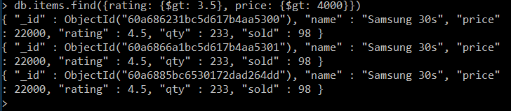
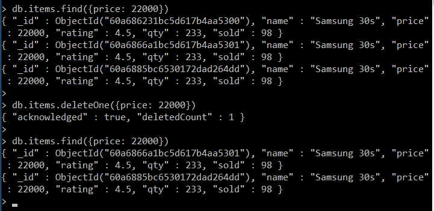
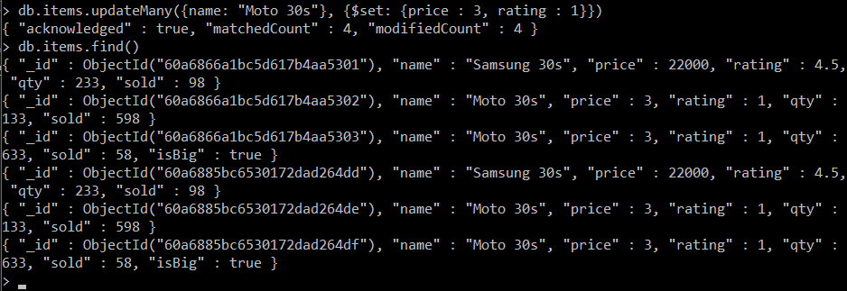

- [Tut 80](#tut-80)
- [Tut 81](#tut-81)
- [Insering Data in mongo DB](#insering-data-in-mongo-db)
- [Tut 82](#tut-82)
- [Querying a Database- Searching for data in MongoDB](#querying-a-database--searching-for-data-in-mongodb)
  - [Contents of DB- this is the result *without using any filter* :](#contents-of-db--this-is-the-result-without-using-any-filter-)
  - [By using a correct filter & an incorrect filter :](#by-using-a-correctfilter-an-incorrect-filter-)
  - [`gte`](#gte)
  - [`gt`](#gt)
  - [And Operator( `,` )](#and-operator--)
  - [`lt`](#lt)
  - [`lte`](#lte)
  - [`or`](#or)
  - [Projection parameter](#projection-parameter)
- [Tut 83](#tut-83)
- [Deleting Data from MongoDB](#deleting-data-from-mongodb)
- [Tut 84](#tut-84)
  - [Updating data from Mongo DB](#updating-data-from-mongo-db)
- [Tut 85](#tut-85)
  - [85 MongoDB Compass Mongoose](#85-mongodb-compass-mongoose)
  - [86](#86)

* * * 
* * * 

# Tut 80


- RDBMS, More Scalable
- Document oriented DataBase stores the data in the form of documents


> For 3rd point: 
> - lhs <=> RDBMS like MYSQL    &   
> - rhs <=> MongoDB
> - in comparision to MS EXCEL:

&larr; &rarr; &uarr; &darr;

Comparision between MongoDB and MS EXCEL
| MongoDB  | MS EXCEL |
| -------- | -------- |
| Database | Workbook |
| Tables   | Sheet    |
| Rows     | Rows     |

**BSON**: Simiar to JSON except the fact that here we have to declare the type of the data type (integer, char, etc.)


> **`mongod`**    =    *mongo demon* is the name of the process for running MongoDB, on running the process the DB will start mongo is a cmd shell for connecting to mongod, by using mongo we can also connect to mongod running on a different machine, instead of mongo we can also use python, nodejs for connecting to mongod

To start `mongo` first run `mongod` in a different terminal

> When there is no db created then it uses the default db: **`text`**

> `show dbs` command shows db which contain atleast 1 row

> On using command `use adarsh` : 
> - ***if*** :  db with name `adarsh` is already present then it uses that
> 
> - ***else*** : it creates a new db named `adarsh`
> 


* * * 
* * * 

# Tut 81

# Insering Data in mongo DB

`use harryKart` consider harryKart as a fictional e-comm website*

> **`insertOne()`** :
> 
> `db.items.insertOne({name: "Samsung 30s", price: 22000, rating: 4.5, qty: 233, sold: 98})`
> 
> 

*ये जो हमने बनाए है उसे **collection** कहा जाता है MongoDB मे, we can refer it as a table in RDBMS or a object in JS.*


> **`insertMany()`**
> 
> `db.items.insertMany([{name: "Samsung 30s", price: 22000, rating: 4.5, qty: 233, sold: 98}, {name: "Moto 30s", price: 29000, rating: 3.5, qty: 133, sold: 598}, {name: "Moto 30s", price: 129000, rating: 2.5, qty: 633, sold: 58, isBig: true}])`
> 
> 

*to get all items in present in the DB*
**`db.items.find()`**

- अगर हम `mongod` और `mongo` दोनों को बंद कर के फिर से start करे तो हमे अपना पुराना samsung वाला DB दिखेगा--जरूर दिखेगा

- जो हमने mongod process चलाई है वो commands को ले-ले कर _data directory_ मे data को store कर देगा, & since the data is stored there it'll persist there until we delete the data

Mongo gives unique id to all the elements that are added in the DB, so the Samsung 30s is added twice(dupicates) in the DB with ***different ids***

Primary(1°) key in MongoDB is `ObjectId` assigned by MongoDB itself

MongoDB doesn't enforce a schema on the tables (*like in SQL we have to insert data in same column, format, ...*), it's more like JS Objects, as seen in the following ex: 

`db.items.insertMany([{name: "Samsung 30s", price: 22000, rating: 4.5, qty: 233, sold: 98}, {name: "Moto 30s", price: 29000, rating: 3.5, qty: 133, sold: 598}, {name: "Moto 30s", price: 129000, rating: 2.5, qty: 633, sold: 58, isBig: true}])`


* * * 
* * * 

# Tut 82

# Querying a Database- Searching for data in MongoDB

## Contents of DB- this is the result *without using any filter* : 
`db.items.find()` :


## By using a correct filter & an incorrect filter :

- `db.items.find({"price": 3.5})`
- `db.items.find({"rating": 3.5})` - will return all objects with rating = 3.5


On applying correct filter we get 2 documents.


**Some Complex Filters**

## `gte`

`db.items.find({rating: {$gte: 3.5}})`

`gte` = *greater than equal to*


## `gt`

`db.items.find({rating: {$gt: 3.5}})`

`gt` = *greater than*


## And Operator( `,` )

`db.items.find({rating: {$gt: 3.5}, price: {$gt: 4000}})`



## `lt` 

`db.items.find({rating: {$lt: 3.5}, price: {$gt: 114000}})`


## `lte`

less than equal to


## `or`


`db.items.find({ $or: [ {rating: {$gt: 3.5}}, {"price": {$gt: 114000}} ] })`


## Projection parameter

`db.items.find({rating: {$gt: 3.5}}, {rating: 1}) `
- rating: 1 means that only rating will be shown, others like: price, name, qty won't be shown.


`db.items.find({rating: {$gt: 3.5}}, {rating: 1, qty: 1})`
- rating: 1, qty: 1 means that only rating and qty will be shown, others like: price, name, qty won't be shown.


* * * 
* * * 

# Tut 83

# Deleting Data from MongoDB

Has syntax similar to searching

- `show dbs`
- `use adarsh`
- `show collections`

- `db.items.find()`


- `db.items.find({price: 22000})`


Deleting Items from the MongoDB Database:

`db.items.deleteOne({price: 22000})`
- If Multiple *documents*(elements/object) exist for the command then it deletes the very first enry.
- will delete first entry in case of multi document match



deleteMany deletes all the matching entries


* * * 
* * * 

# Tut 84

## Updating data from Mongo DB

CRUD- Create Read Update & Delete - expected from any DB

- `show dbs` : shows all the databases
- `use adarsh` :  adarsh database को use करने के लिए
- `show collections` : collections in Mongo = Tables in RDBMS
- To create New Database : `use new_DB_Name` 
- `db.anotherCollection.insertOne({a : 123})`


`db.items.updateOne({filterObject}, {vlaueToBeChanged})`
`db.items.updateOne({name: "Moto 30s"}, {$price:2})`

> - on running command: `db.items.updateOne({name: "Moto 30s"}, {$set: {price:2}})`
> 

> - `db.items.updateMany({name: "Moto 30s"}, {$set: {price : 3, rating : 1}})`
> 
> 

!!!CRUD operations complete here!!!


* * * 
* * * 

# Tut 85

## 85 MongoDB Compass Mongoose

- run `mongod` on *powershell admin* and Open MongoDB Compass
- MongoDB Compass connects to process `mongod`

Mongoose
- Mongoose is used by NodeJS for connecting to `mongod`
- Mongoose is an Object Data Modeling(ODM) Library for MongoDB and Node.js
- It's just a layer b/w Node.JS and MongoDB


[Mongoose Getting Started](https://mongoosejs.com/docs/)

```javascript
const mongoose = require('mongoose');
mongoose.connect('mongodb://localhost/adarsh', {useNewUrlParser: true, useUnifiedTopology: true});

const db = mongoose.connection;
db.on('error', console.error.bind(console, 'connection error:'));
db.once('open', function() {
  // 
  console.log("We're connected to MongoDB");
});
```
Output: 


## 86
