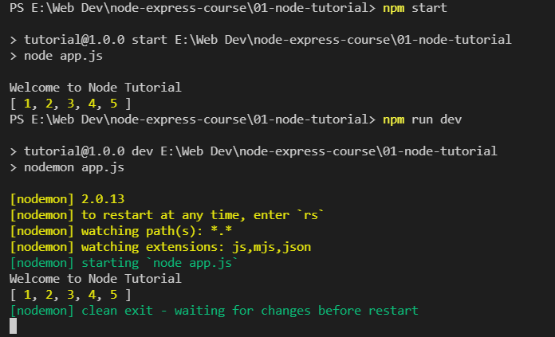
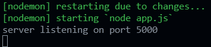
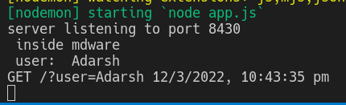

# Table of Contents 
- [Table of Contents](#table-of-contents)
- [NodeJS Tutorial](#nodejs-tutorial)
  - [Global Variables in NodeJS](#global-variables-in-nodejs)
  - [Modularizing Code](#modularizing-code)
  - [Built-in Modules](#built-in-modules)
    - [`os module`](#os-module)
    - [`path` module](#path-module)
    - [`fs` module](#fs-module)
    - [`http` module aka *server setup*](#http-module-aka-server-setup)
  - [npm - node package manager](#npm---node-package-manager)
  - [Event Loop](#event-loop)
  - [Async Patterns](#async-patterns)
  - [Events Emitter](#events-emitter)
- [Streams](#streams)
- [HTTP Requests](#http-requests)
  - [Setting Up Servers](#setting-up-servers)
      - [Notable well-known port numbers](#notable-well-known-port-numbers)
- [Express.js](#expressjs)
    - [Setting up a basic server in express js](#setting-up-a-basic-server-in-express-js)
    - [using `sendFile()` method](#using-sendfile-method)
  - [API Vs SSR](#api-vs-ssr)
  - [Setting Up API](#setting-up-api)
  - [Route Parameters](#route-parameters)
  - [Query String Parameter](#query-string-parameter)
      - [Example : Using Query String to filter data](#example--using-query-string-to-filter-data)
  - [MiddleWares in ExpressJS](#middlewares-in-expressjs)
    - [Using multiple middleware functions](#using-multiple-middleware-functions)
    - [One use Case of middleware : adding to `req` object from one route & accessing it from anotehr route.](#one-use-case-of-middleware--adding-to-req-object-from-one-route--accessing-it-from-anotehr-route)
    - [Options in Middleware : Built-in & Third-Party Middleware](#options-in-middleware--built-in--third-party-middleware)
  - [POST Method](#post-method)
    - [Case 1 : POST request using HTML](#case-1--post-request-using-html)
    - [Case 2 : POST request using JavaScript](#case-2--post-request-using-javascript)
  - [PUT Method](#put-method)
  - [DELETE Method](#delete-method)
  - [Express Router Setup : Grouping the routes](#express-router-setup--grouping-the-routes)
  - [Express Router Controllers](#express-router-controllers)


# NodeJS Tutorial
[TOC](#table-of-contents)

> Nodejs REPL 
> Read Eval Print Loop
> it's an interactive nodejs shell
>
>
> press tab twice in REPL & it'll show all the modules always available in Nodejs
> `_` is refered to as the previous variable/value used in the REPL, like:
> ```javascript
> > 65
> 65
> > _
> 65
>  _ + 3
> 68
> > "a"
> 'a'
> > _
> 'a'
> >
> ```

## Global Variables in NodeJS

[TOC](#table-of-contents)

> Note : `Window` object not present in NodeJS

These variables area accessible everywhere
> * `__dirname` - path to current directory
> * `__filename` - filename
> * `require` - function to use modules (CommonJS)
> * `module` - info about current module
> * `process` - info about environment where the program is being executed

---

## Modularizing Code

[TOC](#table-of-contents)

<div style="background-color: rgb(147, 8, 160);">

 CommonJS, every file is module (by default)
 
 Modules - Encapsulated Code (only share minimum)
</div>

<details>
<summary>Initial Code</summary>

```javascript
const secret = 'SUPER SECRET'
const john = 'john'
const peter = 'peter'

const sayHi = (name) => {
  console.log(`Hello there ${name}`)
}

sayHi('susan')
// sayHi(names.john)
// sayHi(names.peter)

```

</details>
</br>


> The `module` is an object containing an object `exports` which is accessible everywhere.<br/>
> We can add different items inside the `module.exports` **object** 

*Whenever we are importing a file then we are actually running the code present in that file see O/P image for more clarity.*

<details>
<summary><code>03-modules.js</code></summary>

```javascript
// CommonJS, every file is module (by default)
// Modules - Encapsulated Code (only share minimum)
const names = require('./04-names')
 /*here the name of the variable can be xyz as it is an object but the content of the object should be `john` and `peter` as while exporting them only that was written only*/

const sayHi = require('./05-utils') /*here the nae of the variable should be only sayHi
As only single item is added in module.exports and it is added directly and not in object.*/

const SomeVarName = require('./06-alternative-flavor') 
require('./07-mind-grenade')

sayHi('susan')
sayHi(names.john)
sayHi(names.peter)

/*On doing */ console.log("03: ", bake, '\n', sayHi, '\n', data); /*see output*/
```


</details>
</br>

<details>
<summary><code>04-names.js</code> Exporting Multiple Object</summary>

```javascript
// local
const secret = 'SUPER SECRET' /*Note that since `secret is not exported hence it is not excessible outside of this file`*/
// share
const john = 'john'
const peter = 'peter'

module.exports = { john, peter } /*here we are exporting an Object so to access the elements of the object we will have to first destructure it*/

console.log('04: \n', module.exports); //-> { john: 'john', peter: 'peter' }

```

</details>
</br>

<details>
<summary><code>05-utils.js</code> Exporting Single Object</summary>

```javascript
const sayHi = (name) => {
  console.log(`Hello there ${name}`)
}
// export default
module.exports = sayHi

console.log('05: \n', module.exports);  // -> [Function: sayHi]
// note that the o/p is a function and not an object containing a function inside.

```

</details>
</br>


<details>
<summary><code>06-alternative-flavor.js</code></summary>

```javascript
module.exports.items = ['item1', 'item2']
const person = {
  name: 'bob',
}

module.exports.singlePerson = person /*we are able to do this bcoz module.exports is an object */

/*Since we are exporting multiple items so it will be exported via an object
Is's exactly the same as we are doing in `4-name.js`*/

console.log("06: \n", module.exports); //-> { items: [ 'item1', 'item2' ], singlePerson: { name: 'bob' } }

```

</details>
</br>

<details>
<summary><code>07-mind-grenade.js</code></summary>

```javascript
const num1 = 5
const num2 = 10

function addValues() {
  console.log(`07: \nthe sum is : ${num1 + num2}`)
}

addValues()
/*Note that on importing the file in 3-modules.js file we are actually only running the Code,
bcoz at the end of this file we are calling the function `addValues()`*/
```

</details>
</br>

---

## Built-in Modules

[TOC](#table-of-contents)

### `os module`
<details>
<summary><code>08-os-module.js</code></summary>

```javascript
const os = require('os')

// info about current user
const user = os.userInfo()
console.log('user: \n', user)

// method returns the system uptime in seconds
console.log(`The System Uptime is ${os.uptime()} seconds`)

const currentOS = {
  name: os.type(),
  release: os.release(),
  totalMem: os.totalmem(),
  freeMem: os.freemem(),
}
console.log('currentOS: \n', currentOS)

```
Windows 10.


Linux:

</details>
</br>

### `path` module
Allows access to file paths

<details>
<summary><code>09-path-module.js</code></summary>

```javascript
const path = require('path')

console.log(path.sep)
/* returns platform specific seperator
 * for windows it's '\'
 * linux '/'
 **/

const filePath = path.join('content', 'subfolder', 'test.txt')
/*Join all arguments together and normalize the resulting path.*/
console.log(filePath)

const base = path.basename(filePath)
/*Return the last portion of a path
Often used to extract the file name from a fully qualified path*/
console.log(base)

const absolute = path.resolve(__dirname, 'content', 'subfolder', 'test.txt')
/**
 * __dirname - वो js file कौन से folder मे है
 */
console.log(absolute)

```

</details>
</br>

### `fs` module

<details>
<summary><code>readFileSync writeFileSync</code></summary>

```javascript
const { readFileSync, writeFileSync } = require("fs");

let text = readFileSync("exp.txt", "utf-8");//args: filename, encoding
//it's Synchronous or Blocking.

console.log("original text inside exp.txt");
console.log(text);

text = text.replace("content", "सामगरी");
console.log(text);

let text2 = readFileSync('./tut64_sample/abc.txt', 'utf-8');
console.log(text2);

console.log("========\ncreating a new file...\n");
writeFileSync("new_exp.txt", text);//It's Synchronous or Blocking code (tut65.js)

console.log('======\nI don\'t know why I\'m doing this but i\'m doing  it. I am making a new file');
writeFileSync('./tut64_sample/nayka.txt', `maine ye ku likha mujhe pata nhi`, 'utf-8')

console.log('=====Using absolute link=====');
let text3 = readFileSync('E:/Web Dev/NodeJS Express CWH/tut64_sample/abc.txt', 'utf-8')
console.log(text3);
```

</details>
</br>

note: I don't know why but file `10-fs-sync.js` didn't worked for me.<br/>
It was not running bcoz I was in the *`node-express-course`* , it'll work if I go to *`01-node-tutorial`* folder, **perhaps** because it is an npm folder.


<details>
<summary><code>{ flag: 'a' }</code></summary>

```javascript
console.log('*.*.*.*.*.*.*.*.*.*.*\n Appending to a file');
writeFileSync("./tut64_sample/nayka.txt",
    '\nइस file का नाम नयका है',
    { flag: 'a' }
)
console.log('Appending done check => `./tut64_sample/nayka.txt`\n*.*.*.*.*.*.*.*.*.*.*\n');
```

</details>
</br>

<details>
<summary><code>readFile writeFile : 11-fs-async.js</code></summary>

> Note the ***nesting*** done here

I'll be reading from two files `a.txt` & `b.txt` and writing them into `res_fs_async.txt`

```javascript
const { readFile, writeFile } = require("fs");

/**I'll be reading from two files a.txt & b.txt and writing them into res_fs_async.txt */

readFile('./tut64_sample/a.txt', 'utf-8', (err, data) => {
    if (err) {
        console.log(err);
        return;
    }
    console.log(data);
    const a = data;

    readFile('E:/Web Dev/NodeJS Express CWH/tut64_sample/b.txt', 'utf-8', (err, data) => {
        if (err) {
            console.log(err);
            return;
        }
        console.log(data);
        const b = data;

        writeFile('./res_fs_async.txt', `नया data ये है:\na: ${a}\nb:${b}`, (err) => {
            console.log(err);
            return;
        })
    })
})
```

Output:<br/>

</details>
</br>


> ✨🕸🔥🎆🎇<br/>
> ---Synchronous or Blocking---
> * Line by line execution.
> * `readFileSync()` opeation synchronously reads the file and execution of the next line of code is not done until the  reading of the current file is not done
> example:
> ```javascript
> const fs = require("fs");
> let text = fs.readFileSync("exp.txt", "utf-8");
> console.log("the content of the file is:");
> console.log(text);
> ```
> output:<br/>
> 
<br/>

> ✨🕸🔥🎆🎇<br/>
> --- Asynchronous or non-Blocking ---
> * line by line execution not guranteed.
> * callbacks will fire after the Asynchronous block of code.
> * जब हम Asynchronous code लिखते है तब वो background मे चलता रहता है जबतक वो अपना पुरा execution नही कर लेता.
> * और till the time being उस Asynchronous block of code के बाद जो code hai wo run करता रहेगा.
> * जब भी Asynchronous block of code का execution हो जायेगा तब उसका callback function fire होगा.
> * CODE IS ALWAYS EXECUTED LINE-BY-LINE!!!
> * but यहा ऐसा प्रतित होता है की code line-by-line execute नही होता है.
> 
> example:
> ```javascript
> let text2 = fs.readFile("exp.txt", "utf-8", (err, data) => {
>     //a call-back function is required by readFile()
>     //readFile is asynchronous function
>     console.log(data);
> });
> console.log("this is a message");
> ```
> Output:<br/>
> 


[Nodejs works on non-blocking I/O model](https://blog.cloudboost.io/why-is-node-called-a-non-blocking-i-o-model-eb639063bc14)


### `http` module aka *server setup*

[TOC](#table-of-contents)

1. intro


```js
const http = require("http")

const server = http.createServer((req, res) => {
    // req -> request from the client
    // res-> response from the server
    console.log(req);
    /* note that if we do not restart the page in browser till then nothing prints into 
    the console since the server is waiting for the request for it to provide the 
    response, until there is any request the server will not do anything not even 
    log into the console, but as soon as we reresh the browser window then the client 
    (here browser) makes request to our server and server sends the response */
    res.write('welcome to our home page')
    res.end();// this denotes the end of the request
})

server.listen(5000)// the server will listen to all the requests at port no.:5000

```

Output : 

1. 
```javascript
const http = require("http")
const server = http.createServer((req, res) => {
    console.log(req.url);
    if (req.url === '/') {
        res.write('welcome to our home page')
        res.end()
    }
    if (req.url === '/about') {
        res.end('about page')
    }
    /**res.write('welcome to our home page');
     * res.end();
     * I had not removed this part earlier and it was showing error for some reason
     */
})
server.listen(5000)
```

2. &rarr; this is error वाला approach
```js
const http = require("http")
const server = http.createServer((req, res) => {
    console.log(req.url);
    if (req.url === '/') {
        res.write('welcome to our home page')
        res.end()
    }
    if (req.url === '/about') {
        res.end('about page')
    }
    res.end(`
    <h1>Oops!</h1>
    <p> this page don't exist</p>
    <a href='/'>back home</a>
    `)
    // writing html
})
server.listen(5000)
```

3. &rarr; corrected &rarr; use if-else-if
```js
const http = require("http")
const server = http.createServer((req, res) => {
    console.log(req.url);
    if (req.url === '/') {
        res.write('welcome to our home page')
        res.end()
    }
    else if (req.url === '/about') {
        res.end('about page')
    }
    else {
        res.end(`
    <h1>Oops!</h1>
    <p> this page don't exist</p>
    <a href='/'>back home</a>
    `)
    }
})
server.listen(5000)
```


## npm - node package manager

[TOC](#table-of-contents)

contains range of useful utility functions to full-blown frameworks and libraries
ex: React has create react app package and it is hosted on the npm.
A typical node project will have more than few npm packages installed as dependencies

npm calls the reusable code a package

a package essentially is a folder that contains a javascript known as modules and dependencies


Using `lowdash`:


Installing a module as a `dev-dependency`

```bash
npm i nodemon --save-d
# or
npm i nodemon -D
```

Installing a specific version of a module: 

```bash
npm install express@4.17.1
```

setting up `scripts` in `package.json`:
```json
"scripts": {
    "start": "node app.js",
    "dev": "nodemon app.js"
  },
```
For some commands we can use commands like : `npm start`, but for some we can use commands like: `npm run dev` <br/>
Now to run it we will do:<br/>
<br/>

Note that the commands should be `npm start` or `npm run start`  but for `dev` it should i=only be `npm run dev`

Installing package globally : `npm install -g nodemon` <br/>
Now the command `nodemon app.js` works properly

Better to set up these kinds of dependencies locally in `devDependencies` or use `npx` , Installing them globally may sometime give errors

`package-lock.json` contains details( such as version) of dependencies की dependencies


## Event Loop

[TOC](#table-of-contents)

[NodeJS Event Loop](https://nodejs.dev/learn/the-nodejs-event-loop)

> It explains how Node.js can be asynchronous and have non-blocking I/O.
> 
> The Node.js JavaScript code runs on a single thread. There is just one thing happening at a time.
> 
> This is a limitation that's actually very helpful, as it simplifies a lot how you program without worrying about concurrency issues.

&emsp; &emsp; Synchronous JS: Blocking JS<br/>
&emsp; &emsp; &emsp; &emsp; &darr; <br/>
 

&emsp; &emsp; Asynchronous JS: Non-Blocking<br/>
&emsp; &emsp; &emsp; &emsp; &darr; <br/>
<br/>
This happens because the `setTimeout()` function is Asynchronous<br/>
Run the Immediate code firxt & then if time permits run the callback, so
in case if I have 100 `console.log()` tasks after *`third`* then also they will run first
and only after that the second task would execute, *regardless of what time is set*


Note that the setInterval is also Asynchronous so it ofloaded, and here the process continues forever unless it is forced stop


Notes :
Requests coming in &rarr; 1st register the callback &rarr; operation is complete &rarr; instead of executing the callback right away it *effectively* gets put at the end of the line & then when there is no Immediate code to run then we execute the callback.
It helps us offload some time consuming OPs.

<details>
<summary><code>1-event-loop-examples\1-read-file.js</code></summary>

```javascript
const { readFile, writeFile } = require('fs')

console.log('started a first task')
readFile('./content/first.txt', 'utf8', (err, result) => {
  if (err) {
    console.log(err)
    return
  }
  console.log(result)
  console.log('completed first task')
})
console.log('starting next task')
```

</details>
</br>

Every time there is some Asynchronous Code it's gonna be ofloaded and it is executed only when the tast is completed

<details>
<summary><code>1-event-loop-examples\4-server.js</code></summary>

```javascript
const http = require('http')
const server = http.createServer((req, res) => {
  console.log('request event')
  res.end('Hello World')
})
server.listen(5000, () => {
  console.log('Server listening on port : 5000....')
})
```

</details>
</br>

Note that the `server.listen()` function is ***asynchronous*** and the **Event Loop** is waiting for the requests and responding to it

Example : ***Effect of a blocking code on different requests***
<details>
<summary><code>OK Code:✅</code></summary>

```javascript
const http = require('http')

const server = http.createServer((req, res) => {
    if (req.url === '/') {
        res.end('Home Page')
        /**above line is equivalent to the following two:
         * res.write('Home Page')
         * res.end()
         */
    }
    if (req.url === '/about') {
        res.end('About Page')
    }
})
server.listen(5000, () => {
    console.log(`Server is Listening at port 5000`);
})
```
Everything is Good<br/>

</details>
</br>

<details>
<summary><code>Blocking Multile normal Requests because of one slow request </code></summary>

```javascript
const http = require('http')

const server = http.createServer((req, res) => {
    if (req.url === '/') {
        res.end('Home Page')
    }
    if (req.url === '/about') {
        // !! Blocking Code
        for (let i = 0; i < 30; i++) {
            for (let j = 0; j < 1000; j++) {
                console.log(`${i}-${j}`);
            }
        }
        res.end('About Page')
    }
})
server.listen(5000, () => {
    console.log(`Server is Listening at port 5000`);
})
```

Everything is not good and all the requests are blocked because of a single Blocking Code:


</details>
</br>


## Async Patterns

[TOC](#table-of-contents)

[JavaScript Promises](https://www.w3schools.com/js/js_promise.asp)

<div style="color: rgb(1 201 191);">
"I Promise a Result!"<br/>
"Producing code" is code that can take some time<br/>
"Consuming code" is code that must wait for the result<br/>
A Promise is a JavaScript object that links producing code and consuming code<br/>
</div>
<br/>

<div style="color: rgb(244, 117, 255);"><code>async</code> के अंदर <code>await</code> करते है</div>

<details>
<summary>Using JS Promise Object to <code>readFile()</code></summary>

```javascript
const getFile = (path) => {
    /**This is our Wrapper function */
    return new Promise((resolve, reject) => {
        /** "Producing Code" (May take some time) */
        readFile(path, 'utf-8', (err, data) => {
            if (err) {
                reject(err) // when error
            }
            else {
                resolve(data) // when successful
            }
        })
    })
}
/* Method-1 */
getFile('./tut64_sample/a.txt')
    .then(function (result) {
        //this is success function
        console.log(result)
    })
    .catch((err) => {
        //this is error function
        console.log(err);
    })
/* --------end----Method-1------- */

// ---------OR---------

/* -------Method-2------- */
getFile('./tut64_sample/a.txt').then(
    (result) => console.log(result)
    ,
    (err) => console.log(err)
)
/* --------end----Method-3------- */

// -----------OR------------

/* ---------Method-3------- */
const start = async () => {
    // reading both first and second file in sequence
    try {
        const first = await getText('./tut64_sample/a.txt')
        const second = await getText('./tut64_sample/b.txt')
        console.log(first, '-------', second);
    } catch (error) {
        console.log(error);
    }

}
start()
/* --------end----Method-3------- */
```
</details>
</br>

Alternative to `11-fs-async.js`:
<details>
<summary style="color: rgb(244, 117, 255);">This is alternative to the Nested way of reading and writing to a file</summary>

Using module `util`

```javascript
const { readFile, writeFile } = require("fs");
const util = require('util')
const readFilePromise = util.promisify(readFile)
const writeFilePromise = util.promisify(writeFile)
const start = async () => {
    try {
        const first = await readFilePromise('./tut64_sample/a.txt', 'utf-8')
        const second = await readFilePromise('./tut64_sample/b.txt', 'utf-8')
        console.log(first, '-------', second);
        await writeFilePromise('./tut64_sample/result_a_b.txt',
            `\n----now-appending----This the result of util module: \n first: ${first}\nsecond: ${second}`,
            { flag: 'a' })
    } catch (error) {
        console.log(error);
    }

}

start()
```

using `promises` property of `fs` module
```javascript
const { readFile, writeFile } = require("fs").promises

const start = async () => {
    try {
        const first = await readFile('./tut64_sample/a.txt', 'utf-8')
        const second = await readFile('./tut64_sample/b.txt', 'utf-8')
        console.log(first, '-------', second);
        await writeFile('./tut64_sample/result_a_b.txt',
            `\n----now-appending----This the result of util module: \n first: ${first}\nsecond: ${second}`,
            { flag: 'a' })
    } catch (error) {
        console.log(error);
    }
}

start()
```

Final O/p:


</details>
</br>


## Events Emitter

[TOC](#table-of-contents)

**Event Driven Programming in Node JS**

> **Event Driven Programming** : a style in which the flow of the program is at least in part determined by the events that occur as the program executes.

ex : in BrowserJS it could be like : on button click do something, on mouse hover do something.

The idea is like:
1. we ***listen*** for specific events &
2. ***register*** functions that will execute in response to those events. 
3. Once our events takes place callback function fires up.

`event` module

```javascript
const EventEmitter = require('events');

const customEvent = new EventEmitter();
customEvent.on('response', () => {
    console.log(`response data received`);
})

customEvent.emit('response')
```

If this doesn't make sense now &rarr; continue reading examples 

Note that `customEvent` is object of `EventEmitter`

`.on()` function : listen for a specific event | कौन से event को Listen करना है 

`.emit()` function : emit that event | वो event हो जाने पर क्या करना है

note that here `response` is the what we are listening for

The callback function in the `on()` function will fire up only when the `emit()` function is executed

We can add multiple functions to a single event like:

```javascript
const EventEmitter = require('events');

const customEvent = new EventEmitter();
customEvent.on('response', () => {
    console.log(`response data received`);
})
customEvent.on('response', () => {
    console.log(`some other logic here`);
})

customEvent.emit('response')
```


The order matters while we are writing `on()` & `emit()` functions `on()` functions should always be above the `emit()` function.

<details>
<summary>The following code will not prduce any O/P</summary>

```javascript
const EventEmitter = require('events');

const customEvent = new EventEmitter();

customEvent.emit('response')
customEvent.on('response', () => {
    console.log(`response data received`);
})
customEvent.on('response', () => {
    console.log(`some other logic here`);
})
```

</details>

Because i first emit the event and only then i listen for it. This doesn't makes sense

</br>
<details>
<summary>Passing arguments in the emit() function an receiving them as arguments in the callback function(s) of the on() function</summary>
The arg is accepted in the manner we pass them and if we don't pass them then also it's not a problem

```javascript
const EventEmitter = require('events');

const customEvent = new EventEmitter();
customEvent.on('response', () => {
    console.log(`response data received`);
})
customEvent.on('response', (name, num) => {
    console.log(`some other logic here: "${name}" & "${num}"`);
})
customEvent.on('response', (name) => {
    console.log(`some other logic here: "${name}"`);
})

customEvent.emit('response', 'adarsh', 123)
```

</details>
</br>


> we go with `http.createServer()` and then we pass in this callback function and then of course this callback function will be invoked every time someone visits our server.
> 
> We can use EventEmitter API to setup the server
> 
> instead of passing in the callback function we will do the following:

```javascript
const http = require('http')

// const server = http.createServer((req, res) => {
//   res.end('Welcome')
// })

// Using Event Emitter API
const server = http.createServer()
// emits request event
// subcribe to it / listen for it / respond to it
server.on('request', (req, res) => {
  res.end('Welcome')
})

server.listen(5000)
```

[Http extends EventEmitter](https://nodejs.org/API/http.html#http_event_response)


# Streams

[TOC](#table-of-contents)

Streams are used to read or write sequentially

Types of Streams: 

* **Readable** : used to read data sequentially
* **Writeable** : used to write data sequentially
* **Duplex** : used to write read and data sequentially
* **Transform** : In this data can be modified when writing or reading

Streams extend EventEmitter class.

When we use the sync or asynchronous approach while reading the whole file and setting it equal to a variable and if we have a big file then the following issues can occur
1. A lot of memory will be used up
2. As the file size gets larger so that we cann't place everything in one string.

`createReadStream()` is a method that reads the data of the file in <u>***chunks***</u>

I have created a file *0-big.txt* of file size 165KB. And to read that file we will be using `createReadStream()` function

```javascript
// Creating 0-big.txt
const { writeFileSync } = require('fs')
for (let i = 0; i < 10000; i++) {
  writeFileSync('0-big.txt', `hello world ${i}\n`, { flag: 'a' })
}
```


```javascript
const { createReadStream } = require("fs")

const fileContentStream = createReadStream('./0-big.txt')
fileContentStream.on('data', (result) => {
    console.log(result);
})
fileContentStream.emit('data')
```
O/P: 

Notice that we are reading the data in multiple chunks in of 65486 Bytes i.e., 64KB

A `readStream` is created when we use `createReadStream()` and invoke it

Instances of *class* `<fs.ReadStream>` are created and returned using the `fs.createReadStream()` function.
Class `fs.ReadStream` *extends* `<stream.Readable>`

* For streams that are not operating in object mode, the chunk will be either a string or Buffer
* For streams that are in object mode, the chunk can be any JavaScript value other than null.

Default size of Buffer 64KB. To change the buffer size we can do:

```javascript
const { createReadStream } = require("fs")

const fileContentStream = createReadStream(
    './tut64_sample/big.txt',
    { highWaterMark: 90000, encoding: 'utf-8' })
    // highWaterMark Controls the size of the Buffer

fileContentStream.on('data', (result) => {
    console.log(result);
})
```
<u>Note that I haven't used emit() function</u>


the O/p seems in text bcoz the encoding is utf8 or else it would be like the o/p in above Screenshot.

<details>
<summary>In Case of error</summary>

```javascript
const { createReadStream } = require("fs")

const fileContentStream = createReadStream(
    '../tut64_sample/big.txt',
    { highWaterMark: 90000, encoding: 'utf-8' })
fileContentStream.on('data', (result) => {
    console.log(result);
})

fileContentStream.on('error', (err) => {
    console.log(err);
})

// Note that I haven't used emit() function
```
O/P: 
</details>
</br>

[FCC NodeJS Streams](https://www.freecodecamp.org/news/node-js-streams-everything-you-need-to-know-c9141306be93/)

`readableSource.pipe(writableDestination)`


<br/><br/>

**Practical UseCase of Streams**

Creaiing a much bigger file- `big.txt` of size: 1.03 MB  & then serving it on port 5000

on writing the code:

```javascript
const http = require('http')
const { readFileSync } = require('fs')
http
    .createServer((req, res) => {
        const text = readFileSync('./tut64_sample/big.txt', { encoding: 'utf-8' })
        res.end(text);
    })
    .listen(5000)
```

The data transmitted over the network:

1. 
2. 

Code 2 : Sending data in chunks :

```javascript
var http = require('http')
var fs = require('fs')

http
    .createServer(function (req, res) {
        // const text = fs.readFileSync('./content/big.txt', 'utf8')
        // res.end(text)
        const fileStream = fs.createReadStream('./content/big.txt', 'utf8')
        fileStream.on('open', () => {
            fileStream.pipe(res)
        })
        fileStream.on('error', (err) => {
            res.end(err)
        })
    })
    .listen(5000)

```

`pipe()` method is used to push data from `ReadStream` to `WriteStream`. It hepls in writing data in chunks


the memory used up is same but it is better as it is chunked

<br/>

# HTTP Requests

[TOC](#table-of-contents)


The general structure for both messages is similar they both have a start line,
both have optional headers (a blank line indicating that all the meta info has
been sent and effectively headers are that meta info) & an optional body 
Request messages are what the user is sending.

Request Message:
* When the user is requesting something & it just want the resource then there is no body.
* If we want to add a resource to the server then we need to provide that data (payload)

Response Message:
* In header we provide info about our res. msg.


***GET is the default request made by the browser***

in POST request we have to send some payload in the http url

in Headers we provide info. about Response/Request message.


so you go into the browser you request a resource (by default it is a get request) and then in that body when the server sends the html of the site .


## Setting Up Servers

[TOC](#table-of-contents)

* `http` is built-in module
* In computer networking, a `port` is a ***`communication endpoint`***
* At software level withi an OS a port is a logical construct that identifies a specific process or a type of network service.

[Wikipedia- Port (computer networking)](https://en.wikipedia.org/wiki/Port_(computer_networking))

#### Notable well-known port numbers

| Number | Assignment                                                         |
| ------ | ------------------------------------------------------------------ |
| 20     | File Transfer Protocol (FTP) Data Transfer                         |
| 21     | File Transfer Protocol (FTP) Command Control                       |
| 22     | Secure Shell (SSH) Secure Login                                    |
| 23     | Telnet remote login service, unencrypted text messages             |
| 25     | Simple Mail Transfer Protocol (SMTP) email delivery                |
| 53     | Domain Name System (DNS) service                                   |
| 67, 68 | Dynamic Host Configuration Protocol (DHCP)                         |
| *80*   | *Hypertext Transfer Protocol (HTTP) used in the World Wide Web*    |
| 110    | Post Office Protocol (POP3)                                        |
| 119    | Network News Transfer Protocol (NNTP)                              |
| 123    | Network Time Protocol (NTP)                                        |
| 143    | Internet Message Access Protocol (IMAP) Management of digital mail |
| 161    | Simple Network Management Protocol (SNMP)                          |
| 194    | Internet Relay Chat (IRC)                                          |
| 443    | HTTP Secure (HTTPS) HTTP over TLS/SSL                              |


On setting up the server like this: 
```javascript
const http = require('http')

const server = http.createServer((req, res) => {
   console.log('user hit the server');
})

server.listen(5000)
```

> If we visit the website from the browser i.e. user has hit the server but the browser will continue to wait for the response until and unless it receives some response
> 
> The method `response.end()` should always be used in order to provide some response to the browser
> 
> That method must be called on each response

1. We aren't providing any meta data about the body that we're sending back
2. localhost:5000/xyz is alse sending same response as localhost:5000

`res.writeHead()` to provide header and status code: header is object by which browser knows what to do with the response received

* **200** it's statusCode
* `{'content-type': 'text/html' }` is a MIME Type it tells browser that I am sending `HTML`, `CSS`, or `Image`

```javascript
const http = require('http')

const server = http.createServer((req, res) => {
   console.log('user hit the server');
   res.writeHead(200, { 'content-type': 'text/html' })
   res.write('<h1>Home Page</h1>')
   res.end()
   /**OR
    * res.end('<h1>Home Page</h1>')
    */
})

server.listen(5000)
```
O/P: 

and for the following MIME Type:
```javascript
res.writeHead(200, { 'content-type': 'text/plain' })
```
O/P: 

[HTTP response status codes- moz://a](https://developer.mozilla.org/en-US/docs/Web/HTTP/Status)

[MIME types (IANA media types) - moz://a](https://developer.mozilla.org/en-US/docs/Web/HTTP/Basics_of_HTTP/MIME_types)

**request object**
* res.method : Tells what kind of request it is i.e., GET, POST,...
* res.url : user is trying to access the resource by the name of `/blah_blah_blah` or just `/`


**Setting Up Server**

<details>
<summary><code>index.html</code></summary>

```html
<!DOCTYPE html>
<html lang="en">

<head>
   <meta charset="UTF-8">
   <meta http-equiv="X-UA-Compatible" content="IE=edge">
   <meta name="viewport" content="width=device-width, initial-scale=1.0">
   <title>Document</title>
</head>

<body>
   <h1>Home Page</h1>
   <h4>नमसकरम् पृथ्वी</h4>
</body>

</html>
```

</details>
</br>


```javascript
const http = require('http')
const { readFileSync } = require('fs')
const homePage = readFileSync('./index.html')
/**we are using readFileSync here because we are reading the file only once
 * i.e., only at the start of the server */
const server = http.createServer((req, res) => {
   console.log('user hit the server');
   const url = req.url
   console.log(req.method);
   console.log(req.url);

   if (url === '/') {
      //home page
      res.writeHead(200, { 'content-type': 'text/html' })
      res.write(homePage)
      res.end()
   }
   else if (url === '/about') {
      //about page
      res.writeHead(200, { 'content-type': 'text/html' })
      res.write('<h1>About Page</h1>')
      res.end()
   }
   else {
      //styles
      res.writeHead(404, { 'content-type': 'text/html' })
      res.write('<h1>page not found</h1>')
      res.end()
   }
})

server.listen(5000)
```
Note that if I go with the link `localhost:5000/about/xyz` or `localhost:5000/about` then it'll also br `404`

Serving the `navbar-app`

The Problem: 

Normally the look of the `navbar-app` is : <br/>


> after changing the above code as : `const homePage = readFileSync('./navbar-app/index.html')`<br/>
> 

<br/>

Observation: 

The following end points are being requested:<br/>


that is we will have to read and serve the `style.css`, `logo`, `javascript` as well

<details>
<summary>Final Server</summary>

Pretty Big Server code

```javascript
const http = require('http')
const { readFileSync } = require('fs')
const homePage = readFileSync('./navbar-app/index.html')
const homeStyle = readFileSync('./navbar-app/styles.css')
const homeImage = readFileSync('./navbar-app/logo.svg')
const homeLogic = readFileSync('./navbar-app/browser-app.js')
// we are using sync here because we are reading the file only once i.e., only at the start of the server
const server = http.createServer((req, res) => {
   // console.log('user hit the server');
   const url = req.url
   // console.log(req.method);
   console.log(req.url);

   if (url === '/') {
      //home page
      res.writeHead(200, { 'content-type': 'text/html' })
      res.write(homePage)
      res.end()
   }
   else if (url === '/about') {
      //about page
      res.writeHead(200, { 'content-type': 'text/html' })
      res.write('<h1>About Page</h1>')
      res.end()
   }
   else if (url === '/styles.css') {
      //styles
      res.writeHead(200, { 'content-type': 'text/css' })
      res.write(homeStyle)
      res.end()
   }
   else if (url === '/logo.svg') {
      //logo Img
      res.writeHead(200, { 'content-type': 'image/svg+xml' })
      res.write(homeImage)
      res.end()
   }
   else if (url === '/browser-app.js') {
      //javascript logic
      res.writeHead(200, { 'content-type': 'text/javascript' })
      res.write(homeLogic)
      res.end()
   }
   else {
      //404 error page
      res.writeHead(404, { 'content-type': 'text/html' })
      res.write('<h1>page not found</h1>')
      res.end()
   }
})

server.listen(5000)
```
O/P:

</details>
</br>

<br/><br/><br/>

# Express.js

[TOC](#table-of-contents)

[ExpressJS](https://expressjs.com/)

ExpressJS is built on top of node `http` module.

```javascript
const express = require('express')
const app = express() // <- this line will give us a server instance
//or
// const app = require('express')()

app.listen(5000, () => {
   // when we will instantiate the server we will run this function
   console.log('server is listening on port 5000');
})

/*
app.get()
app.post()
app.put()
app.delete()
app.all()
app.use()
app.listen()
*/
// use() is for middleware
```

Syntax is very similar to our previous example.
In the prev example the `http.createServer(...)` was assigned to a variable `server`
Here we are assigning it to a variable `app`

[express = require("express");  app = express();](https://stackoverflow.com/questions/27599614/var-express-requireexpress-var-app-express-what-is-express-is-it/27599657#27599657)

> * `express` is a function that also has properties on it that are also functions (methods).That's why you can create an `Application` object via `express()`, but also use `express.static(/*...*/)` to set up serving static files.
> 
> * `var app = express();` ==> Calls the express function `express()` and puts new Express application inside the `app` variable. It's something like you are creating an object of a class. Where `express()` is just like class and `app` is it's newly created object.
> 
> * Functions (and thus methods) in JavaScript are objects, so they can have properties, and those properties can refer to functions

### Setting up a basic server in express js

```javascript
const express = require('express')
const app = express()

app.get('/', (req, res) => {
   /**
    this callback function will be invoked every time user is
    performing a get request on our root so basically on our domain
    */
   res
      .status(200)
      .send('Home Page')
})

app.get('/about', (req, res) => {
   res
      .status(200)
      .send('About Page')
})

app.all('*', (req, res) => {
   //for everything the user is trying to do in our site
   res
      .status(404)
      .send('<h1>Resource Not Found</h1>')
   //the send() and send() are chained
})

app.listen(5000, () => {
   console.log('server is listening on port 5000');
})
```

### using `sendFile()` method

<!-- <details> -->
<!-- <summary> -->
Serving <code>navbar-app</code> example using Express
<!-- </summary> -->

Create a folder `./public` in the same directory and copy and paste the files logo, styles, browser-app into it.

```javascript
const path = require('path')
const express = require('express')
const app = express()

// setup static and middleware
app.use(express.static('./public'))
/**
 * after the above line all files present in the public folder 
 * are served as static files.
 */

app.get('/', (req, res) => {
   res.sendFile(path.resolve(__dirname, './navbar-app/index.html'))
   /**Note that we are providing ABSOLUTE PATH here to the `sendFile()` method
    * 
     * if I only write this without serving the static css files then
     * only html will be shown
    */
})

app.all('*', (req, res) => {
   // for all the requests that will hit 404
   res.status(404).send('Resource Not found')
})

app.listen(5000, () => {
   console.log('server is listening to port 5000.... ');
})
```

<!-- </details> -->
Note that inside `./navbar-app/index.js` the ***location of css & js*** files are mentioned as :
```html
...
<!-- styles -->
    <link rel="stylesheet" href="./styles.css" />
  </head>
  ...
  <!-- javascript -->
    <script src="./browser-app.js"></script>
  </body>
```

</br>

> static asset = the assets that the server doesn't need to change like: images, css, js file(s)<br/>
> In http module to serve a image we have to set and endpoing for every single static File<br/>
> In express we can just set it up by placing them all in `./public` folder and dump all assets there.


There are two ways of serving the `index.html` file:
1. dumping it into `./public` folder
2. using SSR

method 1 does work properly
```javascript
const path = require('path')
const express = require('express')
const app = express()

// setup static and middleware
app.use(express.static('./public'))

// app.get('/', (req, res) => {
//    res.sendFile(path.resolve(__dirname, './navbar-app/index.html'))
// })

app.all('*', (req, res) => {
   res.status(404).send('Resource Not found')
})

app.listen(5000, () => {
   console.log('server is listening to port 5000.... ');
})
```

when it comes to express in most cases you'll use one of the two following options you'll use it to set up API or templates with server side rendering

## API Vs SSR

[TOC](#table-of-contents)


**API**
* In <u>*http case*</u> when we talk about API we mean setting up an <u>*http interface to interact with our data*</u>. Data is sent using JSON using `res.json()`

**SSR**
* In server side rendering where we will set up templates and send back entire html, css and javascript ourselves using `res.render()`


## Setting Up API

[TOC](#table-of-contents)

`res.json([body])`
Sends a JSON response. This method sends a response (with the correct content-type & statusCode) that is the parameter converted to a JSON string using `JSON.stringify()` by default.

Basic API Setup:🎉🥳🎊

```javascript
const express = require('express')
const app = express()

app.get('/', (req, res) => {
   res.json([{ name: 'john' }, { name: 'susan' }])
   // Note that it is an array of objects
})

app.listen(5000, () => {
   console.log('server listening to port 5000');
})
```


Setting up JS objects in `data.js` file in API.

```javascript
const express = require('express')
const app = express()
const { products, people } = require("./data.js")
app.get('/', (req, res) => {
   res.json(products)
})

app.listen(5000, () => {
   console.log('server listening to port 5000');
})
```
<br/>


Instead of sending everything in the API we can send some specefic items

```javascript
const express = require('express')
const app = express()
const { products, people } = require("./data.js")
app.get('/', (req, res) => {
   // res.json(products)
   res.send('<h1>Home Page</h1>  <a href="/api/products">products</a>')
})
app.get('/api/products', (req, res) => {
   // res.json(products)
   // sending products without the `desc` key
   const newProducts = products.map((product) => {
      const { id, name, image, price } = product
      return { id, name, image, price }
   })
   res.json(newProducts)
})
app.listen(5000, () => {
   console.log('server listening to port 5000');
})
```

## Route Parameters

[TOC](#table-of-contents)

&rarr;  Setting server so that from the site `localhost:5000/api/products/1` I'll get info. only about the `first` product &larr;

```javascript
app.get('/api/products/:productID', (req, res) => {
   console.log(req.params);
   const { productID } = req.params
   const singleProduct = products.find((product) => product.id === Number(productID))
   // I was using filter earlier which was returning empty array if the id didn't exist so I was not getting 404
   /*find can also be written as :
   const singleProduct = products.find((product) => {
        if (product.id === Number(productID))
            return product;
    })
   */
   if (singleProduct) {
      return res.json(singleProduct)
      //app.get() is basically a function so I can write return here but,
      // Note that it was sending `res.send()` or `res.json()` if return was not written
      // but If return was not written then the line next to it was also executed
   }
   return res.status(404).send('Resource Not Found')
})
```
Console: 

Note that in code `productID` is the param which we are passing to the server 

productID is received as a string

**Complex Route Parameters**

```javascript
app.get('/api/products/:productID/reviews/:reviewID', (req, res) => {
   console.log(req.params);
   res.send("नमस्ते दुनीया")
})
```
<br/>
Also note that the `param` from the previous Route is also printed because that route was also present in this route.

## Query String Parameter

> `query string` parameters or `url` parameters is way for to send small amounts of information to the server
> 
> this information is usually used as parameters to for example query database or filter results


```javascript
app.get('/api/query', (req, res) => {
   console.log(req.query);
   res.send("नमस्ते दुनीया")
})
```
> url that I was visiting &rarr; `http://localhost:5000/api/query?name=adarsh&title=singh&age=21`<br/>
> <br/>
> note that &rarr; `query?name=adarsh&title=singh&age=21` &larr; after query there is `?` after which the query parameter is written and we can continue to write as many query parameter as we like<br/>

#### Example : Using Query String to filter data

```javascript
app.get('/api/query', (req, res) => {
   let sortedProducts = [...products]
   const { search, limit } = req.query;
   if (search) {
      sortedProducts = sortedProducts.filter((product) => {
         return product.name.startsWith(search)
      })
   }
   if (limit) {
      sortedProducts = sortedProducts.slice(0, Number(limit))
   }
   if (sortedProducts.length < 1) {
      // return res.status(200).send("no products found")
      // or the below way is a more common way of sending these kind of responses
      return res.status(200).send({ success: true, data: [] })
   }
   return res.json(sortedProducts)
})
```
Note that if i provide the query parms donot match then all the products will be returned

> * `http://localhost:5000/api/query?search=a&limit=1`<br/>
> <br/><br/>
> * `http://localhost:5000/api/query?search=a` <br/>
> 
> * `http://localhost:5000/api/query?`  or  `http://localhost:5000/api/query`
> All Products are displayed
> * `http://localhost:5000/api/query?limit=2` <br/>
>  <br/><br/>


**Errors: `Error [ERR_HTTP_HEADERS_SENT]: Cannot set headers after they are sent to the client`**

you cannot send two responses in the same request one after the another.

to avoid these kind of errors always use `return` keyword while sending the responses

***

## MiddleWares in ExpressJS

[TOC](#table-of-contents)

Middleware are functions that execute during the request to the server 

Each Middleware function has access to both `req`, `res` objects

express provides some middleware functions.

 `req` &rarr; `middleware` &rarr; `res`


express provides the args to the middleware function 

Syntax for a middleware function is as:

```javascript
const logger = (req, res, next) => {
   const method = req.method
   const url = req.url
   const time = new Date().getFullYear()
   console.log(method, url, time);
}

app.get('/', logger, (req, res) => {
   
   res.send('Home')
})
```
logger is a middleware function

Now this will happen if we visit to endpoint `/`:
* console.log is done
* page will continue to load forever.

|               |                                                                  |
| ------------- | ---------------------------------------------------------------- |
| like:  &rarr; |  |


When we are working with a middleware then we have to one of the two things:
1. we must pass it on to a next middleware , OR
2. we are terminating the whole, cycle by sending back a response


**Example 1:**

```javascript
const logger = (req, res, next) => {
   const method = req.method
   const url = req.url
   const time = new Date().getFullYear()
   console.log(method, url, time);

   next(); // <- passing to the next middleware
}

app.get('/', logger, (req, res) => {
   res.send('Home')
})
```

we are passing to the next middleware here it is `app.get('/', ...)` which is sending back the final response


|                                                                  |                                                                  |
| ---------------------------------------------------------------- | ---------------------------------------------------------------- |
|  |  |

<br/>

**Example 2:**

```javascript
const logger = (req, res, next) => {
   const method = req.method
   const url = req.url
   const time = new Date().getFullYear()
   console.log(method, url, time);

   res.send("Testing"); // <- terminating client's wait by sending back a response

}
```

<br/> <br/>

<details>
<summary>Setting up the logger function into file <code>logger.js</code></summary>

```javascript
const logger = (req, res, next) => {
   const method = req.method
   const url = req.url
   const time = new Date().getFullYear()
   console.log(method, url, time);

   next();
}

module.exports = logger
```
</details>


To use the logger we can import/require it as :
```javascript
const logger = require('./logger')
```

Applying the `logger` middle function to all of my routes 
Instead of writing it in the args of each `get()` function 
```javascript
const express = require("express")
const app = express()

const logger = require('./logger')
// **
app.use(logger) // just writing the name of the Middleware function will add it to every Route
// **
app.get('/', (req, res) => {
   res.send('Home')
})
app.get('/about', (req, res) => {
   res.end('About')
})
app.listen(5000, () => {
   console.log('server listening on port 5000');
})
```

In `express.js` <u>order matters</u>

If we write `app.use()` after some route then the route which was written earlier to `app.use()` will not have access to the middleware function.

<br/>

To use the middleware function only after visiting a certain path we do this: <br/>
`app.use('/api', logger)` <br/>

The middleware function will then work for any path that is after the `/api`

| S.No. | Route           | console                                                          |
| ----- | --------------- | ---------------------------------------------------------------- |
| 1     | `/`             |  |
| 2     | `/about`        |  |
| 3     | `/api/products` |  |
| 4     | `/api/items`    |  |

> Note : in ex 4 the route `/api/items` is wrong and in Browser we get 
> **Cannot GET /api/asdfg** but still since route present in `app.use()` is `/api`
> hence, we will get the log in console as in image.

> If path is omitted then the middleware is applied to all of the routes.

<br/>

### Using multiple middleware functions

[TOC](#table-of-contents)

`mdware.js`
```javascript
const mdware = (req, res, next) => {
    console.log('mdware');
    next();
}
module.exports = mdware;
```
<br/>

`app.js`
```javascript
const logger = require('./logger')
const mdware = require('./mdware')
app.use([logger, mdware])
```


Note that the order in which we write the middleware functions in the 
list inside `app.use([..])` is the oreder of their execution

```javascript
const logger = require('./logger')
const authorize = require('./mdware')
app.use([mdware, logger])
```


<br/><br/>

### One use Case of middleware : adding to `req` object from one route & accessing it from anotehr route.

[TOC](#table-of-contents)

<details>
<summary><code>mdware.js</code></summary>

```javascript
const mdware = (req, res, next) => {
    const { user } = req.query;
    if (user == "Adarsh") {
        console.log("inside mdware\n user: ", user);

        req.user = { name: "Adarsh", age: 22 } // <- adding a new object (user) to the req object.
        next();

    } else {
        res.status(401).send("User Unauthorised");
    }
}

module.exports = mdware;
```
</details>

<details>
<summary><code>app.js</code></summary>

```javascript
const express = require('express');
const app = express();
const logger = require('./logger');
const mdware = require('./mdware');

app.use([mdware, logger])

app.get('/', (req, res) => {
    res.send("Home Page");
})
app.get('/abt', (req, res) => {
    console.log(req.user)
    res.send("About Page")
})
app.get('/api/products', (req, res) => {
    res.send("Products Page");
})
app.get('/api/people', (req, res) => {
    res.send("People Page")
})

app.listen(8430, () => {
    console.log(`server listening to port 8430`);
})
```
</details>


| S.No | route              | Browser                                                                                 | Server Console                                                                          |
| ---- | ------------------ | --------------------------------------------------------------------------------------- | --------------------------------------------------------------------------------------- |
| 1    | `/`                |  |  |
| 2    | `/?user=Adarsh`    |  |  |
| 3    | `/abt?user=Adarsh` |  |  |

Now in any of my route I'll have access to that user because of `mdware`

Instead of adding multiple middlewares to all the routes we can also add them 
only to some specefic routes like :

`app.js`
```javascript
app.get('/', (req, res) => {
    res.send("Home Page");
})
app.get('/abt', [mdware, logger],(req, res) => {
    console.log(req.user)
    res.send("About Page")
})

app.listen(8430, () => {
    console.log(`server listening to port 8430`);
})
```
After this nothing will be shown in the home route but at About page we will get some console log depending upon user value.


<br/>

***

### Options in Middleware : Built-in & Third-Party Middleware

[TOC](#table-of-contents)

Built-in Middleware example :

```javascript
app.use(express.static('./public'))
```

Third-Party Middleware Example : 

[***morgan***](https://www.npmjs.com/package/morgan) : HTTP request logger middleware for node.js

Usage : 

```javascript
const morgan = require('morgan');

app.use(morgan('tiny'));
```

O/P at different routes:


***
***

## POST Method

[TOC](#table-of-contents)

### Case 1 : POST request using HTML

<details>
<summary> <code>index.html</code> </summary>

```html
<!DOCTYPE html>
<html lang="en">
  <head>
    <meta charset="UTF-8" />
    <meta http-equiv="X-UA-Compatible" content="IE=edge" />
    <meta name="viewport" content="width=device-width, initial-scale=1.0" />
    <link rel="stylesheet" href="./normalize.css" />
    <link rel="stylesheet" href="./styles.css" />
    <title>Traditional</title>
  </head>
  <body>
    <nav>
      <div class="nav-center">
        <h5>HTTP Methods</h5>
        <div>
          <a href="index.html">regular </a>
          <a href="javascript.html">javascript </a>
        </div>
      </div>
    </nav>
    <main>
      <form action="/login" method="POST">
        <h3>Traditional Form</h3>
        <div class="form-row">
          <label for="name"> enter name </label>
          <input type="text" name="name" id="name" autocomplete="false" />
        </div>
        <button type="submit" class="block">submit</button>
      </form>
    </main>
  </body>
</html>

```
</details>

inside `index.html` look for the form : 
```html

```


Handling POST request in backend

in `app.js` : 
```javascript
app.post('/login', (req, res) => {
    res.status(200).send("POST");
})
```
Well now I have status **200** but I dont have access to whatever is being sent

In order to get the for data we will have to use 
<a target='_blank' href="https://expressjs.com/en/5x/api.html#express.urlencoded"> `express.urlencoded()` </a> which will parse the data and add it to `req.body` built-in middleware as :

This is a built-in middleware function in Express. It parses incoming requests with urlencoded payloads 

`extended:true` option allows parsing urlencoded data with query string library when it's `false` or the `qs` library when `true`

After adding the code in `app.js` : 

```javascript
//parsing the body
app.use(express.urlencoded({ extended: false }))

app.post('/login', (req, res) => {
    console.log("req.body", req.body)  // <- ***
    res.status(200).send("POST");
})
```

Output : 


`name` key is the value present in `name` attribute of `<input>` element 

Example : To show Welcome if name is present in `people` array 

<details>
<summary><code>app.js</code></summary>

```javascript
const morgan = require('morgan');
const { people } = require('./data');
const express = require('express');
const app = express();

app.use(morgan('tiny'));
app.use(express.static('./methods-public'));

//parsing the body
app.use(express.urlencoded({ extended: false }))

app.post('/login', (req, res) => {
    console.log("req.body: ", req.body)

    let { name } = req.body;
    if (!name) {
        console.log('Please Provide Credentials');
        return res.status(401).send("Please Provide Credentials");
    }

    name = people.find((person) => person.name === name)
    if (name) {
        console.log(`Welcome ${name}`);
        return res.status(200).send(`Welcome ${name}`)
    }

    console.log('"Invalid Credentials"');
    res.status(404).send("Invalid Credentials")

})

app.get('/api/people', (req, res) => {
    res.status(200).json({ success: true, data: people })
})

app.listen(8430, () => {
    console.log(`server listening to port 8430`);
})

```


</details>


<br/>

### Case 2 : POST request using JavaScript

[TOC](#table-of-contents)


<details>
<summary><code>javaScript.html</code></summary>

```html
<!DOCTYPE html>
<html lang="en">

<head>
    <meta charset="UTF-8" />
    <meta http-equiv="X-UA-Compatible" content="IE=edge" />
    <meta name="viewport" content="width=device-width, initial-scale=1.0" />
    <link rel="stylesheet" href="./normalize.css" />
    <link rel="stylesheet" href="./styles.css" />
    <title>Javascript</title>
</head>

<body>
    <nav>
        <div class="nav-center">
            <h5>HTTP Methods</h5>
            <div>
                <a href="index.html">regular </a>
                <a href="javascript.html">javascript </a>
            </div>
        </div>
    </nav>
    <main>
        <section>
            <form>
                <h3>Javascript Form</h3>
                <div class="form-row">
                    <label for="name"> enter name </label>
                    <input type="text" name="name" id="name" class="form-input" autocomplete="false" />
                    <small class="form-alert"></small>
                </div>
                <button type="submit" class="block submit-btn">submit</button>
            </form>
            <div class="result"></div>
        </section>
    </main>
    <script src="https://cdnjs.cloudflare.com/ajax/libs/axios/0.21.1/axios.min.js"
        integrity="sha512-bZS47S7sPOxkjU/4Bt0zrhEtWx0y0CRkhEp8IckzK+ltifIIE9EMIMTuT/mEzoIMewUINruDBIR/jJnbguonqQ=="
        crossorigin="anonymous"></script>
    <script>
        const result = document.querySelector('.result')

        const fetchPeople = async () => {
            try {
                const { data } = await axios.get('/api/people')

                const people = data.data.map((person) => {
                    return `<h5>${person.name}</h5>`
                })
                result.innerHTML = people.join('')
            } catch (error) {
                result.innerHTML = `<div class="alert alert-danger">Can't Fetch Data</div>`
            }
        }
        fetchPeople()
        // submit form
        const btn = document.querySelector('.submit-btn')
        const input = document.querySelector('.form-input')
        const formAlert = document.querySelector('.form-alert')
        btn.addEventListener('click', async (e) => {
            e.preventDefault()
            const nameValue = input.value

            try {
                const inside_axios = await axios.post('/api/people', { name: nameValue })
                console.log(inside_axios);

                const data = inside_axios.data;
                const h5 = document.createElement('h5')
                h5.textContent = data.person
                result.appendChild(h5)
            } catch (error) {
                // console.log(error.response)
                formAlert.textContent = error.response.data.msg
            }
            input.value = ''
        })
    </script>
</body>

</html>
```

</details>


1 

2

To handle incoming JSON data we need to use `express.json()` middleware

<details>
<summary><code>app.js</code></summary>

```javascript
const morgan = require('morgan');
const { people } = require('./data');
const express = require('express');
const app = express();

app.use(morgan('tiny'));
app.use(express.static('./methods-public'));

//parsing the body
app.use(express.urlencoded({ extended: false }))

// parsing json
app.use(express.json())
app.get('/api/people', (req, res) => {
    res.status(200).json({ success: true, data: people })
})

app.post('/api/people', (req, res) => {
    console.log("req.body: ", req.body);
    const { name } = req.body;
    if (!name) {
        return res.status(400).json({ success: false, msg: 'No Value provided' })
    }
    res.status(201).json({ success: true, person: name })
})

app.listen(8430, () => {
    console.log(`server listening to port 8430`);
})
```
</details>

`console` : 


<br/>

## PUT Method

[TOC](#table-of-contents)

To edit some item in the backend we need to go with some route parameters like : 
`/api/people/:id`

Here we will be sending the id in the route param & in the body we will send the value with wich update is to be done


|                                                                                         |                                                                                         |                                                                                         |
| --------------------------------------------------------------------------------------- | --------------------------------------------------------------------------------------- | --------------------------------------------------------------------------------------- |
|  |  |  |

code for put:
```javascript
app.put('/api/people/:id', (req, res) => {
    const { id } = req.params;
    const { name } = req.body;
    console.log(id, name);

    let person = people.find((person) => person.id === Number(id))
    if (!person) {
        return res.status(400).json({ success: false, msg: `No entry with id : ${id}` })
    }
    people.map((person) => {
        if (person.id === Number(id)) {
            person.name = name;
        }
    })
    res.status(200).json({ success: true, data: people })
})
```

<br/>

## DELETE Method

[TOC](#table-of-contents)

url : `localhost:8430/api/people/2` , here it doesn't matter if I keep a body here
because I will not be using it.

output : 
```json
{
  "success": true,
  "msg": "person with id: 2 deleted",
  "data": [
    {
      "id": 1,
      "name": "john"
    },
    {
      "id": 3,
      "name": "susan"
    },
    {
      "id": 4,
      "name": "anna"
    },
    {
      "id": 5,
      "name": "emma"
    }
  ]
}
```

delete request code: 

```javascript
app.delete('/api/people/:id', (req, res) => {
    console.log('req.params.id: ', req.params.id);
    let person = people.find((person) => person.id === Number(req.params.id))

    if (!person) {
        return res.status(404).json({ success: false, msg: `no entry with id: ${req.params.id}` })
    }
    let newPeople = people.filter((person) => person.id !== Number(req.params.id))
    return res.status(200).json(
        {
            success: true,
            msg: `person with id: ${req.params.id} deleted`,
            data: newPeople
        })
})
```


## Express Router Setup : Grouping the routes


To simplify the routes in the app.js

run  this from root
```bash
mkdir routes
touch routes/_api_people.js
```

inside `_api_people.js` : 
The file `_api_people.js` will only take care of route `/api/people/....`
in that file change `app` to `router`

in app.js add these lines :
```javascript
const _api_people = require("./routes/_api_people");

//setting up a middleware 
app.use('/api/people', _api_people);
```

Now inside `_api_people.js` change the routes `/api/people` to `/`
as while declaring the middleware we have set the former.
At the end `module.exports = router` to export the router & make it available in `app.js`.

Do the same for the `_login.js` as well

so finally 

<details>
<summary><code>./app.js</code></summary>

```javascript
const morgan = require('morgan');
const express = require('express');
const app = express();

const api_people = require("./routes/_api_people");
const _login = require('./routes/_login');

app.use(morgan('tiny'));
app.use(express.static('./methods-public'));

//parsing the body
app.use(express.urlencoded({ extended: false }))

// parsing json
app.use(express.json())

app.use('/api/people', api_people);

app.use('/login', _login);
app.listen(8430, () => {
    console.log(`server listening to port 8430`);
})

```
</details>

<details>
<summary><code>./routes/_login.js</code></summary>

```javascript
const express = require("express");
const router = express.Router();

router.post('/', (req, res) => {
    const { name } = req.body;
    if (name) {
        return res.status(200).send(`Welcome ${name}`)
    }
    res.status(404).send("No Data Provided")
})

module.exports = router;
```
</details>

<details>
<summary><code>./routes/_api_people</code></summary>

```javascript
const express = require("express");

const router = express.Router();

const { people } = require('../data');
router.get('/', (req, res) => {
    res.status(200).json({ success: true, data: people })
})

router.post('/', (req, res) => {
    console.log("req.body: ", req.body);
    const { name } = req.body;
    if (!name) {
        return res.status(400).json({ success: false, msg: 'No Value provided' })
    }
    res.status(201).json({ success: true, person: name })
})

router.put('/:id', (req, res) => {
    const { id } = req.params;
    const { name } = req.body;
    console.log(id, name);
    let person = people.find((person) => person.id === Number(id))
    if (!person) {
        return res.status(400).json({ success: false, msg: `No entry with id : ${id}` })
    }
    people.map((person) => {
        if (person.id === Number(id)) {
            person.name = name;
        }
    })
    res.status(200).json({ success: true, data: people })
})

router.delete('/:id', (req, res) => {
    console.log('req.params.id: ', req.params.id);
    let person = people.find((person) => person.id === Number(req.params.id))

    if (!person) {
        return res.status(404).json({ success: false, msg: `no entry with id: ${req.params.id}` })
    }
    let newPeople = people.filter((person) => person.id !== Number(req.params.id))
    return res.status(200).json(
        {
            success: true,
            msg: `person with id: ${req.params.id} deleted`,
            data: newPeople
        })
})

module.exports = router
```
</details>


## Express Router Controllers 

<u>**Flavour 1**</u>

Now we will clean the `routes/_api_people.js` as still there are a lot of things

run the following at the root:

```bash
mkdir controllers
touch controller/people.js
```

`routes/_api_people.js` has route and the function so what we will be doing is to place all the functions in the `controller/people.js` and export those functions & import in `routes/_api_people.js`

Final codes : 

`./app.js` looks the same

<details>
<summary><code>routes/_api_people.js</code></summary>

```javascript
const express = require("express");

const router = express.Router();

const {
    getPeople,
    postPeople,
    putPeople,
    deletePeople
} = require("../controller/people");

router.get('/', getPeople)

router.post('/', postPeople)

router.put('/:id', putPeople)

router.delete('/:id', deletePeople)

module.exports = router
```
</details>

<details>
<summary><code>controllers/people.js</code></summary>

```javascript
const { people } = require('../data');

/**
 * GET request on `/api/people`
 * @param {Object} req request from api call
 * @param {Object} res response to api call
 */
const getPeople = (req, res) => {
    res.status(200).json({ success: true, data: people })
}

/**
 * POST request on `/api/people` 
 * @param {Object} req , body contains name object.
 * @param {Object} res , response contains Welcome Onject
 * @returns 
 */
const postPeople = (req, res) => {
    console.log("req.body: ", req.body);
    const { name } = req.body;
    if (!name) {
        return res.status(400).json({ success: false, msg: 'No Value provided' })
    }
    res.status(201).json({ success: true, person: name })
}


/**
 * PUT request on `/api/people` 
 * updates people name with value present in  req.body.name for req.body.id
 * @param {*} req 
 * @param {*} res 
 * @returns 
 */
const putPeople = (req, res) => {
    const { id } = req.params;
    const { name } = req.body;
    console.log(id, name);
    let person = people.find((person) => person.id === Number(id))
    if (!person) {
        return res.status(400).json({ success: false, msg: `No entry with id : ${id}` })
    }
    people.map((person) => {
        if (person.id === Number(id)) {
            person.name = name;
        }
    })
    res.status(200).json({ success: true, data: people })
}

/**
 * DELETE request on `/api/people` 
 * filters out the person with id provided in req.body
 * @param {*} req 
 * @param {*} res 
 * @returns 
 */
const deletePeople = (req, res) => {
    console.log('req.params.id: ', req.params.id);
    let person = people.find((person) => person.id === Number(req.params.id))

    if (!person) {
        return res.status(404).json({ success: false, msg: `no entry with id: ${req.params.id}` })
    }
    let newPeople = people.filter((person) => person.id !== Number(req.params.id))
    return res.status(200).json(
        {
            success: true,
            msg: `person with id: ${req.params.id} deleted`,
            data: newPeople
        })
}

module.exports = {
    getPeople,
    postPeople,
    putPeople,
    deletePeople
}
```

</details>

<u>**Flavour 2**</u>

<details>
<summary><code>routes/_api_people.js</code></summary>

```javascript
const express = require("express");

const router = express.Router();

const {
    getPeople,
    postPeople,
    putPeople,
    deletePeople
} = require("../controller/people");

// router.get('/', getPeople)
// router.post('/', postPeople)
// router.put('/:id', putPeople)
// router.delete('/:id', deletePeople)

router.route('/')
    .get(getPeople)
    .post(postPeople);

router.route('/:id')
    .put(putPeople)
    .delete(deletePeople);


module.exports = router;
```
</details>

