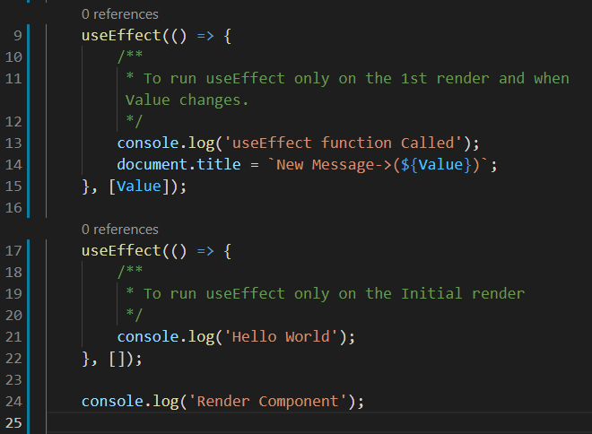

# Table of Contents

- [Table of Contents](#table-of-contents)
- [`create-react-app` command](#create-react-app-command)
- [Event Basics](#event-basics)
  - [Advanced React Topics](#advanced-react-topics)
  - [3-useState-array.js useState-Array Example](#3-usestate-arrayjs-usestate-array-example)
  - [useState-Object Example 4-useState-object.js](#usestate-object-example-4-usestate-objectjs)
  - [Simple Counter UseState Counter Example `5-useState-counter.js`](#simple-counter-usestate-counter-example-5-usestate-counterjs)
- [useEffect Hook](#useeffect-hook)
  - [3-conditional-rendering](#3-conditional-rendering)
    - [short-circuit evaluation and ternary operator](#short-circuit-evaluation-and-ternary-operator)
- [Forms](#forms)
  - [Handling Multiple inputs](#handling-multiple-inputs)
- [useRef() hook](#useref-hook)
- [useReducer() hook](#usereducer-hook)
- [Prop Drilling](#prop-drilling)
- [Context API / useContext](#context-api--usecontext)
- [Custom Hooks](#custom-hooks)
- [prop types](#prop-types)
- [React Router](#react-router)
- [Performance Optimization](#performance-optimization)

# `create-react-app` command

[TOC](#table-of-contents)

[Create React App](https://github.com/facebook/create-react-app)


[React page not updating in browser on saving](https://stackoverflow.com/a/65543913)

<details>
<summary>
<code>Code [3]</code>
</summary>

```javascript
import React from 'react';
import ReactDom from 'react-dom';

import './index.css';

const firstBook = {
    img_src: "https://images-eu.ssl-images-amazon.com/images/I/61r-WomIz0L._AC_UL200_SR200,200_.jpg",
    title: "One Arranged Murder",
    author: "Chetan Bhagat",
    img_alt: "Novel"
};
const secondBook = {
    img_src: "https://images-eu.ssl-images-amazon.com/images/I/71JZ0neAP1L._AC_UL200_SR200,200_.jpg",
    title: "The Blue Umbrella",
    author: "Ruskin Bond",
    img_alt: "Child Novel"
};

const BookList = () => {
    return (
        <section className="booklist">
            <Book img_src={firstBook.img_src} img_alt={firstBook.img_alt} title={firstBook.title} author={firstBook.author} />

            <Book img_src={secondBook.img_src} img_alt={secondBook.img_alt} title={secondBook.title} author={secondBook.author} />
        </section>
    );
}

const Book = (props) => {
    return (
        <article className="books">
            
            <h4>{props.author}</h4>
            <h1>{props.title}</h1>
            {console.log(props)}
        </article>
    );
}

ReactDom.render(<BookList />, document.getElementById('root'));
```
</details>
<br/>

<details>
<summary>
<code>Code[4]</code>
</summary>

```javascript
import React from 'react';
import ReactDom from 'react-dom';

function test_component() {
    return (
        <div>
            --Some text Here--
        </div>
    );
}

ReactDom.render(<test_component />, document.getElementById('root'));
console.log('Rendering Complete...???');
```
</details>
<br>

> The error that we get due to `Code[4]`<br>
> 

So, yes always start the name of the react component by a capital letter. And use only Pascal Case for naming react components.

<br/>
<details>
<summary>
<code>Code [5]</code>
</summary>

```javascript
import React from 'react';
import ReactDom from 'react-dom';

const names = ['John', 'Peter', 'Susan'];

function BookList() {
    return (
        <section className="booklist">
            {names}
        </section>
    )
}

ReactDom.render(<BookList />, document.getElementById('root'));

```

**Output**: </details> 
<br/>
<details>
<summary>
<code>Code [5] Updated</code>
</summary>

Wrapping the items of the array in a `<h1>` tag

```javascript
import React from 'react';
import ReactDom from 'react-dom';

import './index.css';

const names = ['John', 'Peter', 'Susan'];
const newNames = names.map((item) => {
    return <h1>{item}</h1>
});

function BookList() {
    return (
        <section className="booklist">
            {newNames}
        </section>
    )
}

ReactDom.render(<BookList />, document.getElementById('root'));
```

**Output**: </details> 
<br/>
<details>
<summary>
<code>Code [6]</code>
</summary>

```javascript
import React from 'react';
import ReactDom from 'react-dom';

import './index.css';

const bookArray = [
    {
        img_src: "https://images-eu.ssl-images-amazon.com/images/I/61r-WomIz0L._AC_UL200_SR200,200_.jpg",
        title: "One Arranged Murder",
        author: "Chetan Bhagat",
        img_alt: "Novel"
    }
    ,
    {
        img_src: "https://images-eu.ssl-images-amazon.com/images/I/71JZ0neAP1L._AC_UL200_SR200,200_.jpg",
        title: "The Blue Umbrella",
        author: "Ruskin Bond",
        img_alt: "Child Novel"
    }
]

function BookList() {
    return (
        <section className="booklist">
            {bookArray.map((book) => {
                const { img_src, title, author, img_alt } = book; // Object Destructing
                return (
                    <div>
                        <h1>{title}</h1>
                        <h4>{author}</h4>
                    </div>
                );
            })}
        </section>
    )
}

ReactDom.render(<BookList />, document.getElementById('root'));
```

Output: </details> 
<br/>

<details>
<summary>
<code>Code[7]</code>
</summary>

```javascript
import React from 'react';
import ReactDom from 'react-dom';

import './index.css';

const bookArray = [
    {
        img_src: "https://m.media-amazon.com/images/I/41krXoscwsL._AC_UY218_.jpg",
        title: "Senior Secondary School Mathematics for class 12",
        author: "R S Aggrawal",
        img_alt: "Maths Book"
    }
    ,
    {
        img_src: "https://images-eu.ssl-images-amazon.com/images/I/61r-WomIz0L._AC_UL200_SR200,200_.jpg",
        title: "One Arranged Murder",
        author: "Chetan Bhagat",
        img_alt: "Novel"
    }
    ,
    {
        img_src: "https://images-eu.ssl-images-amazon.com/images/I/71JZ0neAP1L._AC_UL200_SR200,200_.jpg",
        title: "The Blue Umbrella",
        author: "Ruskin Bond",
        img_alt: "Child Novel"
    }
    ,
    {
        img_src: "https://images-eu.ssl-images-amazon.com/images/I/A17fPOnXNmL._AC_UL200_SR200,200_.jpg",
        title: "General Knowledge",
        author: "Dr. Binay Karna",
        img_alt: "GK GS"
    }
    ,
    {
        img_src: "https://images-eu.ssl-images-amazon.com/images/I/71aFt4%2BOTOL._AC_UL200_SR200,200_.jpg",
        title: "The Alchemist",
        author: "Paulo Coelho",
        img_alt: "Novel"
    }
    ,
    {
        img_src: "https://images-eu.ssl-images-amazon.com/images/I/81YOuOGFCJL._AC_UL200_SR200,200_.jpg",
        title: "Harry Potter and the Philosopher's Stone",
        author: "J.K. Rowling",
        img_alt: "Novel Harry Potter"
    }
    ,
]

function BookList() {
    return (
        <section className="booklist">
            {bookArray.map((book) => {
                
                /**const { img_src, title, author, img_alt } = book;
                  *Object Destructing
                  */
                return (
                    
                    /*
                    <Book img_src={img_src} img_alt={img_alt} title={title} author={author} />
                    */
                    <Book book_prop={book} />

                );
            })}
        </section >
    )
}

function Book(props) {
    
    /**note that here
     * props = { book_prop: {img_src:"", title:"", author:"", img_alt:""} }
     */
    
    const { img_src, title, author, img_alt } = props.book_prop;
    return (
        <article className="book">
            
            <h1>{title}</h1>
            <h4>{author}</h4>
        </article>
    )
}

ReactDom.render(<BookList />, document.getElementById('root'));
```

</details>
<br>
<details>
<summary>
<code>Code [7] Updated</code>
</summary>

```javascript
import React from 'react';
import ReactDom from 'react-dom';

import './index.css';

const bookArray = [
    {
        id: 1,
        img_src: "https://m.media-amazon.com/images/I/41krXoscwsL._AC_UY218_.jpg",
        title: "Senior Secondary School Mathematics for class 12",
        author: "R S Aggrawal",
        img_alt: "Maths Book"
    }
    ,
    {
        id: 2,
        img_src: "https://images-eu.ssl-images-amazon.com/images/I/61r-WomIz0L._AC_UL200_SR200,200_.jpg",
        title: "One Arranged Murder",
        author: "Chetan Bhagat",
        img_alt: "Novel"
    }
    ,
    {
        id: 3,
        img_src: "https://images-eu.ssl-images-amazon.com/images/I/71JZ0neAP1L._AC_UL200_SR200,200_.jpg",
        title: "The Blue Umbrella",
        author: "Ruskin Bond",
        img_alt: "Child Novel"
    }
    ,
]

function BookList() {
    return (
        <section className="booklist">
            {bookArray.map((book) => {
                return (
                    <>
                        {/* <Book book_prop={book} /> */}
                        <Book key={book.id} book_prop={book} />
                        {/*This is the change*/}
                    </>
                );
            })}
        </section >
    )
}

function Book(props) {
    // no need to change anything here.
    const { img_src, title, author, img_alt } = props.book_prop;
    return (
        <article className="book">
            
            <h1>{title}</h1>
            <h4>{author}</h4>
        </article>
    )
}

ReactDom.render(<BookList />, document.getElementById('root'));
```

</details>

**Spread Operator** `{...books}` can also be used to pass the whole book object.

`code [8]`

1.  
2.  

# Event Basics

[TOC](#table-of-contents)

`Code [9]`

1.  
2.  
3.  

**<code>Code[10]</code>**

<details><summary><code>Code[10.1] bookArray.js</code></summary>

```javascript
// This file contains the bookArray which contains all the books object in an array

export const bookArray = [
    {
        id: 1,
        img_src: "https://m.media-amazon.com/images/I/41krXoscwsL._AC_UY218_.jpg",
        title: "Senior Secondary School Mathematics for class 12",
        author: "R S Aggrawal",
        img_alt: "Maths Book"
    }
    ,
    {
        id: 2,
        img_src: "https://images-eu.ssl-images-amazon.com/images/I/61r-WomIz0L._AC_UL200_SR200,200_.jpg",
        title: "One Arranged Murder",
        author: "Chetan Bhagat",
        img_alt: "Novel"
    }
    ,
    {
        id: 3,
        img_src: "https://images-eu.ssl-images-amazon.com/images/I/71JZ0neAP1L._AC_UL200_SR200,200_.jpg",
        title: "The Blue Umbrella",
        author: "Ruskin Bond",
        img_alt: "Child Novel"
    }
    ,
]
```

</details><details><summary><code>Code[10.2] Book.js</code></summary>

```javascript
// This file contains the function Book.js

function Book(props) {
    const clickHandler = (e) => {
        alert('Button Clicked');
        console.log(e);
        console.log(e.target);
    }
    function complexExample(author) {
        console.log(author);
    }
    const { img_src, title, author, img_alt } = props.book_prop;
    return (
        <article className="book" onMouseOver={() => {
            console.log(title);
        }}>
            
            <h1>{title}</h1>
            <h4>{author}</h4>
            <button type="button" onClick={clickHandler}>Example Button</button>
            <button type="button" onClick={() => complexExample(author)}>Complex Example</button>
            {/* <button type="button" onClick={complexExample(author)}>Complex Example</button> */}
        </article>
    )
}

export default Book;
```

</details>
<br>
<details><summary><code>Code[10.3] index.js</code></summary>

```javascript
import React from 'react';
import ReactDom from 'react-dom';

import './index.css'; // Importing CS file

import BookFunctionalComponent from './Book';
/**Since the file Book.js exports *Book()* as default
 * So, we can use any name to access the function
 * when we are importing it in some file.*/

import { bookArray } from './bookArray';
/**Since bookArray.js file does named Export of bookArray
 * So, we have to use the same name inside {} to access it
*/

function BookList() {
    return (
        <section className="booklist">
            {bookArray.map((book) => {
                return (
                    <Book key={book.id} book_prop={book} />
                );
            })}
        </section >
    )
}

ReactDom.render(<BookList />, document.getElementById('root'));
```

</details>

---
The above codes can also be written as:

<details>
<summary><code>index.js</code></summary>

```javascript
import React from 'react';
import ReactDom from 'react-dom';
import "./index.css";

import { bookArray } from './bookArray';
import { Book } from './Book';

export const clickEvent = (title) => console.log('Button clicked\nBook Name: ', title);
export const eventHandler = (e) => console.log(e, e.target); // "e" is the event object
export const abc2 = () => console.log("to call this function arrow function need not be used");

const BookList = () => {
    return (
        <section className="booklist">
            {
                bookArray.map((bookObj) => {
                    return (
                        <Book key={bookObj.id} bookObj={bookObj} />
                    )
                })
            }
        </section>
    )
}

ReactDom.render(<BookList />, document.getElementById('root'));
```

</details>


<details>
<summary><code>Book.js</code></summary>

```javascript
// This file contains the function Book.js

import { clickEvent } from ".";
import { eventHandler } from ".";
import { abc2 } from ".";
export function Book(props) {
    const { img_src, title, author } = props.bookObj;
    return (
        <>
            <div className="book" >
                
                <h2>{title}</h2>
                <h4>{author}</h4>
                <button className="btn" onClick={() => clickEvent(title)}>Example Button</button>
                <button className="btn" onClick={abc2}>No Arrow Function</button>
                <button className="btn" onClick={eventHandler}>Event Handler</button>
            </div>
        </>
    )
}


```
</details>


<details>
<summary>
<code>bookArray.js</code>
</summary>

```javascript
// This file contains the bookArray which contains all the books object in an array

export const bookArray = [
    {
        id: 1,
        img_src: "https://images-eu.ssl-images-amazon.com/images/I/61r-WomIz0L._AC_UL200_SR200,200_.jpg",
        title: "One Arranged Murder",
        author: "Chetan Bhagat"
    },
    {
        id: 2,
        img_src: "https://images-eu.ssl-images-amazon.com/images/I/71JZ0neAP1L._AC_UL200_SR200,200_.jpg",
        title: "The Blue Umbrella",
        author: "Ruskin Bond"
    },
    {
        id: 3,
        img_src: "https://m.media-amazon.com/images/I/41krXoscwsL._AC_UY218_.jpg",
        title: "Senior Secondary School Mathematics for class 12",
        author: "R S Aggrawal",
    },
    {
        id: 4,
        img_src: "https://upload.wikimedia.org/wikipedia/en/e/e5/The_Oath_of_the_Vayuputras.jpg",
        title: "The Oath of the Vayuputras - Shiva Trilogy",
        author: "Amish Tripathi",
        img_alt: "Novel"
    },
    {
        id: 5,
        img_src: "https://upload.wikimedia.org/wikipedia/en/7/78/The_Secret_of_the_Nagas.jpg",
        title: "The Secret of the Nagas - Shiva Trilogy",
        author: "Amish Tripathi",
        img_alt: "Novel"
    },
    {
        id: 6,
        img_src: "https://upload.wikimedia.org/wikipedia/en/0/0e/The_Immortals_Of_Meluha.jpg",
        title: "The Immortals of Meluha - Shiva Trilogy",
        author: "Amish Tripathi",
        img_alt: "Novel"
    },
]

```
</details> 

on running command: `npm run build`


<br/><br/>

## Advanced React Topics

[TOC](#table-of-contents)

----------
----------

`code[12]`:

1.  
2.  

`code [13]`:

1.  
2.  

## 3-useState-array.js useState-Array Example

[TOC](#table-of-contents)

`Code[14]` inside the file

```javascript
// [14.1]
import React from 'react';
import { data } from '../../../data';

// [14.2]
const UseStateArray = () => {
  return <h2>useState array example</h2>;
};

// [14.3]
export default UseStateArray;
```

`code[15] data.js` file:

```javascript
export const data = [
  { id: 1, name: 'john' },
  { id: 2, name: 'peter' },
  { id: 3, name: 'susan' },
  { id: 4, name: 'anna' },
];

```

<details>
<summary>
<code>code [14.2]</code> of <b>3-useState-array.js useState-Array Example</b>
</summary>

```javascript
const UseStateArray = () => {
    const [people, setPeople] = React.useState(data);

    const removeItem = (id) => {
        /**
         * This function replaces the people array with some other array.
        */
        let newArray = people.filter((person) => person.id !== id);
        console.log(newArray);
        // people is array of objects
        // person is an object of people array
        setPeople(newArray);
    }

    return (
        <>
            <h1>hello!</h1>
            {
                people.map((person) => {
                    const { id, name } = person;
                    console.log(name, id);
                    return (
                        <div key={id} className="item">
                            <h4>{name}</h4>
                            <button onClick={() => removeItem(id)}>
                                remove
                                </button>
                        </div>
                    );
                }
                )
            }
            <button className="btn" onClick={() => { setPeople([]) }}>
                Clear all List Items
                {/*This button replaces the people array:"[{...}, {...}, ...]" with an empty array: "[]"*/}
            </button>
        </>
    )
};
```
</details>

<br/><br/>

## useState-Object Example 4-useState-object.js

[TOC](#table-of-contents)

`code[16]` initial

```javascript
// [16.1]
import React, { useState } from 'react';

// [16.2]
const UseStateObject = () => {
  return <h2>useState object example</h2>;
};

// [16.3]
export default UseStateObject;
```

<details>
<summary><code>code [16.2]</code></summary>

```javascript
const UseStateObject = () => {
    const [person, setPerson] = useState({
        name: "peter",
        age: 24,
        message: "random messags",
    })


    const changeMessage = () => {
        setPerson({ ...person, message: "hello world" });
    }

    return (
        <>
            <h3>{person.name}</h3>
            <h3>{person.age}</h3>
            <h3>{person.message}</h3>
            <button className="btn" onClick={changeMessage}>
                Change Message
            </button>
        </>
    )

};
```

</details>
<br>

<details>
<summary><code>code [16.2]</code> alternative</summary>

```javascript
const UseStateObject = () => {
    const [Name, setName] = useState('peter');
    const [Age, setAge] = useState(24);
    const [Message, setMessage] = useState('random message');

    const changeMessage = () => {
        setMessage("hello world");
    }

    return (
        <>
            <h3>{Name}</h3>
            <h3>{Age}</h3>
            <h3>{Message}</h3>
            <button className="btn" onClick={changeMessage}>
                Change Message
            </button>
        </>
    )

};
```

</details>
<br>

## Simple Counter UseState Counter Example `5-useState-counter.js`

[TOC](#table-of-contents)

`Code[17]`

```javascript
// [17.1]
import React, { useState } from 'react';

// [17.2]
const UseStateCounter = () => {
    return <h2>useState counter example</h2>;
};

    // [17.3]
export default UseStateCounter;

```

`code[17.2]`

```javascript
const UseStateCounter = () => {
    const [Value, setValue] = useState(0);

    return (
        <>
            <section style={{ margin: "4rem" }}>
                <h2>regular counter</h2>
                <h1>{Value}</h1>
                <button className="btn" onClick={() => setValue(Value - 1)}>Decrease</button>
                <button className="btn" onClick={() => setValue(0)}>Reset</button>
                <button className="btn" onClick={() => setValue(Value + 1)}>Increase</button>
            </section>
        </>
    )
};
```

`code[17.2]` with More Complex Example:

```javascript
const UseStateCounter = () => {
    const [Value, setValue] = useState(0);

    const complexIncrease = () => {
        setTimeout(() => {
            // setValue(Value + 1);
            /**this won't change 0->1 & 1->2 if the button is clicked twice 
             * in time less than 2 sec
             * setValue() function is sync function
            */
            setValue((preValue) => {
                return preValue + 1;
            });
        }, 2000);

    }

    return (
        <>
            <section style={{ margin: "4rem" }}>
                <h2>regular counter</h2>
                <h1>{Value}</h1>
                <button className="btn" onClick={() => setValue(Value - 1)}>Decrease</button>
                <button className="btn" onClick={() => setValue(0)}>Reset</button>
                <button className="btn" onClick={() => setValue(Value + 1)}>Increase</button>
            </section>
            <section style={{ margin: "4rem" }}>
                <h2>more complex example</h2>
                <h1>{Value}</h1>
                <button className="btn" onClick={complexIncrease}>
                    complex Increase
                </button>
            </section>
        </>
    )
};
```

Implementing the above used concept in `code[14.2]` updated in function `removeItem()` inside the function `UseStateArray()`

```javascript
const removeItem = (id) => {
        /*
        let newArray = people.filter((person) => person.id !== id);
        console.log(newArray);
        // people is array of objects
        // person is an object of people array
        setPeople(newArray);
        */

        setPeople((oldPeople) => {
            let newPeople = oldPeople.filter((person) => person.id !== id);
            return newPeople;
        })
    }
```

# useEffect Hook

`code[18]` :

```javascript
// [18.1]
import React, { useState, useEffect } from 'react';
// by default runs after every re-render
// cleanup function
// second parameter

/* [18.2] */
const UseEffectBasics = () => {
  return <h2>useEffect Basics</h2>;
};

// [18.3]
export default UseEffectBasics;

```

`code[18.2]` → 1

```javascript
const UseEffectBasics = () => {

    const [Value, setValue] = useState(0);

    useEffect(() => {
        console.log('useEffect function Called');
        document.title = `New Message->(${Value})`;
    })

    console.log('Render Component');

    return (
        <>
            <h2>useEffect Basics</h2>
            <h1>{Value}</h1>
            <button className="btn" onClick={() => setValue(Value + 1)}>
                {/* note that I have used arrow funn. here
                so that it doesn't get automatically called */}
                Click Me
            </button>
        </>
    );
};
```

Output:

1.  
2.  
3.  

It is rendered 3 times first while loading of the page(value = 0), second when value = 1, third when value = 2

> We can multiple useEffect functions in the same prog.
> 

`Code [19]` :

```javascript
// [19.1]
import React, { useState, useEffect } from 'react';

// cleanup function
// second argument

// [19.2]
const UseEffectCleanup = () => {
    return <h2>useEffect cleanup</h2>;
};

// [19.3]
export default UseEffectCleanup;
```

`code[19.2]` → 1 copy

The Issue:

1.  Initially what do I have on first loading of the page:<br>
    
2.  What I have on resizing after I resixe the window:<br>
    

A hell lot of Event Listeners are attached if we resize the window but more worse is that we are not able to remove them which leads to more memory consumption

After doing This change:

```javascript

useEffect(() => {
    window.addEventListener('resize', checkSize);
    return () => {
        window.removeEventListener('resize', checkSize);
    }
});
```

Initial: 

Later: 

`Code[20]` - file: `3-useEffect-fetch-data.js`

```javascript
// [20.1]
import React, { useState, useEffect } from 'react';

// [20.2]
const url = 'https://api.github.com/users';

// [20.3]
const UseEffectFetchData = () => {
    return <h2>fetch data</h2>;
};

// [20.4]
export default UseEffectFetchData;
```

<details>
<summary>
<code>code[20] at end</code>
</summary>

```javascript
import React, { useState, useEffect } from 'react';

const url = 'https://api.github.com/users';

const UseEffectFetchData = () => {
    const [Users, setUsers] = useState([]);
    useEffect(() => {
        getUser();
    }, []);
    const getUser = async () => {
        const response = await fetch(url);
        const users = await response.json();

        setUsers(users);
    }
    console.log(Users);
    return (
        <>
            <h2>fetch data</h2>
            <h1>gitHub users</h1>
            <ul className='users'>
                {
                    Users.map((user) => {
                        const { id, login, avatar_url, html_url } = user;
                        return (
                            <>
                                <li key={id}>
                                    
                                    <div>
                                        <h4>{login}</h4>
                                        <a href={html_url}>
                                            Profile
                                        </a>
                                    </div>
                                </li>
                            </>
                        )
                    })
                }
            </ul>
        </>
    );
};

export default UseEffectFetchData;

```
</details> 

## 3-conditional-rendering

[TOC](#table-of-contents)

`code[21]`- file `1-multiple-returns.js`

```javascript
// [21.1]
import React, { useState, useEffect } from 'react';
const url = 'https://api.github.com/users/QuincyLarson';

// [21.2]
const MultipleReturns = () => {
    return <h2>multiple returns</h2>;
};

// [21.3]
export default MultipleReturns;

```

`code [21.1]` → one

```javascript
url = "https://api.github.com/users/WRONG-URL";
const MultipleReturns = () => {

    const [IsLoading, setIsLoading] = useState(true);
    const [IsError, setIsError] = useState(false);
    const [User, setUser] = useState("default user");

    useEffect(() => {
        fetch(url)
            .then((response) => {
                return response.json();
            })
            .then((person) => {
                /**the value of response.json() that was returned from previous "then" is received by this "then" in arg "person".
                */
                const { login } = person;
                setUser(login);
                setIsLoading(false);
            })
            .catch((error) => console.log(error));
    }, []); // [] denotes that useEffect runs once


    if (IsLoading) return (<div><h1>Loading...</h1></div>);
    if (IsError) return (<div><h1>Error...</h1></div>);
    return (<div><h1>{User}</h1></div>);
};
```

error received:


`code [21.1]` → two

`useEffect()` method of `code [21.1]`

```javascript
useEffect(() => {
        fetch(url)
            .then((response) => {
                if (response.status >= 200 && response.status <= 299)
                    return response.json();
                else {
                    setIsLoading(false);
                    setIsError(true);
                    throw new Error(response.statusText);
                }
            })
            .then((person) => {
                const { login } = person;
                setUser(login);
                setIsLoading(false);
            })
            .catch((error) => console.log(error));
    }, []);
```

error received now:


### short-circuit evaluation and ternary operator

`code[22]`

```javascript
// [22.1]
import React, { useState } from 'react';
// short-circuit evaluation
// ternary operator

// [22.2]
const ShortCircuit = () => {
    // const firstValue = text || 'hello world';
  // const secondValue = text && 'hello world';

// [22.3]
  return <h2>short circuit</h2>;
};

export default ShortCircuit;

```

`code[22.2]` → one

```javascript
const ShortCircuit = () => {
    const [Text, setText] = useState('');
    const firstValue = Text || 'hello world';
    const secondValue = Text && 'hello world';

    return (<>
        {/* {if(true){console.log('hello world')}} */}
        <h1>1: {firstValue}</h1>
        <h1>2: {secondValue}</h1>
        <h3>3: {Text || "|| operator Text is false"}</h3>
        {Text && <h3>4: && operator Text is true</h3>}
        {!Text && <h3>5: && operator Text is false</h3>}
    </>);
};
```

`code[22.2]` → two
ternary operator and short-circuit evaluation use case.

```javascript
const ShortCircuit = () => {
    const [IsError, setIsError] = useState(false);

    return (<>
        <h2>this is extension to code[22]</h2>
        <h3>short-circuit evaluation</h3>

        <button className="btn" onClick={() => { setIsError(!IsError) }}>
            toggle error
        </button>
        {IsError && <h3><code>Error...</code></h3>}

        {IsError ? (<p>There is an Error</p>) : (<div><h2>no error</h2></div>)}

    </>);
};
```

1.  
2.  

fileName = `3-show-hide.js`

`code[23]`

```javascript
// [23.1]
import React, { useState, useEffect } from 'react';

// [23.2]
const ShowHide = () => {
  return <h2>show/hide</h2>;
};

// [23.3]
export default ShowHide;
```

`code[23.2]` updated

```javascript
const ShowHide = () => {
    const [Show, setShow] = useState(false)
    return <>
        <button className="btn" onClick={() => setShow(!Show)}>
            show/hide
        </button>
        {Show && <Item />}
    </>;
};

const Item = () => {
    const [Width, setWidth] = useState(window.innerWidth);

    const checkSize = () => {
        setWidth(window.innerWidth);
    }
    useEffect(() => {
        window.addEventListener('resize', checkSize);
        return () => {
            // clean-up function
            window.removeEventListener('resize', checkSize)
        }
    }, []) //useEffect ends here
    return (
        <div style={{ marginTop: '2rem' }}>
            <h1>Window</h1>
            <h2>Width: {Width}</h2>
        </div>
    )
}
```

# Forms

[TOC](#table-of-contents)

`code[24]`

```javascript
// [24.1]
import React, { useState } from 'react';
/*
* plain JS way of handling form:
const input = document.getElementById('myText');
const inputValue = input.value

* React way:
value, onChange

*/

// [24.2]
const ControlledInputs = () => {
    return <>
        <h1>controlled inputs</h1>
    </>;
};

// [24.3]
export default ControlledInputs;
```

`code[24.2] → one` :

```javascript
const ControlledInputs = () => {
    function handleSubmit(e) {
        e.preventDefault();
        console.log('hello world');
    }
    return <>
        <h1>controlled inputs</h1>
        <article>
            {/* <form className='form' onSubmit={handleSubmit}> */}
            <form className='form' onSubmit={handleSubmit}>
                <label htmlFor="firstName">Name: </label>
                <input type="text" id="firstName" name="firstName" />
                <br /><br />

                <label htmlFor="email">Email: </label>
                <input type="text" id="email" name="email" />
                <br />

                {/* <button type="submit" onClick={handleSubmit}>add person</button> */}
                <button type="submit" >add person</button>
            </form>
        </article>
    </>;
};
```

Accessing form data:

On using `value={FirstName}`<br/>


on using `value={FirstName} onChange={(e) => setFirstName(e.target.value)` <br/>


<br/>
<details>
<summary>
<code>code[24.2] → two</code>
</summary>

```javascript
const ControlledInputs = () => {
    const [FirstName, setFirstName] = useState('');
    const [Email, setEmail] = useState('');
    function handleSubmit(e) {
        e.preventDefault();
        console.log(FirstName, Email);
    }
    return <>
        <h1>controlled inputs</h1>
        <article>
            {/* <form className='form' onSubmit={handleSubmit}> */}
            <form className='form' onSubmit={handleSubmit}>
                <label htmlFor="firstName">Name: </label>
                <input type="text" id="firstName" name="firstName" value={FirstName} onChange={(e) => setFirstName(e.target.value)}
                />
                <br /><br />

                <label htmlFor="email">Email: </label>
                <input type="text" id="email" name="email" value={Email} onChange={(e) => setEmail(e.target.value)} />
                <br />

                {/* <button type="submit" onClick={handleSubmit}>add person</button> */}
                <button type="submit" >add person</button>
            </form>
        </article>
    </>;
};
```
</details>
<br/>

a JS ES-6 feature

```javascript
let day = "Monday";
let month = "July";
let obj1 = {day:day, month:month}
let obj2 = {day, month}
console.log(obj1); // {day: "Monday", month: "July"}
console.log(obj2); // {day: "Monday", month: "July"}
```

Making a list from the data entered into the form:

<details>
<summary>
<code>code[24.2] → three</code>
</summary>

```javascript
const ControlledInputs = () => {
    const [FirstName, setFirstName] = useState('');
    const [Email, setEmail] = useState('');
    const [People, setPeople] = useState([]);

    useEffect(() => {
        //just to print the People variable after it updates
        console.log("useEffect function\nPeople: ", People);
    }, [People]);

    function handleSubmit(e) {
        e.preventDefault();
        console.log(FirstName, Email);

        if (FirstName && Email) {
            console.log(FirstName, Email);
            const person = {
                id: new Date().getTime().toString(),
                FirstName, Email
            };
            setPeople([...People, person])
            // setPeople((People) => { return [...People, person]; })
            console.log("person", person);
            console.log("People", People);
            setFirstName('');
            setEmail('');
        }
        else {
            console.log('empty value(s)');
        }
    }
    return <>
        <h1>controlled inputs</h1>
        <article>
            {/* <form className='form' onSubmit={handleSubmit}> */}
            <form className='form' onSubmit={handleSubmit}>
                <label htmlFor="firstName">Name: </label>
                <input type="text" id="firstName" name="firstName" value={FirstName} onChange={(e) => setFirstName(e.target.value)}
                />
                <br /><br />

                <label htmlFor="email">Email: </label>
                <input type="text" id="email" name="email" value={Email} onChange={(e) => setEmail(e.target.value)} />
                <br />

                {/* <button type="submit" onClick={handleSubmit}>add person</button> */}
                <button type="submit" >add person</button>
            </form>
            {People.map((person) => {
                const { id, FirstName, Email } = person;
                return (
                    <div className="item" key={id}>
                        <h4>{FirstName}</h4>
                        <p>{id}</p>
                        <p>{Email}</p>
                    </div>
                )
            })}
        </article>
    </>;
};
```

</details>

output:


[TOC](#table-of-contents)

## Handling Multiple inputs

[TOC](#table-of-contents)

file: `2-multiple-inputs.js`

<details>
<summary>
<code>code[25]:</code>
</summary>

```javascript
// [25.1]
import React, { useState } from 'react';

// [25.2]
const ControlledInputs = () => {
    const [FirstName, setFirstName] = useState('');
    const [Email, setEmail] = useState('');
    const [Age, setAge] = useState('');
    const [People, setPeople] = useState([]);

    const handleSubmit = (e) => {
        e.preventDefault();
        if (FirstName && Email) {
            const person = { id: new Date().getTime().toString(), FirstName, Email };
            console.log(person);
            setPeople((people) => {
                return [...people, person];
            });
            setFirstName('');
            setEmail('');
        } else {
            console.log('empty values');
        }
    };

    return (
        <>
            <article>
                <form className='form' onSubmit={handleSubmit}>
                    <label htmlFor='firstName'>Name : </label>
                    <input type='text' id='firstName' name='firstName'
                        value={FirstName}
                        onChange={(e) => setFirstName(e.target.value)}
                    />
                    <br /><br />

                    <label htmlFor='email'>Email : </label>
                    <input type='email' id='email' name='email'
                        value={Email}
                        onChange={(e) => setEmail(e.target.value)}
                    />
                    <br /><br />

                    <label htmlFor='age'>Age : </label>
                    <input type='text' id='age' name='age'
                        value={Age}
                        onChange={(e) => setAge(e.target.value)}
                    />
                    <br /><br />
                    <button type='submit'>add person</button>
                </form>
                {People.map((person, index) => {
                    const { id, FirstName, Email } = person;
                    return (
                        <div className='item' key={id}>
                            <h4>{FirstName}</h4>
                            <p>{Email}</p>
                        </div>
                    );
                })}
            </article>
        </>
    );
};

// [25.3]
export default ControlledInputs;
```

</details>


<details>
<summary>
<code>code[25.2] updated</code>
</summary>

```javascript
const ControlledInputs = () => {
    const [Person, setPerson] = useState(
        {
            firstName: '',
            email: '',
            age: ''
        }
    )
    const [People, setPeople] = useState([]);

    const handleChange = (e) => {
        const name = e.target.name;
        const value = e.target.value;
        setPerson({ ...Person, [name]: value });
    }

    const handleSubmit = (e) => {
        e.preventDefault();
        if (Person.firstName && Person.email && Person.age) {

            const newPerson = {
                ...Person,
                id: new Date().getTime().toString()
            };

            setPeople([...People, newPerson]);
        }
    };

    return (
        <>
            <article>
                <form className='form' onSubmit={handleSubmit}>
                    <label htmlFor='firstName'>First Name : </label>
                    <input type='text' id='firstName' name='firstName'
                        value={Person.firstName}
                        onChange={handleChange}
                    />
                    <br /><br />

                    <label htmlFor='email'>Email : </label>
                    <input type='email' id='email' name='email'
                        value={Person.email}
                        onChange={handleChange}
                    />
                    <br /><br />

                    <label htmlFor='age'>Age : </label>
                    <input type='text' id='age' name='age'
                        value={Person.age}
                        onChange={handleChange}
                    />
                    <br /><br />
                    <button type='submit'>add person</button>
                </form>
                {People.map((person, index) => {
                    const { id, firstName, email, age } = person;
                    return (
                        <div className='item' key={id}>
                            <h4>{firstName}</h4>
                            <h4>{age}</h4>
                            <p>{email}</p>
                        </div>
                    );
                })}
            </article>
        </>
    );
};
```
</details>


# useRef() hook

[TOC](#table-of-contents)

> UseRef() hook is used to target the elements, i.e., tagreting the DOM elements.<br>
> It can access properties like `innerhtml`

fileName: `1-useRef-basics.js`

`code[26]`:

```javascript
// [26.1]
import React, { useEffect, useRef } from 'react';

// preserves value
// DOES NOT trigger re-render
// target DOM nodes/elements

// [26.2]
const UseRefBasics = () => {
  return <h2>useRef</h2>;
};

// [26.3]
export default UseRefBasics;
```

`code[26.2]` updated

```javascript
const UseRefBasics = () => {
    const refContainer = useRef(null);
    const ref_div = useRef(null);

    const handleSubmit = (e) => {
        e.preventDefault();
        console.log('refContainer');
        console.log(refContainer.current);
        console.log(ref_div.current);
    }
    useEffect(() => {
        console.log(refContainer.current);
        refContainer.current.focus();
    })
    return (
        <>
            <h2>useRef</h2>
            <form className="form">
                <input type="text" ref={refContainer} />
                <button type="submit" onClick={handleSubmit}>Submit</button>
            </form>
            <div ref={ref_div}>Hello World</div>
        </>
    )
};
```

# useReducer() hook

[TOC](#table-of-contents)

`code[27]`

```javascript
// [27.1]
import React, { useState, useReducer } from 'react';
import Modal from './Modal';
import { data } from '../../../data';
// reducer function

// [27.2]
const Index = () => {
    return <h2>useReducer</h2>;
}

// [27.3]
export default Index;
```

<details>
<summary>
<code>code[27.2] → a</code>
</summary>

```javascript
const Index = () => {
    const [Name, setName] = useState('');
    const [People, setPeople] = useState(data);
    const [ShowModal, setShowModal] = useState(false);

    const handleSubmit = (e) => {
        e.preventDefault();
        if (Name) {
            setShowModal(true);
            console.log(Name);
            setPeople([...People, { id: new Date().getTime().toString(), name: Name }]);
            console.log(People);
        }
        else {
            setShowModal(true);
        }
    }
    return (
        <>
            <h2>useReducer</h2>
            {ShowModal && <Modal />}
            <form onSubmit={handleSubmit} className="form">
                <input type="text" value={Name} onChange={(e) => setName(e.target.value)} />
                <br />
                <button type="submit" className="btn">Add</button>
            </form>
            {
                People.map((person) => {
                    return (
                        <div key={person.id}>
                            <h3>{person.name}</h3>
                        </div>
                    )
                })
            }
        </>
    );
};
```

</details>

<br/>

<details>
<summary>
<code>code[27.2] → b</code> basic reducer setup</summary>

```javascript
const reducer = (state, action) => { };

const defaultState = {
    people: [],
    isModalOpen: true,
    modalContent: 'hello world'
}

const Index = () => {

    const [Name, setName] = useState('');

    const [state, dispatch] = useReducer(reducer, defaultState);

    const handleSubmit = (e) => {
        e.preventDefault();
        if (Name) {
        } else {
        }
    }
    return (
        <>
            <h2>useReducer</h2>
            {state.isModalOpen && <Modal modalContent={state.modalContent} />}
            <form onSubmit={handleSubmit} className="form">
                <input type="text" value={Name} onChange={(e) => setName(e.target.value)} />
                <br />
                <button type="submit" className="btn">Add</button>
            </form>
            {state.people.map((person) => {
                return (
                    <div className="item" key={person.id}>
                        <h4>{person.name}</h4>
                    </div>
                )
            })}
        </>
    );
};
```

</details>

<br/>

<details>
<summary>
code from <code>reducer.js</code>
</summary>

```javascript
// reducer function

export const reducer = (state, action) => {
    if (action.type === 'ADD_ITEM') {
        const newPeople = [...state.people, action.payLoad];
        //since people is a list of objects
        console.log("state: ", state);
        console.log("newPeople: ", newPeople);
        return {
            ...state,
            people: newPeople,
            isModalOpen: true,
            modalContent: 'Item Added'
        };
        /**
         * if i don't write the return statement here then
         * the value of state won't update so newPeople will
         * only contain 1 element all the time
         */
    }
    else if (action.type === 'NO_VALUE') {
        return {
            ...state,
            isModalOpen: true,
            modalContent: 'please enter value'
        }
    }
    else if (action.type === 'CLOSE_MODAL') {
        return {
            ...state,
            isModalOpen: false
        }
    }
    else if (action.type === 'REMOVE_ITEM') {
        /* const newPeople = state.people.filter((person) => { person.id !== action.payload })
        */
        // the above line is wrong have a look at it but the lie below is correct
        const newPeople = state.people.filter((person) => person.id !== action.payLoad);

        return {
            ...state,
            people: newPeople,
            isModalOpen: true,
            modalContent: 'item removed'
        }
    }
    throw new Error(`No matching dispatch "type": ${action.type}`);
};

```
</details>
<br/>
<details>
<summary>
code from <code>index.js : code [27.2] → final</code>
</summary>

```javascript
//importing  reducer function
import { reducer } from './reducer';

const defaultState = {
    people: [],
    isModalOpen: false,
    modalContent: 'hello world'
}

const Index = () => {

    const [Name, setName] = useState('');

    const [state, dispatch] = useReducer(reducer, defaultState);

    const handleSubmit = (e) => {
        e.preventDefault();
        if (Name) {
            const newPerson = {
                id: new Date().getTime().toString(),
                name: Name
            }
            dispatch({ type: 'ADD_ITEM', payLoad: newPerson });
            setName('');
        }
        else {
            dispatch({ type: 'NO_VALUE' });
        }
    }

    const closeModal = () => {
        dispatch({ type: "CLOSE_MODAL" });
        // this closeModal function is to be called from Modal.js inside a useEffect Hook after a time interval of 3 seconds.
    }

    return (
        <>
            <h2>useReducer</h2>
            {state.isModalOpen && <Modal closeModal={closeModal} modalContent={state.modalContent} />}
            <form onSubmit={handleSubmit} className="form">
                <input type="text" value={Name} onChange={(e) => setName(e.target.value)} />
                <br />
                <button type="submit" className="btn">Add</button>
            </form>
            {state.people.map((person) => {
                return (
                    <div className="item" key={person.id}>
                        <h4>{person.name}</h4>
                        <button onClick={() => dispatch({ type: "REMOVE_ITEM", payLoad: person.id })}>
                            remove
                        </button>
                    </div>
                )
            })}
        </>
    );
};
```
</details>
<br/>

<details>
<summary>
code from <code>Modal.js</code>
</summary>

```javascript
import React, { useEffect } from 'react';

const Modal = (props) => {
    const { modalContent, closeModal } = props;
    useEffect(() => {
        setTimeout(() => {
            closeModal();
        }, 2500);
    })
    return (
        <div className='modal'>
            <h4>{modalContent}</h4>
            {/* abcde */}
        </div>
    );
};

export default Modal;

```
</details>

<br/> <br/>

# Prop Drilling

[TOC](#table-of-contents)

<details>
<summary><code>code[28]</code> : 
</summary>

```javascript
import React, { useState } from 'react';
import { data } from '../../../data';
// more components
// fix - context api, redux (for more complex cases)

const PropDrilling = () => {

    const [People, setPeople] = useState(data);

    const removePerson = (id) => {
        /**
         * This function is to be used only by the SinglePerson component
         * but we need to pass it via to List component
         * List component won't be using the function
         */
        setPeople((People) => {
            return People.filter((person) => person.id !== id);
        })
    }

    return (
        <section>
            <h2>prop drilling</h2>
            <List People={People} removePerson={removePerson} />
        </section>
    );
};

const List = (props) => {
    const { People, removePerson } = props;

    return (<>
        {
            People.map((person) => {
                return (
                    <SinglePerson
                        key={person.id}
                        {...person}
                        removePerson={removePerson}
                    />
                )
            })
        }
    </>);
}

const SinglePerson = (props) => {
    const { name, id, removePerson } = props;
    return <>
        <div className="item">
            <h4>{name}</h4>
            <button onClick={() => removePerson(id)}>remove</button>
        </div>
    </>
}
export default PropDrilling;

```
</details>

<br/><br/>

# Context API / useContext

[TOC](#table-of-contents)

<details>
<summary><code>code[29]</code> 👈 same as <em><b>Prop Drilling</b></em> : 
</summary>

```javascript
import React, { useState, useContext } from 'react';
import { data } from '../../../data';
// more components
// fix - context api, redux (for more complex cases)

const ContextAPI = () => {

    const [People, setPeople] = useState(data);

    const removePerson = (id) => {
        /**
         * This function is to be used only by the SinglePerson component
         * but we need to pass it via to List component
         * List component won't be using the function
         */
        setPeople((People) => {
            return People.filter((person) => person.id !== id);
        })
    }

    return (
        <section>
            <h2>prop drilling</h2>
            <List People={People} removePerson={removePerson} />
        </section>
    );
};

const List = (props) => {
    const { People, removePerson } = props;

    return (<>
        {
            People.map((person) => {
                return (
                    <SinglePerson
                        key={person.id}
                        {...person}
                        removePerson={removePerson}
                    />
                )
            })
        }
    </>);
}

const SinglePerson = (props) => {
    const { name, id, removePerson } = props;
    return <>
        <div className="item">
            <h4>{name}</h4>
            <button onClick={() => removePerson(id)}>remove</button>
        </div>
    </>
}
export default ContextAPI;

```
</details>
<br/>

<details>
<summary><code>code[29]</code> updated</em> : 
</summary>

```javascript
import React, { useState, useContext } from 'react';
import { data } from '../../../data';
// more components
// fix - context api, redux (for more complex cases)

// 👌
const PersonContext = React.createContext();

const ContextAPI = () => {

    const [People, setPeople] = useState(data);

    const removePerson = (id) => {
        /**This function is to be used only by the SinglePerson component
         * but, we need to pass it via to List component.
         * List component won't be using the function.
         */
        setPeople((People) => {
            return People.filter((person) => person.id !== id);
        })
    }

    return ( /*👌*/
        <PersonContext.Provider value={{ removePerson }}>
            <h2>context API / useContext</h2>
            <List People={People} />
        </PersonContext.Provider>
    );
};

const List = (props) => {
    const { People } = props;
    return (<>
        {People.map((person) => {
            return (
                <SinglePerson key={person.id} {...person} />
            )
        })}
    </>);
}

const SinglePerson = (props) => {
    const { name, id } = props;

    const { removePerson } = useContext(PersonContext); //👌

    return <>
        <div className="item">
            <h4>{name}</h4>
            <button onClick={() => removePerson(id)}>remove</button>
        </div>
    </>
}
export default ContextAPI;

```

</details>

<br/><br/>

# Custom Hooks

[TOC](#table-of-contents)

<details>
<summary><code>code[30] : 1-fetch-example.js</code> Initial Code
</summary>

```javascript
/* code[30.1] */
import React, { useState, useEffect } from 'react';
import { useFetch } from './2-useFetch';

// ATTENTION!!!!!!!!!!
// I SWITCHED TO PERMANENT DOMAIN

/* code[30.2] */
const url = 'https://course-api.com/javascript-store-products';

/* code[30.3] */
const Example = () => {

    const [loading, setLoading] = useState(true)
    const [products, setProducts] = useState([])

    const getProducts = async () => {
        const response = await fetch(url)
        const products = await response.json()
        setProducts(products)
        setLoading(false)
    }

    useEffect(() => {
        getProducts()
    }, []);

    console.log(products)
    return (
        <div>
            <h2>{loading ? 'loading...' : 'data'}</h2>
        </div>
    )
}

/* code[30.4] */
export default Example

```
</details>
<br/>

<details>
<summary><code>code[31] : 2-useFetch.js</code>
</summary>

*<div style="color: rgb(14 186 181)">This is a custom hook defined by me.</div>*

```javascript
import { useState, useEffect } from 'react';

export const useFetch = (url) => {

    const [IsLoading, setIsLoading] = useState(true)
    const [Products, setProducts] = useState([])

    const getProducts = async () => {
        const response = await fetch(url)
        const Products = await response.json()
        setProducts(Products)
        setIsLoading(false)
    }

    useEffect(() => {
        getProducts()
    }, [url]);

    return { Products, IsLoading };
};
```
</details>
<br/>
<details>
<summary><code>code[30] : 1-fetch-example.js</code> Final Code
</summary>

```javascript
/* code[30.1] */
import React, { useState, useEffect } from 'react';
import { useFetch } from './2-useFetch';

// ATTENTION!!!!!!!!!!
// I SWITCHED TO PERMANENT DOMAIN

/* code[30.2] */
const url = 'https://course-api.com/javascript-store-Products';

/* code[30.3] */
const Example = () => {

    const { IsLoading, Products } = useFetch(url);

    console.log(Products)
    return (
        <div>
            <h2>{IsLoading ? 'IsLoading...' : 'data'}</h2>
        </div>
    )
}

/* code[30.4] */
export default Example
```
</details>
<br/>

See the drastic decrease in the no. of lines of code.

<br/><br/>

# prop types

[TOC](#table-of-contents)

<details>
<summary>
    <code>code[32] : </code>
    <a href="https://course-api.com/react-prop-types-example">
    https://course-api.com/react-prop-types-example
    </a>
</summary>

```json
[
    {
    "id": "recxaXFy5IW539sgM",
    "name": "albany sectional",
    "image": {
      "url": "https://dl.airtable.com/.attachments/05ecddf7ac8d581ecc3f7922415e7907/a4242abc/product-1.jpeg"
    },
    "price": 10.99
  },
  {
    "id": "recyqtRglGNGtO4Q5",
    "name": "leather sofa",
    "image": {
      "url": "https://dl.airtable.com/.attachments/3245c726ee77d73702ba8c3310639727/f000842b/product-5.jpg"
    },
    "price": 9.99
  },
  {
    "id": "recNWGyP7kjFhSqw3",
    "name": "sofa set"
  }
]
```
</details>
<br />

> Note that the last object doesn't has "image" and "price" attribs.

<details>
<summary> 
    <code>code[33] : index.js</code>
</summary>

```javascript
import React from 'react'
import Product from './Product'
import { useFetch } from '../../9-custom-hooks/final/2-useFetch'

// ATTENTION!!!!!!!!!!
// I SWITCHED TO PERMANENT DOMAIN
const url = 'https://course-api.com/react-prop-types-example'

const Index = () => {
    const { products } = useFetch(url)
    return (
        <div>
            <h2>products</h2>
            <section className='products'>
                {products.map((product) => {
                    return <Product key={product.id} {...product} />
                })}
            </section>
        </div>
    )
}

export default Index
```
</details>
<br />

<details>
<summary><code> code[34] : Product.js</code> initial</summary>

```javascript
// code[34.1]
import React from 'react';

// code[34.2]
const Product = () => {
    return <article className='product'>single product</article>;
};

// code[34.3]
export default Product;
```
</details>
<br />

<details>
<summary><code> code[34.2] &rarr; 1</code></summary>

```javascript
// code[34.2]
const Product = (props) => {
    const { name, image, price } = props;
    return <article className='product'>
        
        <h4>{name}</h4>
        <p>₹{price}</p>
    </article>;
};
```
</details>
<br />

<details>
<summary><code> code[34.2] &rarr; 2</code></summary>

```javascript
const Product = (props) => {
    const { name, image, price } = props;

    console.log(name, "-", price, "-", image);

    return (
        <article className='product'>
            <h4>static value</h4>
            {/* 
            <h4>{name}</h4>
            <p>₹{price}</p> */}
        </article>
    );
};
```
</details>
<br/>

<code> code[34] &rarr; 3</code>

```javascript
...
import PropTypes from "prop-types";

const Product = (props) => {
                ...
}

Product.propTypes = {
    image: PropTypes.object.isRequired,
    name: PropTypes.string.isRequired,
    price: PropTypes.number.isRequired
}
export default Product;

```

Browser Console:<br/>


<details>
<summary> <code>code[34] &rarr; 4</code> : Solution</summary>

```javascript
import React from 'react';
import PropTypes from "prop-types";
import defaultImage from "../../../assets/default-image.jpeg";

const Product = (props) => {
    const { name, image, price } = props;

    console.log(name, "-", price, "-", image);

    return (
        <article className='product'>
            {/* <h4>static value</h4> */}
            
            <h4>{name}</h4>
            <p>₹{price}</p>
        </article>
    );
};

Product.propTypes = {
    image: PropTypes.object.isRequired,
    name: PropTypes.string.isRequired,
    price: PropTypes.number.isRequired
}

Product.defaultProps = {
    image: defaultImage,
    name: "default Name",
    price: -1
}
export default Product;
```
</details>
<br />

<details>
<summary> <code>code[34] &rarr; 5</code> : Solution Approach 2 </summary>

```javascript
...
import defaultImage from "../../../assets/default-image.jpeg";

const Product = (props) => {
    const { name, image, price } = props;
    const url = image && image.url;

    console.log(name, "-", price, "-", image);
    return (
        <article className='product'>
            
            <h4>{name || "default name"}</h4>
            <p>₹{price || -1}</p>
        </article>
    );
};

Product.propTypes = {
    image: PropTypes.object.isRequired, // <--shortcut: ptor
    name: PropTypes.string.isRequired, // <--shortcut: ptsr
    price: PropTypes.number.isRequired // <--shortcut: ptnr
}

// Product.defaultProps = {
//     image: defaultImage,
//     name: "default Name",
//     price: -1
// }

export default Product;
```
</details>
<br />


---

# React Router

[TOC](#table-of-contents)

Initial Code files

<details>
<summary><code> index.js: code[35] &rarr; initial</code></summary>

```javascript

/* code[35.1] */
import React from 'react';
// react router
import { BrowserRouter as Router, Route, Switch } from 'react-router-dom';
// pages
import Home from './Home';
import About from './About';
import People from './People';
import Error from './Error';
import Person from './Person';
// navbar
import Navbar from './Navbar';


/* code[35.2] */
const ReactRouterSetup = () => {
    return <h2>react router</h2>;
};


/* code[35.3] */
export default ReactRouterSetup;
```

</details>

<br/>

<details>
<summary><code> index.js: code[35.2] &rarr; 1</code></summary>

```javascript

const ReactRouterSetup = () => {
    return (<>
        <Router>
            <Route path='/'>
                <Home />
            </Route>

            <Route path='/about'>
                <About />
            </Route>

            <Route path='/ShakeAndBake'>
                <People />
            </Route>
        </Router>
    </>);
};
```

**Output That I am receiving at `http://localhost:3000/about` i.e. at `/about` endpoint after writing this much code**


</details>

<br/>

<details>
<summary><code> index.js: code[35.2] &rarr; 2: </code><b>exact</b> prop</summary>

```javascript
const ReactRouterSetup = () => {
    return (<>
        <Router>
            <Route exact path='/'>
                <Home />
            </Route>

            <Route path='/about'>
                <About />
            </Route>

            <Route path='/ShakeAndBake'>
                <People />
            </Route>
        </Router>
    </>);
};

```

</details>

<br/>

<details>
<summary><code> index.js: code[35.2] &rarr; 3 : </code> end point= '<b>*</b>': includes everything</summary>

```javascript

const ReactRouterSetup = () => {
    return (<>

        <Router>
            <Switch>
                <Route exact path='/'>
                    <Home />
                </Route>

                <Route path='/about'>
                    <About />
                </Route>

                <Route path='/ShakeAndBake'>
                    <People />
                </Route>

                <Route path='*'>
                    <Error />
                </Route>
            </Switch>
        </Router>
    </>);
};

```

</details>

<br/>

<details>
<summary><code> index.js: code[35.2] &rarr; 4 : </code> <b>Switch</b> Component: renders only the first matching component</summary>

```javascript
const ReactRouterSetup = () => {
    return (<>

        <Router>
            <Switch>
                <Route exact path='/'>
                    <Home />
                </Route>

                <Route path='/about'>
                    <About />
                </Route>

                <Route path='/ShakeAndBake'>
                    <People />
                </Route>

                <Route path='*'>
                    <Error />
                </Route>
            </Switch>
        </Router>
    </>);
};

```

</details>

<br/>

<details>
<summary><code> index.js: code[35.2] &rarr; 5: </code> Adding Navbar & Links</summary>

```javascript
const ReactRouterSetup = () => {
    return (<>
        {/* <h2>react router</h2> */}
        <Router>
            <Navbar />
            <Switch>
                <Route exact path='/'>
                    <Home />
                </Route>

                <Route path='/about'>
                    <About />
                </Route>

                <Route path='/ShakeAndBake'>
                    <People />
                </Route>

                <Route path='*'>
                    <Error />
                </Route>
            </Switch>
        </Router>
    </>);
};
```

</details>

<br/>

<details>
<summary><code>Navbar.js: initial code</code></summary>

```javascript
import React from 'react';
import { Link } from 'react-router-dom';
const Navbar = () => {
    return (<>
        <nav>Navbar</nav>
    </>
    );
};

export default Navbar;
```

</details>

<br/>
<details>
<summary><code>Navbar.js: Final code</code></summary>

```javascript
import React from 'react';
import { Link } from 'react-router-dom';
const Navbar = () => {
    return (<>
        <nav>
            <ul>
                <li><Link to="/">Home</Link></li>
                <li><Link to="/about">About</Link></li>
                <li><Link to="/ShakeAndBake">People</Link></li>
            </ul>
        </nav>
    </>
    );
};

export default Navbar;
```

</details>

<br/>

<details>
<summary><code>Error.js: initial code</code></summary>

```javascript
import React from 'react';
import { Link } from 'react-router-dom';
const Error = () => {
    return (
        <div>
            <h1>Error Page</h1>
        </div>
    );
};

export default Error;
```

</details>

<br/>

<details>
<summary><code>Error.js: final code</code></summary>

```javascript
import React from 'react';
import { Link } from 'react-router-dom';
const Error = () => {
    return (
        <div>
            <h1>Error Page</h1>
            <Link to="/">
                <button className="btn">Back Home</button>
            </Link>
        </div>
    );
};

export default Error;

```

</details>

<br/>

<hr/>

Lists in React: adding links to list Items

<details>
<summary><code>index.js: initial code</code></summary>

```javascript
import React from 'react';
// react router
import { BrowserRouter as Router, Route, Switch } from 'react-router-dom';
// pages
import Home from './Home';
import About from './About';
import People from './People';
import Error from './Error';
import Person from './Person';
// navbar
import Navbar from './Navbar';

const ReactRouterSetup = () => {
    return (<>
        {/* <h2>react router</h2> */}
        <Router>
            <Navbar />
            <Switch>
                <Route exact path='/'>
                    <Home />
                </Route>

                <Route path='/about'>
                    <About />
                </Route>

                <Route path='/person'>
                    <People />
                </Route>

                <Route path='*'>
                    <Error />
                </Route>
            </Switch>
        </Router>
    </>);
};

export default ReactRouterSetup;

```
</details>

<details>
<summary><code>People.js: initial code</code></summary>

```javascript
import React, { useState } from 'react';
import { data } from '../../../data';
import { Link } from 'react-router-dom';
const People = () => {
    const [people, setPeople] = useState(data);
    return (
        <div>
            <h1>People Page</h1>
            {people.map((person) => {
                return (
                    <div key={person.id} className='item'>
                        <h4>{person.name}</h4>
                    </div>
                );
            })}
        </div>
    );
};

export default People;

```

</details>

<details>
<summary><code>Person.js: initial code</code></summary>

```javascript
import React, { useState, useEffect } from 'react';
import { data } from '../../../data';
import { Link, useParams } from 'react-router-dom';
const Person = () => {
  return (
    <div>
      <h2>person</h2>
    </div>
  );
};

export default Person;

```
</details>

---

Final Codes

<details>
<summary><code>index.js</code></summary>

```javascript
const ReactRouterSetup = () => {
    return (<>
        <Router>
            <Navbar />
            <Switch>
                <Route exact path='/'>
                    <Home />
                </Route>

                <Route path='/about'>
                    <About />
                </Route>

                <Route path='/people'>
                    <People />
                </Route>

                <Route path='/person/:id' children={<Person />}></Route>

                <Route path='*'>
                    <Error />
                </Route>
            </Switch>
        </Router>
    </>);
};
```

</details>
</br>

<details>
<summary><code>People.js</code></summary>

```javascript
const People = () => {
    const [people, setPeople] = useState(data);
    return (
        <div>
            <h1>People Page</h1>
            {people.map((person) => {
                return (
                    <div key={person.id} className='item'>
                        <h4>{person.name}</h4>
                        <Link to={`/person/${person.id}`}>More</Link>
                    </div>
                );
            })}
        </div>
    );
};
```

</details>
</br>

<details>
<summary><code>Person.js</code></summary>

```javascript
const Person = () => {
    const [Name, setName] = useState('default name');
    const { id } = useParams();

    useEffect(() => {
        const newperson = data.find((item) => item.id === parseInt(id))
        console.log(newperson);
        setName(newperson.name)
    }, [])

    return (<>
        {console.log(useParams())}
        <div>
            <h2>{Name}</h2>
        </div>
    </>);
};
```

</details>
</br>

<hr/>

# Performance Optimization

[TOC](#table-of-contents)

In the folder: `src\tutorial\12-memo-useMemo-useCallback`
<details>
<summary><code>code[36] index.js: initial code</code></summary>

```javascript
import React, { useState, useEffect, useCallback, useMemo } from 'react'
import { useFetch } from '../../9-custom-hooks/final/2-useFetch'

// ATTENTION!!!!!!!!!!
// I SWITCHED TO PERMANENT DOMAIN
const url = 'https://course-api.com/javascript-store-products'

// every time props or state changes, component re-renders

/* code[36.1] */
const Index = () => {
    const { products } = useFetch(url)
    const [count, setCount] = useState(0)

    return (
        <>
            <h1>Count : {count}</h1>
            <button className='btn' onClick={() => setCount(count + 1)}>
                click me
            </button>
            <BigList products={products} />
        </>
    )
}

/* code[36.2] */
const BigList = ({ products }) => {
    useEffect(() => {
        console.log("big list called");
    })
    return (
        <section className='products'>
            {products.map((product) => {
                return <SingleProduct key={product.id} {...product}></SingleProduct>
            })}
        </section>
    )
}

/* code[36.3] */
const SingleProduct = ({ fields }) => {

    useEffect(() => {
        console.count('single product called');
    })

    let { name, price } = fields
    price = price / 100
    const image = fields.image[0].url

    return (
        <article className='product'>
            
            <h4>{name}</h4>
            <p>${price}</p>
        </article>
    )
}
export default Index;

```

</details>
</br>

<details>
<summary><code>code[36.2] BigList component <b><em>Updated</em></b></code></summary>

```javascript
// wrapping everythong insde React.memo
const BigList = React.memo(({ products }) => {
    useEffect(() => {
        console.log("big list called");
    })
    return (
        <section className='products'>
            {products.map((product) => {
                return <SingleProduct key={product.id} {...product}></SingleProduct>
            })}
        </section>
    )
})
```

</details>
</br>

<details>
<summary><code>code[36]&rarr;c index.js</code></summary>

```javascript
const Index = () => {
    ...
    const addToCart = () => {
        setCart(Cart + 1);
    }
    ...
}

const BigList = React.memo(({ products, addToCart }) => {
    ...
    return <SingleProduct key={product.id} {...product} addToCart={addToCart} />
    ...
}

const SingleProduct = ({ fields, addToCart }) => {
    ...
    <button className="btn" onClick={addToCart}>Cart++</button>
    ...
}

```

</details>
</br>

<details>
<summary><code>code[36.1]&rarr;d Index</code> Component after using <code>useCallback</code> with empty dependency list</summary>

```javascript
const Index = () => {
    ...
    const addToCart = useCallback(() => {
            console.log('Cart', Cart);
            setCart(Cart + 1);
        }, [])
    ...
}
```

</details>
</br>


<details>
<summary><code>code[36.1]→e Index Component after using **useCallback** Final</code></summary>

```javascript
const Index = () => {
    ...
    const addToCart = useCallback(() => {
            console.log('Cart', Cart);
            setCart(Cart + 1);
        }, [])
    ...
}
```

</details>
</br>

---

`useMemo() hook`

<details>
<summary><code>index.js initial</code></summary>

```javascript
import React, { useState, useEffect, useCallback, useMemo } from 'react'
import { useFetch } from '../../9-custom-hooks/final/2-useFetch'

// ATTENTION!!!!!!!!!!
// I SWITCHED TO PERMANENT DOMAIN
const url = 'https://course-api.com/javascript-store-products'

// every time props or state changes, component re-renders

const Index = () => {
    const { products } = useFetch(url)
    const [count, setCount] = useState(0)

    const [Cart, setCart] = useState(0);

    const addToCart = useCallback(() => {
        console.log('Cart', Cart);
        setCart(Cart + 1);
    }, [Cart])

    return (
        <>
            <h1>Count : {count}</h1>
            <button className='btn' onClick={() => setCount(count + 1)}>
                click me
            </button>

            <h1>Cart : {Cart}</h1>

            <BigList products={products} addToCart={addToCart} />
        </>
    )
}

const BigList = React.memo(({ products, addToCart }) => {
    useEffect(() => {
        console.log("big list called");
    })
    return (
        <section className='products'>
            {products.map((product) => {
                return <SingleProduct key={product.id} {...product} addToCart={addToCart} />
            })}
        </section>
    )
})

const SingleProduct = ({ fields, addToCart }) => {

    useEffect(() => {
        console.count('single product called');
    })

    let { name, price } = fields
    price = price / 100
    const image = fields.image[0].url

    return (
        <article className='product'>
            
            <h4>{name}</h4>
            <p>${price}</p>
            <button className="btn" onClick={addToCart}>Cart++</button>
        </article>
    )
}
export default Index;

```

</details>
</br>


<details>
<summary><code>index.js</code> using funn. calcMostExpensive without useMemo</summary>

```javascript
...
const calcMostExpensive = (data) => {
    console.log('hello');
    return (
        data.reduce((total, item) => {
            const price = item.fields.price;
            if (price >= total) {
                total = price
            }
            return total;
        }, 0) / 100
    );
}

const Index = () => {
    ...
    return(<>
    ...
    <h1>Most Expensive: ${calcMostExpensive(products)}</h1>
    ...
    </>)
};

...
```
The function is re-rendered multiple times so if originally the function takes long time
then on multiple re-renders the condition will worsen more.<br/>

</details>
</br>

<details>
<summary><code>index.js</code>after using useMemo() hook</summary>

```javascript
...

const calcMostExpensive = (data) => {
    ...
}

const Index = () => {
    ...
    const mostExpensive = useMemo(() => { return calcMostExpensive(products) }, [products])
/*   OR   
    const mostExpensive = useMemo(() => calcMostExpensive(products), [products])
*/

    return (<>
    ...
    <h1>Most Expensive: ${mostExpensive}</h1>
    ...
</>);
}
...
```

</details>
</br>

