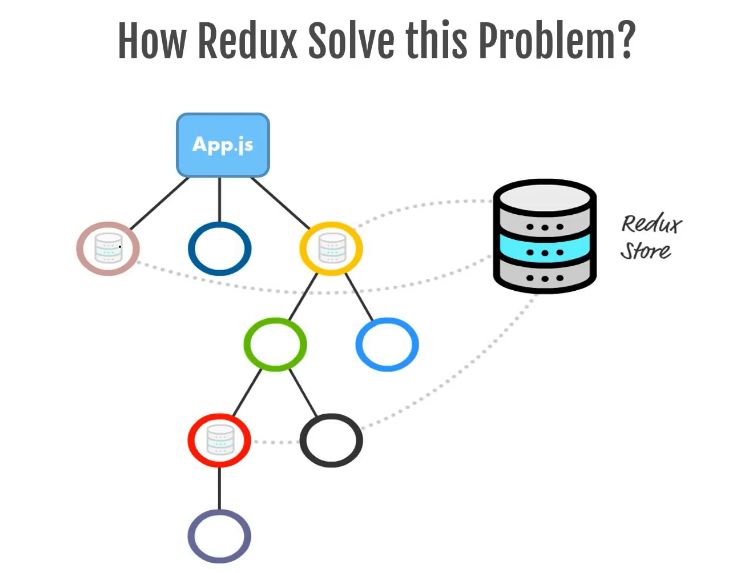
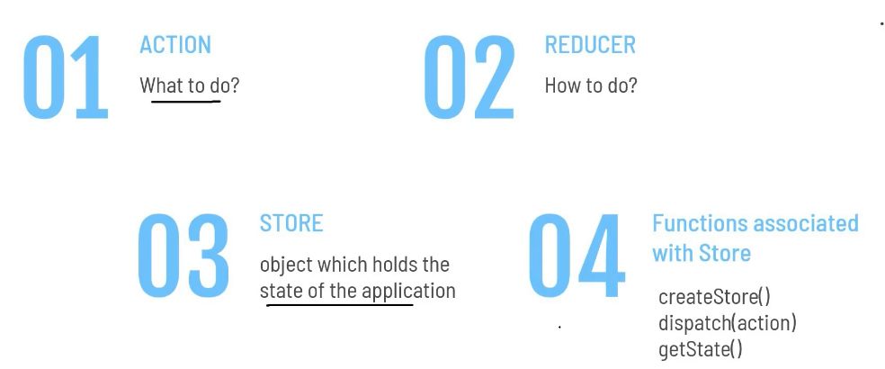
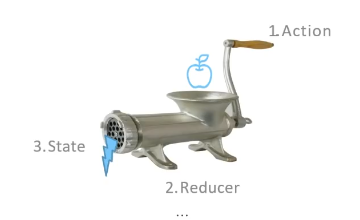
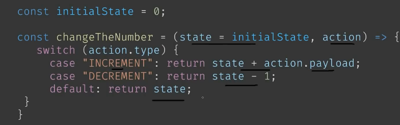
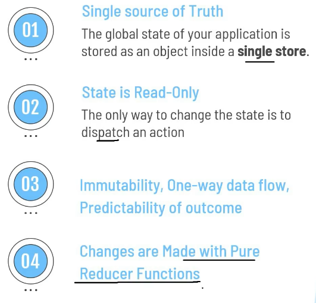

We put states in the Redux Store and whenever a component requires it, can just use it from there

What is Redux


 **Redux** is a pattern and Library for managing and updating **Application State**, using events called **Action**. It serves as a Centralized store for state that needs to be used accross the entire Application, with rules ensuring that the state can only be updated in a **Predictable** fashion.

Redux Main Topics : 



1. **Action** : What to do - see useReducer()
   {
      type: 'Increment',
      payload: num
   }
2. **Reducer** : How to do => useReducer Hook => (state, action)
3. **Store** : Centralized => Object which holds the state of the Application
4. **createStore** : How to create store
5. **dispatch(action)** : see useReducer()
6. **getState()** : get current value of the state.


1.1 **Action Creator** : 
```js
export const incNum = (num)=>{
   return {
      type: 'Increment',
      payload: num
   }
}
```

(oldState, Action) &rarr; **Reducer** &rarr; newState





**Redux Store** brings togerher state, action & Reducer.

We will only have a single store in a Redux App

Every Redux Store has a **single root** Reducer function

```js
import {createStore} from 'redux';

const store = createStore(rootReducers);
```

### Redux Principles

1. Single Source of Truth : Global 





Pure function : same input same o/p


Jitna man kare utna reduces banao lekin rootReduer ka andar sabko dal do

